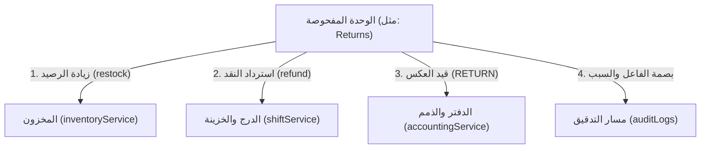

# وثيقة نطاق الفحص الجنائي — ERPM-SCOPE
## المستوى 0: الإعداد قبل الفحص (Pre-Inspection Setup)

> **الغرض:** تحديد حدود النطاق بوضوح قطعي وتأمين بيئة فحص معزولة تمنع تلوث الإنتاج وتضمن إمكانية إعادة إنتاج الفحوصات الجنائية.

---

## ١. بطاقة الفحص الأساسية

- **اسم الوحدة:** [مثال: منظومة المرتجعات — Returns]
- **رقم الإصدار / البروتوكول:** ERPM-Forensic Protocol v1.0
- **تاريخ بدء الفحص:** [YYYY-MM-DD]
- **المدقق / الوكيل المسؤول:** [اسم الوكيل / الفريق]
- **الهدف التجاري والتشغيلي:** [مثال: التحقق الجنائي من سلامة الدورة المستندية وحركات المخزون والدرج عند الإرجاع]

---

## ٢. لقطة البيئة (Environment Snapshot)

| العنصر | القيمة / المعرّف | ملاحظات التحقق |
|---|---|---|
| **Git Commit Hash** | `git rev-parse HEAD` | تثبيت نقطة الكود قبل أي فحص |
| **Git Branch** | `git branch --show-current` | التأكد من العمل على فرع معزول |
| **قاعدة بيانات الفحص** | `erp_<name>_test` | معزولة تماماً على المنفذ 3310 |
| **منفذ الإنتاج 3306** | ⛔ محظور ومحمي | لا مساس بقاعدة الإنتاج الحية |
| **حالة المستودع** | Clean (`git status`) | خلو الفرع من أي تعديلات غير ملتزمة |

---

## ٣. الحدود الصريحة للنطاق (Scope Boundaries)

### أ) المكونات المشمولة بالفحص (In-Scope)
- **الجداول في قاعدة البيانات:**
  - `salesControlRequests`
  - `returnRequests`
  - `invoices` (أعمدة الحالة والمرتجع)
  - `inventoryMovements` (حركات RETURN)
  - `accountingEntries` (قيود RETURN)
  - `receipts` (استرداد النقد)
- **ملفات الخادم والخدمات:**
  - `server/routers/returnRouter.ts`
  - `server/services/returnService.ts`
  - `server/services/returns/*`
- **واجهات وشاشات المستخدم:**
  - `client/src/pages/Returns.tsx`
  - `client/src/components/returns/*`
- **تطبيق الهاتف (إن وُجد):**
  - شاشات اعتماد وصندوق المرتجعات في أندرويد.

### ب) المكونات الخارجة عن النطاق (Out-of-Scope)
- وحدة التوظيف والرواتب (`hr`, `payroll`).
- عقود الصيانة والمطبعة غير المرتبطة بالمرتجع المباشر.
- مزامنة المتجر الإلكتروني الخارجي.

---

## ٤. خريطة التبعيات ونقاط التلامس (Dependency Map)

---

## ٥. مؤشرات خط الأساس المرجعية للأداء (Baseline Metrics)

قبل البدء في الفحص، تم تسجيل المؤشرات التالية للمقارنة اللاحقة:
- **زمن استجابة استعلام القائمة الرئيسي:** `~120ms`
- **زمن تنفيذ عملية المرتجع الكاملة:** `~280ms`
- **عدد الاستعلامات لكل عملية (Queries Count):** `8 استعلامات`
- **تغطية الاختبارات الحالية:** `95%` للخدمة الأساسية.

---

## ٦. إقرار البدء والجاهزية
- [ ] تم التحقق من العزل الكامل لقاعدة الفحص.
- [ ] تم تشغيل الفحص الساكن الأولي `pnpm check`.
- [ ] تم توثيق خريطة التبعيات ونقاط التلامس بين الوحدات.
- [ ] الفريق جاهز للانتقال إلى المستوى 1 (الفحص الثابت).
