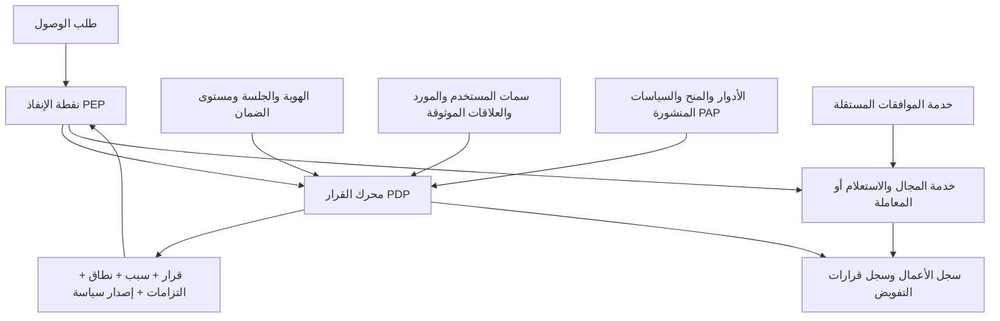

# الخطة الموحدة لإعادة هندسة الصلاحيات وحوكمة الوصول

> **معرّف الوثيقة:** AGP-002  
> **الإصدار:** 2.1  
> **التاريخ:** 29 يوليو 2026  
> **الحالة:** مقترح حاكم للمراجعة والاعتماد قبل التنفيذ  
> **الجمهور:** مالك المنظومة، قائد التطوير، مطورو الخادم والواجهة، فريق الاختبار، ومسؤول الأمن والتدقيق  
> **النطاق:** منظومة إدارة الأعمال متعددة المنشآت، بما يشمل كل نقاط الدخول الخادمية والواجهات والمهام الخلفية  
> **ملاحظة حاكمة:** هذه الوثيقة لا تستبدل الوثيقة السابقة تلقائياً. بعد اعتمادها رسمياً من مالك المنظومة وقائد التطوير، تُوسم الوثيقة السابقة بأنها مستبدلة، وتصبح هذه الوثيقة مصدر الحقيقة للتنفيذ. **الاستبدال ليس إلغاءً:** ما استُبدل من قرارات ٢٤/٧ وما بقي منها سارياً محدَّدٌ حصراً في [ملحق أ](#ملحق-أ--جدول-المصالحة-مع-قرارات-٢٤٧).

### سجلّ التغييرات

| الإصدار | التاريخ | التغيير |
|---|---|---|
| 2.0 | 29 يوليو 2026 | الإصدار الأول من الخطة الموحدة. |
| **2.1** | **29 يوليو 2026** | إضافة **ملحق أ — جدول المصالحة مع قرارات ٢٤/٧** الواردة في `docs/rbac-redesign-2026-07-24.md` §٦، وتحديد ما يُنسَخ منها وما يبقى سارياً وما يُرحَّل مدخلاً للقسم 31. **لم يُعدَّل أي بند آخر.** بنود المراجعة الأخرى (مصادر السلطة المستجدّة، أنواع الـPrincipal غير البشرية، حدّ المنشأة في النشر الحاليّ) **ما زالت مفتوحة** ولم تُدمَج بعد. |

---

## 1. الغرض من الوثيقة

تهدف هذه الخطة إلى نقل المنظومة من نموذج صلاحيات عام على مستوى الوحدة:

- `FULL`
- `READ`
- `NONE`

إلى نموذج دقيق وقابل للتفسير والاختبار، يحدد بصورة مستقلة:

- من صاحب الطلب؟
- ما الفعل التجاري المطلوب؟
- على أي مورد أو سجل؟
- ضمن أي منشأة أو فرع أو قسم أو مخزن؟
- على أي حقول؟
- تحت أي حالة أو حد مالي أو سياق؟
- هل توجد قيود فصل مهام أو متطلبات MFA أو موافقة؟
- لماذا سُمح الطلب أو رُفض؟

النتيجة المطلوبة هي أن تفعيل صلاحية واحدة يفتح الفعل المحدد فقط، ولا يؤدي إلى فتح أفعال أخرى ضمناً بسبب اسم الدور أو مستوى عام أو مجموعة مخفية.

هذه وثيقة تصميم وخطة تنفيذ، وليست كوداً أو مخططاً ملزماً لأسلوب برمجي بعينه.

---

## 2. الخلاصة التنفيذية

المشكلة الحالية ليست في شكل مصفوفة الصلاحيات وحده، بل في تعدد مصادر السلطة:

- اسم الدور الأساسي `baseRole`.
- بوابات خادمية تعتمد أسماء مثل مدير أو كاشير.
- صلاحيات عامة من نوع `FULL/READ/NONE`.
- دور مخصص أو استثناء مستخدم.
- قواعد فرع وملكية وحقول حساسة موزعة بين الخدمات.
- مسارات لا تمر بالبوابة الرئيسية، مثل الطباعة والوسائط والتكاملات والمهام الخلفية.

النموذج المستهدف هو نموذج هجين:

1. **RBAC:** الأدوار حزم إدارية واضحة من الصلاحيات الذرية.
2. **ABAC:** السمات الموثوقة تقيد القرار، مثل الفرع والحالة والحد المالي وحداثة MFA.
3. **ReBAC:** العلاقات المباشرة تقيد الوصول عند الحاجة، مثل المنشئ، المالك، المسند إليه أو المشرف.
4. **SoD:** فصل المهام يمنع اجتماع سلطات متعارضة أو تنفيذ خطوات متعارضة على المعاملة نفسها.
5. **حوكمة الوصول:** التعيينات المؤقتة، الاعتماد، المراجعة، الإلغاء، التفسير والتدقيق.

الدور لن يكون مصدراً مباشراً للحكم على أي إجراء. دوره الوحيد هو جمع منح ذرية معلنة للسهولة الإدارية.

لن يكون `FULL` قيمة تنفيذية في المحرك الجديد. يمكن أن يبقى زرّاً في الواجهة يحدد مجموعة ظاهرة من الصلاحيات الذرية، ويعرض أثرها قبل الحفظ.

---

## 3. الواقع الحالي الذي يجب أن تنطلق منه عملية التنفيذ

### 3.1 القيود الحالية

- توجد وحدات عامة قليلة مقارنة بمئات إجراءات الخادم الفعلية.
- تمنح قيمة `FULL` أفعال الوحدة كافة، وقد تشمل الإنشاء والتعديل والإلغاء والاعتماد.
- يمكن لاسم `baseRole` أن يمنح سلطة خارج المصفوفة الظاهرة.
- المستخدم مرتبط عملياً بدور واحد ودور مخصص واحد وفرع واحد.
- خرائط صلاحيات الدور والمستخدم مخزنة بصيغة JSON عامة.
- طبقة القدرات الدقيقة الحالية سقالة غير مكتملة وغير موصولة بالإنفاذ.
- نطاق الفروع المتعدد موجود كأساس غير مفعل.
- توجد نقاط دخول tRPC وExpress ووسائط وطباعة ومهام خلفية وتكاملات يجب أن تدخل كلها في الحصر.
- قد تختلف شاشة الصلاحيات الفعلية عن قرار الخادم بسبب وجود أكثر من مصدر للحكم.

### 3.2 نقاط القوة التي يجب الحفاظ عليها

- الدور لا يُعتمد من JWT كحقيقة نهائية، بل يُقرأ من قاعدة البيانات.
- توجد آليات لإبطال الجلسات فردياً وجماعياً.
- توجد حدود عزل بين قاعدة التحكم بالمنصة وقواعد بيانات المنشآت.
- توجد سجلات تدقيق لتغييرات كيانات مهمة يمكن البناء عليها.
- توجد بذرة لكتالوج قدرات دقيقة وفصل المهام.
- توجد علاقات أعمال فعلية يمكن استخدامها كمصادر نطاق موثوقة، مثل الفرع والمنشئ والمسند إليه.

### 3.3 قاعدة الانتقال

لا يجوز بناء المحرك الجديد على افتراض أن المشروع صفحة بيضاء. يجب قياس السلوك الفعلي الحالي، ثم الانتقال تدريجياً دون توسيع صلاحيات غير مقصود أو كسر العمليات السليمة.

---

## 4. النطاق

### 4.1 داخل نطاق الخطة

- المستخدمون البشريون.
- المجموعات والوحدات التنظيمية.
- حسابات الخدمة والتكاملات والمهام الخلفية.
- أدوار المنشأة وصلاحياتها.
- صلاحيات إدارة المنصة كحد ثقة منفصل.
- كل نقاط tRPC.
- كل مسارات Express.
- الطباعة والتنزيل والتصدير والإرسال والمشاركة الخارجية.
- webhooks والمهام المجدولة والعمليات غير المتزامنة.
- المزامنة أو التشغيل غير المتصل متى كان قادراً على إحداث أثر.
- إخفاء القوائم والمسارات والأزرار في الواجهة بوصفه انعكاساً لقرار الخادم.
- نطاقات المنشأة والفرع والقسم والمخزن والخزينة والقناة والملكية والإسناد.
- الحقول الحساسة والحدود المالية وحالة السجل.
- MFA الإضافي للعمليات الحساسة.
- فصل المهام والموافقات والتفويض المؤقت.
- محاكي الوصول وتفسير القرار.
- التدقيق والمراجعة الدورية والإلغاء الفوري.
- خطة ترحيل واختبار وتراجع كاملة.

### 4.2 خارج الإصدار الأساسي الأول

تؤجل العناصر التالية إلى ما بعد اكتمال الإنفاذ الأساسي وظهور حاجة أعمال مثبتة:

- منصة ReBAC أو Zanzibar مستقلة.
- لغة ABAC عامة تسمح للمسؤول بكتابة تعبيرات مفتوحة.
- IGA كامل يشمل الربط الآلي بكل مصادر الموارد البشرية والتزويد والإلغاء الخارجي.
- SSO وLDAP وSAML إذا لم تكن متطلباً تشغيلياً مباشراً.
- اكتشاف الشذوذ المعتمد على نماذج متقدمة.
- تحديد موقع جغرافي إلزامي لكل مستخدم.
- بصمة جهاز بوصفها عامل ثقة مستقل.
- صلاحيات مستقلة لكل حقل ولكل قيمة في جميع الموارد.
- استبدال كل موافقات المجالات بمحرك Workflow عام في دفعة واحدة.

تأجيل هذه العناصر لا يعني إغفالها معمارياً؛ يجب تصميم حدود واضحة تسمح بإضافتها لاحقاً دون إعادة بناء المحرك.

---

## 5. مستويات الإلزام في هذه الوثيقة

| المستوى | المعنى |
|---|---|
| **يجب (MUST)** | شرط أمني أو تشغيلي لا يعتبر النظام مقبولاً بدونه. |
| **يفضل (SHOULD)** | تصميم موصى به، ولا يُترك إلا بسبب موثق ومراجع. |
| **لاحقاً (LATER)** | قدرة مؤجلة عمداً، ولا تدخل الإصدار الأساسي. |
| **ممنوع (MUST NOT)** | نمط لا يجوز إدخاله في التصميم أو التنفيذ الجديد. |

---

## 6. المصطلحات الحاكمة

| المصطلح | التعريف |
|---|---|
| الهوية `Principal` | مستخدم أو مجموعة أو حساب خدمة أو جلسة مفوضة تطلب تنفيذ فعل. |
| المورد `Resource` | الكائن التجاري المستهدف، مثل فاتورة أو سند أو تقرير أو موظف أو ملف عميل. |
| الفعل `Action` | الأثر التجاري المحدد، مثل العرض أو الإنشاء أو الاعتماد أو الإلغاء أو التصدير. |
| الصلاحية الذرية `Permission` | تعريف ثابت لحق تنفيذ فعل محدد على نوع مورد محدد. |
| المنحة `Grant` | ربط صلاحية بصاحب أو دور أو مجموعة، مع نطاق وشروط ومدة ومصدر. |
| المنع الصريح `Deny` | قاعدة تمنع صلاحية ضمن نطاق محدد وتتغلب على السماح العادي المطابق. |
| الدور `Role` | حزمة إدارية مسماة من منح ذرية معلنة؛ ليس حقاً تنفيذياً عاماً. |
| تعيين الدور `Role Assignment` | ربط دور بمستخدم أو مجموعة مع نطاق ومدة وسبب ومصدر اعتماد. |
| النطاق `Scope` | مجموعة الموارد أو السجلات التي يمكن أن تنطبق عليها المنحة. |
| الشرط `Condition` | قيد محدد النوع يختبر سمة موثوقة للمستخدم أو المورد أو البيئة. |
| الالتزام `Obligation` | متطلب ينتج عن القرار، مثل إخفاء حقول أو MFA إضافي أو سبب إلزامي. |
| السياسة `Policy` | قاعدة منشورة ومُنسخة تنظم المنح والمنع والنطاق والشروط والأولوية. |
| RBAC | منح خط أساس وظيفي عبر أدوار تجمع صلاحيات ذرية ظاهرة. |
| ABAC | تقييد أو تخصيص القرار باستخدام سمات خادمية موثوقة ومحددة النوع. |
| ReBAC | اتخاذ علاقة مثبتة بين المستخدم والمورد، مثل المالك أو المسند إليه، جزءاً من القرار. |
| SoD | قيد يمنع جمع أو تنفيذ مهام متعارضة. |
| Approval | موافقة على طلب أو معاملة محددة؛ لا تمنح صلاحية دائمة أو عالمية. |
| IGA | حوكمة دورة حياة الهوية والوصول وطلبات المنح والمراجعة والإلغاء؛ ليست جزءاً من قرار التنفيذ اللحظي. |
| PDP | نقطة قرار الصلاحية المركزية. |
| PEP | نقطة الإنفاذ الموجودة أمام الإجراء أو داخل خدمة المجال أو الاستعلام. |
| PAP | نقطة إدارة السياسات والأدوار والنشر والتراجع. |
| PIP | مصادر السمات والعلاقات الموثوقة التي يعتمد عليها القرار. |

---

## 7. الفصل الإلزامي بين المسؤوليات

يجب ألا تتحول منظومة الصلاحيات إلى محرك ضخم يخلط كل شيء. تُفصل المسؤوليات كما يلي:

| المجال | السؤال الذي يجيب عنه |
|---|---|
| المصادقة والجلسة | هل الهوية صحيحة؟ وما مستوى ضمان الجلسة وحداثة MFA؟ |
| التفويض | هل لهذه الهوية حق تنفيذ هذا الفعل على هذا المورد الآن؟ |
| التحقق التجاري | هل الحالة والمبلغ والخصم والانتقال التجاري صحيح؟ |
| الموافقات | هل الطلب المحدد حصل على الموافقات المطلوبة؟ |
| الإنفاذ | كيف يُطبق مرشح الصفوف أو إخفاء الحقول أو منع الكتابة؟ |
| الحوكمة | من منح الوصول؟ لماذا؟ متى يراجع أو ينتهي أو يلغى؟ |
| التدقيق والكشف | ماذا حدث؟ ولماذا سُمح أو رُفض؟ وهل وقع سلوك غير معتاد؟ |

قواعد حاكمة:

- Authentication وMFA يحددان موثوقية الجلسة، ولا يمنحان صلاحية أعمال.
- Authorization يحدد ما يجوز للجلسة فعله.
- Business Validation يحدد سلامة العملية تجارياً، حتى لو كان المستخدم مفوضاً.
- Approval يجيز معاملة محددة، ولا يوسع صلاحية أو نطاقاً غير موجودين.
- IGA يحكم دورة حياة الوصول، ولا يستبدل PDP.
- Row filters وfield masks التزامات ينفذها PEP، ولا تُخزن كـSQL حر.

---

## 8. المبادئ الحاكمة

### 8.1 المنع الافتراضي

أي فعل أو مورد أو نقطة دخول أو سمة أو سياسة غير معروفة يجب أن تفشل مغلقاً.

### 8.2 عزل المنشأة حد صلب

حدود المنشأة ليست Scope قابلاً للتوسيع. لا يستطيع أي دور أو موافقة أو استثناء داخل منشأة منح وصول إلى منشأة أخرى.

### 8.3 الخادم هو جهة الحكم

إخفاء شاشة أو زر أو مسار ليس حماية. الواجهة تستهلك نتيجة الوصول الفعلي لتحسين التجربة فقط، بينما الإنفاذ النهائي خادمي.

### 8.4 الصلاحية مبنية على أثر تجاري

الصلاحية الذرية تمثل فعلاً تجارياً مستقلاً، لا مجرد endpoint ولا كل نقرة واجهة ولا كل عمود في قاعدة البيانات.

### 8.5 لا توسع ضمني

- لا يمنح اسم الدور صلاحيات.
- لا توجد عبارة «الدور فأعلى».
- لا يمنح `FULL` أفعالاً مستقبلية.
- لا تؤدي صلاحية إلى تفعيل صلاحيات أخرى تلقائياً.
- لا يجوز أن توسع الموافقة صلاحية أو نطاقاً.
- تُعرض المتطلبات والتبعيات صراحة ولا تُمنح تلقائياً.

### 8.6 المنحة وحدة غير قابلة للفصل

تظل الصلاحية مرتبطة بنطاقها وشروطها ومدتها ومصدرها. لا يجوز جمع الأفعال من دور مع النطاق الأوسع لدور آخر.

مثال: إذا كان المستخدم مديراً في الفرع (ب) وكاشيراً في الفرع (أ)، فلا يجوز أن تعمل صلاحيات المدير داخل الفرع (أ) بسبب دمج عالمي خاطئ.

### 8.7 أقل امتياز

يُمنح الحد الأدنى اللازم للعمل، مع مراجعة خاصة للأفعال الحساسة والتصدير والحقول المالية والشخصية.

### 8.8 قابلية التفسير

يجب أن يبين النظام مصدر كل قرار:

- الدور أو المنحة المباشرة.
- النطاق المطابق.
- الشرط المطابق أو المخالف.
- المنع أو تعارض SoD.
- إصدار السياسة.
- الالتزامات المطلوبة.

### 8.9 سياسة مُنسخة وقابلة للتراجع

كل تغيير حساس يمر بمسودة ومراجعة ومعاينة أثر ونشر، مع إمكانية تراجع مجربة.

### 8.10 الإبطال الفوري أو المحدد بـSLO

تغيير الدور أو النطاق أو حالة المستخدم أو السياسة يجب أن ينعكس فوراً، أو ضمن SLO قصير معلن ومختبر عبر كل الخوادم والكاشات.

---

## 9. المعمارية المستهدفة

### 9.1 RBAC

- يوفر خط الأساس الوظيفي.
- الدور يجمع صلاحيات ذرية معلنة.
- لا يحتوي الدور على سلطة عامة ناتجة من اسمه.
- لا يحتوي الدور على ترتيب أمني رقمي.
- لا توجد وراثة تشغيلية في الإصدار الأساسي.

### 9.2 ABAC

يستخدم أولاً لعدد محدود من السمات الموثوقة:

- الفرع أو مجموعة الفروع.
- القسم أو الوحدة التنظيمية.
- حالة المورد.
- المبلغ أو النسبة أو العملة.
- وقت العمل أو تقويم المنشأة عند الحاجة.
- حداثة MFA.
- نوع القناة أو المخزن أو الخزينة.

لا يستخدم كلغة حرة، ولا كبديل كامل عن المنح الصريحة.

### 9.3 ReBAC

يستخدم فقط عندما تعتمد الصلاحية على علاقة فعلية، مثل:

- أن المستخدم أنشأ السجل.
- أن السجل مسند إلى المستخدم.
- أن المستخدم مشرف على صاحب السجل.
- أن المستخدم عضو في فريق مرتبط بالمورد.

لا تُنشأ منصة علاقات عامة في الإصدار الأول إذا كانت العلاقات الحالية typed في نموذج المجال تكفي.

### 9.4 SoD

يطبق عند مرحلتين:

- عند تكوين الدور أو تعيين المنح لمنع التوليفات السامة.
- عند تنفيذ المعاملة لمنع الشخص نفسه من تنفيذ خطوات متعارضة على السجل نفسه.

---

## 10. كتالوج الصلاحيات الذرية

### 10.1 صيغة التسمية

الصيغة القياسية:

`domain.resource.action`

إذا كان المورد مركباً، يستخدم اسماً مستقراً داخل جزء المورد، مثل `invoice_payment` أو `customer_pii`، ولا تضاف أجزاء متغيرة تكسر الصيغة أو تخلط الشرط بالفعل.

أمثلة توضيحية:

| المجال | المورد | الفعل | الكود المفاهيمي |
|---|---|---|---|
| المبيعات | الفاتورة | عرض | `sales.invoice.view` |
| المبيعات | الفاتورة | إنشاء | `sales.invoice.create` |
| المبيعات | الفاتورة | إصدار | `sales.invoice.issue` |
| المبيعات | الفاتورة | إلغاء | `sales.invoice.void` |
| المبيعات | دفعة الفاتورة | عكس | `sales.invoice_payment.reverse` |
| العملاء | بيانات العميل الحساسة | عرض | `crm.customer_pii.view` |
| المخزون | التسوية | طلب | `inventory.adjustment.request` |
| المخزون | التسوية | اعتماد | `inventory.adjustment.approve` |
| الخزينة | السند | إنشاء | `treasury.voucher.create` |
| الخزينة | السند | اعتماد | `treasury.voucher.approve` |
| التقارير | الربحية | عرض | `reports.profit.view` |
| التقارير | التقرير | تصدير | `reports.report.export` |
| المنتجات | تكلفة المنتج | عرض | `catalog.product_cost.view` |
| الموارد البشرية | الراتب | عرض | `hr.salary.view` |

هذه أمثلة وليست الكتالوج النهائي. الكتالوج النهائي يُبنى من جرد نقاط الدخول والعمليات الفعلية.

### 10.2 الأفعال القياسية

تستخدم مفردات مستقرة قدر الإمكان:

- `list`
- `view`
- `create`
- `update`
- `delete`
- `archive`
- `issue`
- `submit`
- `approve`
- `reject`
- `post`
- `void`
- `reverse`
- `refund`
- `assign`
- `merge`
- `import`
- `export`
- `download`
- `print`
- `send`
- `share`
- `schedule`
- `close`
- `reopen`

يمكن استخدام أفعال أعمال أكثر تحديداً عندما يمثل الفعل أثراً مستقلاً لا تغطيه القائمة.

في السجلات المالية أو الخاضعة للاحتفاظ، لا يفترض وجود `delete` نهائي. تستخدم أفعال مثل `void` أو`reverse` أو`archive` وفق قواعد المجال، ويحتاج أي حذف صلب سياسة احتفاظ وقانون واعتماداً مستقلاً، لا مجرد «دور أعلى».

### 10.3 ما لا يوضع في كود الصلاحية

ممنوع إدخال ما يلي في اسم الصلاحية:

- اسم الدور.
- الفرع أو رقم السجل.
- نسبة مثل `>10%`.
- مبلغ أو عملة.
- نافذة زمنية.
- عبارة «كل السجلات».
- حالة MFA.
- اسم المعتمد.
- شرط SQL.

هذه خصائص للمنحة أو النطاق أو السياسة أو الموافقة.

### 10.4 بيانات تعريف الصلاحية

يجب أن يتضمن سجل الصلاحية:

- كوداً ثابتاً وفريداً.
- المجال والمورد والفعل.
- اسماً ووصفاً واضحين.
- مالكاً وظيفياً.
- تصنيف حساسية.
- هل هي قراءة أو كتابة أو أثر خارجي.
- هل تتطلب عادةً MFA إضافياً.
- هل تدخل في قواعد SoD.
- متطلبات التدقيق.
- حالة دورة الحياة: نشطة، مهملة، متقاعدة.
- الإصدار وتاريخ الإنشاء.

تغيير معنى الصلاحية بصورة جوهرية يحتاج إصداراً أو كوداً جديداً، لا تغييراً صامتاً تحت الكود نفسه.

### 10.5 العلاقة بين الصلاحية ونقطة الدخول

- كل نقطة دخول يجب أن ترتبط بصلاحية واحدة على الأقل.
- يمكن أن تحمي صلاحية واحدة عدة نقاط دخول إذا كانت تؤدي الأثر التجاري نفسه.
- إذا كانت نقطة الدخول تؤدي أكثر من أثر مستقل، فيجب تقسيمها أو التصريح بكل الصلاحيات المطلوبة.
- دلالة الجمع الافتراضية للآثار المتعددة هي `allOf`: يجب استيفاء صلاحية كل أثر قبل بدء التنفيذ.
- لا يستخدم `anyOf` إلا لبدائل متكافئة ومعلنة تؤدي الغرض نفسه، مع توثيق سبب التكافؤ.
- يفحص كل أثر مرة أخرى عند نقطة حدوثه داخل خدمة المجال أو المعاملة؛ لا يكفي فحص أول الطلب إذا ظهرت آثار إضافية لاحقاً.
- لا يجوز وضع إرسال أو مشاركة أو طباعة أو تصدير تحت صلاحية قراءة عامة.
- لا يجوز وضع اعتماد أو إلغاء أو عكس تحت صلاحية تعديل عامة.

---

## 11. الأدوار والتعيينات والاستثناءات

### 11.1 الدور

الدور:

- اسم ووصف وحزمة منح.
- يمكن أن تكون له إصدارات.
- لا يمنح شيئاً بسبب اسمه.
- لا يحتوي `role_level`.
- لا يستخدم «مدير فأعلى».
- لا يحدد الفرع أو المدة أو الحد المالي داخل تعريفه.
- يحتوي في الإصدار الأساسي منح `ALLOW` صريحة فقط؛ غياب الصلاحية يعني عدم منحها.

يستخدم `DENY` للقيود المؤسسية أو استثناءات المستخدم والتعيين محددة النطاق. لا يوضع منع واسع داخل دور قابل للتركيب إلا إذا ظهرت حاجة أعمال مثبتة، وبعد توفير معاينة أثر وقاعدة أولوية لا لبس فيها.

منح الدور نفسها لا تحمل فرعاً أو نطاقاً تنظيمياً. عند تعيين الدور لمستخدم أو مجموعة، يقيّد نطاق التعيين ومدة سريانه كل منح الدور الناتجة عنه. أما المنحة المباشرة أو التفويض فلها نطاقها ومدتها الخاصان.

### 11.2 القوالب والوراثة

في الإصدار الأساسي:

- يسمح بإنشاء دور جديد عن طريق «نسخ من قالب ثم تعديل».
- النسخ لا ينشئ وراثة حية.
- أي تعديل لاحق على القالب لا يتسرب إلى الدور المنسوخ دون مراجعة ونشر.

إذا ظهرت لاحقاً حاجة لتركيب الأدوار:

- تكون علاقة composition منفصلة.
- تمنع الدورات.
- يحدد عمق أقصى.
- تُسطح المنح عند النشر.
- يظهر مصدر كل منحة.
- يعرض فرق الأثر قبل النشر.

### 11.3 تعيينات متعددة

يجب أن يدعم المستخدم أكثر من تعيين، ويحتوي كل تعيين على:

- المستخدم أو المجموعة.
- الدور.
- النطاق.
- تاريخ البدء.
- تاريخ الانتهاء عند الحاجة.
- السبب.
- مصدر الطلب.
- منشئ التعيين.
- مسار الاعتماد.
- حالة التعيين.

لا تدمج نطاقات الأدوار منفصلة عن أفعالها.

### 11.4 المجموعات والوحدات التنظيمية

- يمكن للمستخدم الانتماء إلى أكثر من مجموعة أو وحدة تنظيمية.
- المجموعة وسيلة إدارية للإسناد، وليست دوراً مخفياً.
- يجب أن يكون مصدر العضوية معروفاً وقابلاً للتدقيق.
- أي تغيير عضوية يؤثر في الوصول يجب أن يمر بالإبطال وتحديث القرار.

### 11.5 استثناء المستخدم

يدعم النظام:

- سماح مباشر مؤقت عند وجود ضرورة.
- منع مباشر محدد النطاق.
- تاريخ انتهاء إلزامي للرفع المؤقت.
- سبب وموافق ومصدر.
- ظهور الاستثناء في شاشة الوصول الفعلي.

يفضل ألا تكون المنح المباشرة الدائمة هي النمط الاعتيادي. تُستخدم الأدوار للتعيين المستقر، والاستثناءات للحالات المحددة.

### 11.6 الدور المفقود أو المعطل

إذا فُقد الدور أو تعطل أو أصبح إصدار السياسة غير صالح:

- يوضع المستخدم في حالة `NO_ACCESS/QUARANTINED`.
- لا يهبط إلى دور افتراضي يملك صلاحيات قراءة.
- يسمح فقط بمسارات استعادة الوصول أو الدعم المصرح بها.

### 11.7 الحساب الجديد

- الافتراضي الحاكم لكل حساب جديد هو `NO_ACCESS`.
- إذا كان إنشاء الحساب يتضمن تعيين دور أساسي، فيجب أن يكون ذلك تعييناً صريحاً ومدققاً داخل مسار الإنشاء، وليس default خفياً في المخطط أو الخدمة.
- لا يجوز أن يكون الدور الافتراضي كاشيراً أو أي دور تشغيلي.
- يجب أن تكون حالة `NO_ACCESS` متطابقة في مخطط البيانات والخدمة وAPI والواجهة والاختبارات وكل مسارات الإنشاء.
- لا يدخل المستخدم إلى الإنتاج قبل اكتمال الفرع أو النطاق والمتطلبات الأمنية اللازمة لدوره.

### 11.8 حسابات الخدمة والتكامل

- تمثل كنوع Principal مستقل عن المستخدم البشري.
- لا يعاد استخدام حساب مستخدم تفاعلي لتشغيل job أو webhook أو تكامل.
- لكل حساب خدمة مالك وغرض وصلاحيات ونطاق وبيانات اعتماد ودورة تدوير.
- لا تمنح حسابات الخدمة أدواراً عامة أو صلاحيات واجهة لا تحتاجها.
- تسجل أفعالها بهوية الخدمة ومعرف الطلب، ولا تنسب إلى مستخدم وهمي.
- تُلغى أو تُدوّر بيانات اعتمادها عند انتهاء التكامل أو تغير مالكه.

### 11.9 التفويض المؤقت

- لا يستطيع المفوض منح ما لا يملكه فعلياً.
- يجب أن يكون نطاق التفويض مساوياً أو أضيق من نطاق المفوض.
- له تاريخ بدء وانتهاء وسبب ومستفيد ومصدر موافقة.
- يمكن منع تفويض قدرات حساسة محددة كلياً.
- لا يسمح بسلسلة تفويض مفتوحة؛ يبدأ الإصدار الأول بعمق واحد ما لم تعتمد حاجة أخرى.
- يعاد تقييم التفويض عند تغير وصول المفوض أو تعطيله.
- يُلغى التفويض تلقائياً عند انتهاء مدته أو فقدان مصدره.
- لا يستطيع المفوض أو المستفيد اعتماد طلب التفويض منفرداً إذا كان حساساً.

---

## 12. النطاقات والشروط

### 12.1 النطاقات القياسية الأولية

يبدأ النظام بنطاقات مغلقة ومحددة النوع:

| الفئة | أمثلة |
|---|---|
| المنشأة | المنشأة الحالية فقط، وهو حد غير قابل للتوسيع. |
| الفرع | الفرع الحالي، فروع محددة، كل فروع المنشأة. |
| الوحدة التنظيمية | وحدة محددة أو شجرة وحدات معتمدة. |
| المورد التشغيلي | مخازن، خزائن، قنوات، أقسام أو مواقع محددة. |
| العلاقة | أنشأه المستخدم، مسند إليه، عضو بالفريق، تحت إشرافه. |
| السجل | سجلات محددة استثنائياً عند الحاجة. |

### 12.2 الشروط القياسية الأولية

- حالة المستند أو السجل.
- المبلغ والقيمة القديمة والجديدة.
- نسبة الخصم.
- العملة.
- الحد لكل معاملة أو فترة.
- نوع العميل أو المنتج عند وجود حاجة مثبتة.
- الوقت وفق توقيت وتقويم المنشأة.
- حداثة المصادقة أو MFA.
- قناة الطلب أو المخزن أو الخزينة.

### 12.3 مصدر السمات

- يجب أن تأتي السمات التفويضية من الخادم أو قاعدة البيانات أو مصدر هوية موثوق.
- لا تقبل قيمة الفرع أو المالك أو مستوى المستخدم من العميل كحقيقة.
- يجب أن يكون لكل سمة نوع ومصدر ومالك ودورة تحديث.
- أي سمة مجهولة أو قديمة أو غير صالحة تفشل مغلقاً.

### 12.4 ممنوعات تمثيل السياسة

ممنوع:

- تخزين SQL أو SQL-like.
- تخزين أسماء أعمدة وجداول يختارها مسؤول الواجهة.
- JSON حر يسمح بدوال أو تعبيرات غير مضبوطة.
- تنفيذ post-filter بعد جلب كل البيانات بوصفه الحماية الوحيدة.
- تفسير `NULL` على أنه «كل الفروع» أو «بلا حد» دون دلالة صريحة.

إذا احتاج النظام إلى شروط مركبة:

- تستخدم AST أو DSL مغلقة ذات schema version.
- السمات والمشغلات allowlisted.
- يحدد عمق وعدد الشروط.
- تُتحقق الصيغة قبل النشر.
- يفشل المفسر مغلقاً عند أي عنصر غير معروف.
- تبنى الاستعلامات بمعاملات آمنة داخل الخادم.

---

## 13. نطاق السجل والحقل والقيمة

هذه أبعاد متعامدة يمكن أن تجتمع في القرار نفسه، وليست مستويات بديلة.

### 13.1 نطاق السجل

أمثلة:

- سجلات أنشأها المستخدم.
- سجلات مسندة إليه.
- سجلات فرعه.
- سجلات مجموعة فروع محددة.
- سجلات فريقه.
- كل سجلات المنشأة لصلاحية محددة.

قواعد الإنفاذ:

- في القوائم، يطبق مرشح التفويض داخل الاستعلام قبل `count` وpagination.
- في العرض والتعديل والحذف، يدمج معرف السجل مع predicate المصرح به في الاستعلام نفسه.
- التصدير والتجميع والعدادات تستخدم النطاق نفسه.
- لا يكفي جلب السجل ثم فحصه لاحقاً إذا كان الاستعلام السابق قد سرب وجوده أو بياناته.
- يجب حل المورد النهائي قبل القرار لمنع IDOR عبر معرف وسيط.

### 13.2 نطاق الحقل

يجب الفصل بين:

- حق عرض الحقل.
- حق تعديل الحقل.
- حق تصدير الحقل.
- حق البحث أو الترتيب أو التجميع باستخدام الحقل.
- طريقة الإخفاء أو التنقيح.

الأولوية للحقول الحساسة:

- التكلفة.
- الهامش.
- الرواتب.
- البيانات الشخصية.
- حدود الائتمان.
- الحسابات البنكية.
- أسرار التكامل.

يفضل استخدام مجموعات حقول وظيفية بدلاً من صلاحية مستقلة لكل عمود، مع صلاحيات منفصلة للحقول الأعلى حساسية.

يجب أن يمنع الخادم mass assignment ويقارن الحقول المتغيرة فعلياً عند التعديل.

### 13.3 نطاق القيمة

القدرة تبقى ثابتة، مثل تطبيق خصم. أما الحدود فتكون في السياسة:

- حد أقصى للنسبة.
- حد أقصى للمبلغ.
- حد يومي أو شهري.
- عملة محددة.
- حد لكل عميل أو فرع.
- سلوك التجاوز: رفض أو طلب موافقة.

تُفحص القيم القديمة والجديدة والتراكمية داخل معاملة المجال، مع الأقفال المناسبة لمنع سباقات التنفيذ وTOCTOU.

---

## 14. عقد قرار الصلاحية

### 14.1 المدخلات

كل قرار يستقبل مفاهيمياً:

- الهوية والجلسة.
- الفعل.
- المورد أو نوع المورد ومعرفه.
- سياق الطلب.
- تلميح concurrency اختياري من العميل عند الحاجة، وليس إصدار سياسة موثوقاً.

يختار الخادم دائماً إصدار السياسة المنشور والنشط. لا يستطيع العميل تثبيت إصدار قديم أو اختيار سياسة أوسع. عند وجود تلميح إصدار غير مطابق، يعاد التقييم بالإصدار النشط أو يرفض الطلب وفق نوع العملية.

### 14.2 النتائج

يعيد المحرك نتيجة typed واحدة لا تحتمل التنفيذ الجزئي:

- `PERMIT`
- `DENY`
- `CHALLENGE`
- `PENDING_APPROVAL`

قواعد النتيجة:

- `PERMIT` هي النتيجة الوحيدة التي تسمح لـPEP ببدء الأثر التجاري.
- لا تصدر `PERMIT` قبل استيفاء MFA والموافقة وكل الالتزامات المانعة للتنفيذ.
- `CHALLENGE` تعني وجود مسار منحة صالح مبدئياً، لكن يلزم step-up؛ ولا تسمح بالتنفيذ.
- `PENDING_APPROVAL` تعني وجود مسار منحة صالح مبدئياً، لكن يلزم اعتماد الطلب المحدد؛ ولا تسمح بالتنفيذ.
- إذا لم توجد منحة أصلية صالحة، تكون النتيجة `DENY`، ولا يعرض النظام MFA أو الموافقة كطريقة للحصول على حق غير موجود.
- يجب أن يفحص PEP نوع النتيجة كاملاً، ولا يختزلها إلى boolean فضفاض.

ويتضمن القرار داخلياً:

- معرف القرار.
- سبب القرار ورمز السبب.
- المنح والمنع المطابقين.
- النطاق المحسوب.
- مرشح السجلات.
- الحقول المسموحة والمخفية.
- الحدود والالتزامات.
- تعارضات SoD.
- إصدار السياسة.
- معرف التتبع.

أي `UNKNOWN` أو خطأ سياسة أو سمة مفقودة يتحول إلى `DENY` آمن مع تنبيه تشغيلي.

### 14.3 جبر دمج المنح

تُقيّم كل منحة كوحدة كاملة مستقلة:

`الصلاحية + نطاق التعيين + نطاق المنحة المباشرة إن وجد + الشروط + الحقول + الحدود + الالتزامات + مدة السريان`

قواعد الدمج:

1. ينتج كل تعيين دور مجموعة statements مستقلة من صلاحيات الدور مقيدة بنطاق التعيين ومدته.
2. تنتج المنح المباشرة والتفويضات statements مستقلة بنطاقاتها ومددها.
3. يقيّم كل statement كاملاً على المورد المطلوب؛ لا تجمع أبعاده منفصلة.
4. تكون النتيجة قابلة للسماح إذا وجد statement كامل يغطي الفعل والمورد والقيم والحقول المطلوبة، ولم يطابقه منع أعلى أولوية.
5. يمكن اتحاد مناطق السجلات التي تسمح بها statements متعددة، لكن تبقى الحقول والحدود والالتزامات مرتبطة بالمنطقة والمسار اللذين منحاها.
6. تُطرح مناطق المنع المطابقة من مناطق السماح.
7. لا يجوز تركيب صلاحية الفعل من تعيين (أ) مع نطاق تعيين (ب) أو حقول تعيين (ج) أو حد مالي من تعيين (د).
8. إذا طابقت عدة مسارات المورد نفسه، يستخدم المحرك قواعد دمج محددة النوع ومختبرة؛ ولا يختار تلقائياً أقل التزامات لتجاوز MFA أو الموافقة.

### 14.4 ترتيب التقييم

الترتيب الحاكم:

1. تثبيت المنشأة وحد الثقة.
2. التحقق من حالة المستخدم والجلسة ومتطلبات كلمة المرور وMFA.
3. التحقق من أن الفعل والمورد ونقطة الدخول مسجلة.
4. تحميل المورد النهائي والسمات الموثوقة اللازمة.
5. تطبيق المنع المؤسسي الصلب وقواعد SoD.
6. تطبيق المنع الصريح المطابق للنطاق.
7. إنشاء statements الفعالة لكل تعيين ومنحة وتفويض مع إبقاء كل أبعادها مرتبطة.
8. تقييم النطاق والعلاقات والشروط داخل كل statement، ثم تطبيق جبر الدمج المحدد في القسم السابق.
9. حساب قيود الحقول والقيم.
10. تحديد الالتزامات، مثل MFA أو الموافقة أو تسجيل السبب.
11. إصدار `DENY` افتراضي إذا لم يبق مسار سماح كامل.
12. إصدار `PERMIT` فقط إذا استوفيت كل الالتزامات، وإلا إصدار `CHALLENGE` أو`PENDING_APPROVAL`.
13. إنفاذ `PERMIT` داخل الاستعلام أو خدمة المجال أو المعاملة.
14. تسجيل القرار والنتيجة.

### 14.5 قواعد الأولوية

- حد المنشأة لا يمكن تجاوزه.
- المنع المؤسسي الصلب وSoD أعلى من كل منح عادية.
- المنع المباشر المقيد بالنطاق يتغلب على السماح المطابق.
- المنحة المباشرة لا تتغلب على منع صلب.
- الموافقة لا تتغلب على غياب الصلاحية.
- MFA لا يمنح صلاحية.
- السياسة لا توسع الوصول سراً؛ أي سماح شرطي يجب أن يكون منحة مرئية ومفسرة.
- عند اجتماع سياسات جلسة متعددة، يطبق الأكثر تقييداً.

### 14.6 تفسير آمن

- يحصل المسؤول المخول على trace كامل.
- يحصل المستخدم العادي على سبب مفهوم دون كشف تفاصيل قد تساعد على الاستكشاف أو الهجوم.
- يجب أن تطابق المعاينة والمحاكي قرار الخادم الفعلي.

---

## 15. المصادقة والجلسات وMFA

### 15.1 ما يجب الحفاظ عليه

- عدم اتخاذ الدور المخزن في JWT مصدراً للسلطة.
- قراءة حالة المستخدم والجلسة وتعييناته من مصدر حديث.
- الإبطال الفردي والجماعي.
- فصل جلسات المنصة عن جلسات المنشآت.

### 15.2 ما يجب إضافته

- فرض `mustChangePassword` خادمياً.
- فرض `mustEnroll2FA` خادمياً.
- مستوى ضمان للجلسة.
- وقت آخر MFA وإعادة مصادقة.
- انتهاء بسبب الخمول.
- انتهاء مطلق.
- إصدار سياسة أو authorization epoch.
- إشارات مخاطرة لا تُستخدم منفردة كحقيقة.

### 15.3 Step-up MFA

تحدد الصلاحية الحساسة:

- هل تحتاج MFA؟
- ما الحد الأقصى لعمر MFA؟
- هل تحتاج إعادة إدخال كلمة المرور أو وسيلة أقوى؟

أمثلة مرشحة للمراجعة:

- إدارة الصلاحيات.
- impersonation.
- الحذف أو الإلغاء أو العكس المالي.
- التصدير الحساس.
- تغيير بيانات أمنية أو بنكية.
- break-glass.

### 15.4 IP والموقع والجهاز

- تكون سياسات اختيارية مبنية على المخاطر.
- لا hard-code لدولة أو مدينة أو شبكة.
- لا يُقفل الحساب تلقائياً بسبب الموقع وحده.
- يمكن أن تؤدي الإشارة إلى challenge أو step-up أو تنبيه.
- تخضع البيانات لسياسة خصوصية واحتفاظ.

### 15.5 الكاش واتساق القرار

يمكن استخدام كاش مُنسخ لتحسين الأداء بشرط:

- ربطه بإصدار سياسة.
- إبطال موثوق عند التغيير.
- فشل آمن عند عدم الاتساق.
- قياس زمن انتشار الإبطال.
- عدم تخزين دور قديم في الجلسة بوصفه سلطة نهائية.

---

## 16. فصل المهام SoD

### 16.1 الأنواع

1. **فصل ساكن:** يفحص السلطة الفعالة المجمعة عبر كل الأدوار والمجموعات والمنح المباشرة والمؤقتة والتفويضات، ويمنع اجتماع قدرات متعارضة متى تداخلت نطاقاتها؛ ولا يقتصر الفحص على الدور أو التعيين الواحد.
2. **فصل ديناميكي:** يمنع المستخدم من تنفيذ خطوتين متعارضتين في العملية نفسها.
3. **فصل على مستوى الكائن:** يسمح بالقدرتين عموماً، لكن يمنع استخدامها على السجل نفسه.
4. **فصل تاريخي:** يمنع الفاعل من تنفيذ خطوة لاحقة بناءً على أفعال سابقة على السجل.

### 16.2 أزواج أولية للمراجعة مع ملاك المجالات

- إنشاء السند واعتماده.
- طلب تسوية مخزون واعتمادها.
- إنشاء أمر شراء والجمع منفرداً بين اعتماده واستلامه ودفعه.
- احتساب العمولة واعتمادها وصرفها.
- إعداد الرواتب واعتمادها ودفعها.
- عد الجرد واعتماد النتيجة.
- إنشاء حملة واعتمادها وإطلاقها.
- طلب صلاحية والموافقة على الطلب نفسه.
- إدارة الصلاحيات وإدارة أو حذف سجل تدقيقها.

القائمة النهائية لا تعتمد تقنياً فقط؛ يجب اعتمادها من مالك كل عملية.

### 16.3 الاستثناءات

- لا يوجد تجاوز صامت لـadmin.
- المؤسسات الصغيرة يمكن أن تستخدم استثناءً مؤقتاً بضوابط تعويضية.
- الاستثناء يحتاج سبباً ومدة وMFA وموافقة وتنبيهاً ومراجعة لاحقة.
- لا يسمح للمستخدم باعتماد الاستثناء الخاص به.

---

## 17. الموافقات

### 17.1 الأنواع المنفصلة

#### أ. موافقة منح الوصول

تغطي:

- تعيين دور.
- منح مباشر.
- توسيع نطاق.
- تفويض مؤقت.
- break-glass عند الحاجة.

#### ب. موافقة نشر السياسة

تغطي:

- تعديل دور حساس.
- إضافة أو إزالة صلاحية حساسة.
- تغيير قاعدة SoD.
- تغيير عتبة أو نطاق واسع.

#### ج. موافقة معاملة الأعمال

تغطي:

- إلغاء أو عكس.
- خصم يتجاوز الحد.
- تعديل ائتمان حساس.
- اعتماد سند أو تسوية.
- مشاركة خارجية.

### 17.2 متطلبات طلب الموافقة

يجب أن يرتبط الطلب بـ:

- نوع الفعل.
- المورد ومعرفه.
- إصدار أو بصمة حالة المورد.
- القيم والمبلغ والعملة عند الحاجة.
- مقدم الطلب.
- سبب الطلب.
- السياسة التي طلبت الموافقة.
- الخطوات والمعتمدين وquorum.
- تاريخ الانتهاء.
- حالة الاستهلاك.
- معرف idempotency.

### 17.3 التنفيذ بعد الموافقة

- الموافقة single-use عندما تكون مرتبطة بعملية واحدة.
- يعاد تقييم الصلاحية والنطاق وحالة المورد عند التنفيذ.
- إذا تغير المورد جوهرياً، تُلغى صلاحية الموافقة القديمة.
- لا تنفذ الموافقة طلباً خارج نطاق مقدم الطلب.
- تبقى معاملات وأقفال خدمة المجال هي المسؤولة عن سلامة الأثر المالي أو المخزني.
- التصعيد يعيد التوجيه إلى معتمد مخول مسبقاً، ولا يوسع سلطة الموافقة تلقائياً.
- يمنع اعتماد الذات.

---

## 18. إدارة المنصة وBreak-glass

### 18.1 فصل إدارة المنصة

- إدارة المنصة trust domain منفصل.
- مدير المنصة لا يرث تلقائياً صلاحيات أعمال داخل كل منشأة.
- دخول بيانات منشأة لأغراض الدعم يحتاج مساراً صريحاً ومقيداً.
- لا تُخلط جداول أو جلسات platform admin بتعيينات أدوار المنشأة.

### 18.2 الوصول الطارئ

يستخدم break-glass بدلاً من admin bypass، ويتطلب:

- حساباً أو قدرة طوارئ منفصلة.
- MFA حديثاً وقوياً.
- سبباً إلزامياً.
- مدة قصيرة.
- نطاقاً محدداً.
- إشعاراً فورياً.
- سجل قرار كامل.
- مراجعة بعد الاستخدام ضمن SLA.
- إبطالاً تلقائياً عند انتهاء المدة.

### 18.3 Impersonation والدعم

- يحتاج صلاحية ذرية مستقلة وموافقة أو سياسة دعم معتمدة.
- تنشأ جلسة دعم منفصلة تحتفظ بهوية الموظف الفاعل والمستخدم المستهدف معاً.
- لا يُستبدل اسم الفاعل في السجل باسم المستخدم المستهدف.
- يكون الوصول تقاطعاً بين صلاحيات المستخدم المستهدف ونطاق الدعم المعتمد، ولا يمنح أيهما سلطة أوسع.
- يمكن منع الأفعال المالية أو الأمنية الحساسة أثناء impersonation.
- يحتاج سبباً ومدة وMFA حديثاً وإشعاراً واضحاً داخل الواجهة.
- كل قرار أثناء الجلسة يربط بالفاعل والمستخدم المستهدف وطلب الدعم.

---

## 19. نموذج البيانات المفاهيمي

النموذج التالي يحدد المسؤوليات ولا يفرض أسماء جداول نهائية:

| المجموعة | الكيانات المفاهيمية | الغرض |
|---|---|---|
| كتالوج الصلاحيات | Permission definitions، resource/action registry | تعريف ما يمكن فعله بصورة ثابتة ومُنسخة. |
| الأدوار | Roles، role versions، role permission grants | جمع المنح الذرية وإدارة إصدارات الأدوار. |
| التعيينات | User role assignments، group role assignments | ربط الأدوار بالأشخاص والمجموعات مع نطاق ومدة. |
| الاستثناءات | User permission statements | منح أو منع مباشر محدود ومفسر. |
| التنظيم | Organizational units، groups، memberships | تمثيل الهيكل الإداري ومصادر الإسناد. |
| النطاق | Scope sets، scope members، grant scope bindings | تمثيل الفروع والوحدات والمخازن والعلاقات المسموحة. |
| السياسات | Policy definitions، revisions، bindings | الشروط typed وقواعد الأولوية والنشر. |
| الحقول | Field groups، field restrictions | العرض والتعديل والتصدير والإخفاء. |
| الحدود | Authorization limits | المبالغ والنسب والعملات والفترات وسلوك التجاوز. |
| SoD | SoD rules، conflict parties، exceptions | اكتشاف ومنع التوليفات والمعاملات المتعارضة. |
| طلبات الوصول | Access requests، access decisions | طلبات الأدوار والمنح والتوسيع والإلغاء. |
| التفويض | Delegations | صلاحيات مؤقتة محددة النطاق والمدة. |
| الموافقات | Workflows، steps، rules، requests، decisions | اعتماد المنح والسياسات ومعاملات الأعمال. |
| الجلسات | Existing user sessions + assurance data | حالة الجلسة والإبطال ومستوى MFA. |
| النشر | Policy change sets، publications، rollbacks | دورة حياة السياسة المنشورة. |
| التدقيق | Authorization change events، decision logs | تتبع تغييرات السلطة وقرارات الوصول. |

### 19.1 قواعد النموذج

- لا حاجة لفرض UUID على كل جدول إذا كانت المفاتيح الرقمية الحالية مناسبة.
- الكود الثابت للصلاحية هو الهوية المنطقية المهمة.
- لا تخزن SQL داخل أي صف سياسة.
- لا تستخدم JSON حر كمصدر حقيقة للفروع أو المنح أو الحقول أو الحدود.
- يمكن استخدام JSON موثق ومتحقق منه كلقطة تدقيق أو AST محددة schema version.
- لا يوضع حد الخصم أو الجلسة أو IP أو MFA داخل صف الدور.
- لا يوضع Scope تنظيمي دائم داخل تعريف الدور؛ يوضع في التعيين.
- `approved_by` مفرد لا يكفي؛ الموافقات المتعددة تحتاج طلباً وخطوات وقرارات.
- يمكن تطوير جداول `roles` و`userSessions` الحالية بدلاً من إنشاء بدائل متوازية بلا ضرورة.
- يبقى سجل تدقيق الأعمال منفصلاً عن سجل قرارات التفويض.
- إذا بقيت سياسات كل منشأة داخل قاعدة بياناتها المعزولة، لا يلزم تكرار tenantId في كل صف؛ وإذا نُقلت إلى مخزن مركزي يصبح tenantId إلزامياً.

---

## 20. تغطية الإنفاذ

### 20.1 نقاط الدخول التي يجب حصرها

- tRPC queries وmutations.
- Express routes.
- الطباعة.
- الوسائط والتنزيل.
- التصدير والاستيراد.
- البريد وWhatsApp والقنوات الخارجية.
- webhooks.
- المهام المجدولة والخلفية.
- العمليات غير المتزامنة.
- المزامنة غير المتصلة.
- تكاملات API وحسابات الخدمة.
- أدوات الإدارة والدعم وimpersonation.

### 20.2 بيانات الحصر لكل نقطة

يسجل لكل نقطة:

- اسم نقطة الدخول.
- المجال وخدمة الأعمال.
- الصلاحية الذرية.
- المورد النهائي.
- هل هي قراءة أو كتابة أو أثر خارجي.
- نطاق المنشأة والفرع والملكية.
- الحقول الحساسة.
- حدود القيمة.
- متطلبات MFA.
- قواعد SoD.
- متطلبات الموافقة.
- أحداث التدقيق.
- الاختبارات المرتبطة.
- مالك المجال.

### 20.3 قواعد الإنفاذ

- ممنوع استعمال اسم الدور كشرط أعمال.
- ممنوع `admin/manager/cashier` bypass داخل المسارات التجارية.
- ممنوع الاعتماد على إخفاء الواجهة.
- ممنوع وضع أثر كتابي أو خارجي تحت صلاحية قراءة.
- ممنوع تصفية السجلات بعد جلبها فقط.
- ممنوع أن تنفذ المهمة الخلفية بسلطة غير محددة.
- يجب التحقق من المورد النهائي، لا معرف وسيط فقط.
- يجب استخدام النطاق نفسه في list وcount وsearch وexport وdrill-down.
- يجب أن تنفذ الكتابة داخل معاملة المجال مع إعادة فحص الشروط القابلة للتغير.

---

## 21. واجهات الإدارة والاستخدام

### 21.1 مصفوفة الأدوار

تعرض بهيكل:

1. المجال.
2. المورد.
3. الفعل.
4. النطاق.
5. الشروط والحدود.
6. الحساسية وSoD وMFA.

حالات الخلية:

- غير ممنوحة.
- مسموحة مباشرة.
- مسموحة من دور أو مجموعة.
- ممنوعة صراحة.
- مشروطة.
- غير منطبقة.

### 21.2 التجميع في الواجهة

- يجوز توفير «تحديد مجموعة» أو «كل أفعال القراءة».
- يوسع الزر إلى مربعات ذرية ظاهرة.
- يظهر عدد الصلاحيات التي ستتغير.
- لا يخزن wildcard تنفيذي.
- إضافة صلاحية جديدة مستقبلاً لا تدخل تلقائياً في دور قديم.

### 21.3 إدارة المستخدم

تعرض:

- كل تعيينات الأدوار.
- نطاق كل تعيين.
- مصدر التعيين.
- تاريخ السريان والانتهاء.
- الاستثناءات المباشرة.
- الوصول الفعلي النهائي.
- التحذيرات وتعارضات SoD.
- سبب كل سماح أو منع.

### 21.4 محاكي الوصول

يجيب عن:

- هل يستطيع المستخدم تنفيذ الفعل على سجل محدد؟
- لماذا؟
- من أين جاءت المنحة؟
- ما النطاق أو الشرط المؤثر؟
- ما الحقول التي ستظهر؟
- هل يحتاج MFA أو موافقة؟
- ماذا سيتغير إذا نُشرت المسودة؟

يجب أن يستخدم المحاكي محرك القرار نفسه، لا نسخة منطقية منفصلة في الواجهة.

### 21.5 إدارة التغيير

- مسودة.
- فحص صحة.
- محاكاة.
- فرق قبل/بعد.
- المستخدمون المتأثرون.
- الصلاحيات الجديدة والمسحوبة.
- تعارضات SoD.
- مراجعة واعتماد.
- نشر بإصدار.
- تراجع.

---

## 22. التدقيق والحوكمة

### 22.1 فصل السجلات

1. **سجل أعمال:** ماذا تغير في الفاتورة أو السند أو العميل؟
2. **سجل تفويض:** لماذا سُمح أو رُفض تنفيذ الفعل؟
3. **سجل تغيير سلطة:** من منح أو سحب أو عدل دوراً أو سياسة؟

### 22.2 سجل قرار التفويض

يتضمن:

- معرف القرار.
- المنشأة.
- المستخدم أو حساب الخدمة.
- الجلسة ومستوى الضمان.
- الفعل والمورد ومعرفه عند الحاجة.
- النطاق المختصر.
- النتيجة.
- رمز السبب.
- القواعد والمنح المطابقة.
- الالتزامات.
- إصدار السياسة.
- معرف التتبع.
- الوقت.

### 22.3 ما يسجل إلزامياً

- كل تغيير دور أو منحة أو نطاق أو سياسة داخل معاملة التغيير.
- كل رفض.
- كل سماح حساس.
- كل استخدام break-glass أو impersonation.
- كل تصدير أو مشاركة لبيانات حساسة.
- كل طلب وقرار موافقة.

تنتج القرارات العادية trace ومقاييس منظمة، وتحدد سياسة الاحتفاظ ما يجب حفظه بصورة دائمة لتجنب حجم غير منضبط أو تسريب بيانات.

يمكن تجميع محاولات الرفض الآلية المتطابقة أو تقييد معدل كتابتها تشغيلياً، بشرط عدم فقد العدد، والنافذة الزمنية، والفاعل، ونوع القرار، ومعرفات التتبع اللازمة للتحقيق.

### 22.4 حماية السجل

- Append-only أو tamper-evident حسب مستوى الخطر.
- لا يخزن payload حساساً أو أسراراً.
- صلاحية قراءة السجل منفصلة.
- مدير الصلاحيات لا يستطيع تعديل أو حذف سجل تدقيقه.
- سياسة احتفاظ وأرشفة معلنة.
- مراقبة فقد الأحداث أو تأخرها.

### 22.5 دورة حياة الوصول

- Joiner: يبدأ بـ`NO_ACCESS`، ثم يحصل على تعيين صريح ومعتمد وفق وظيفته ونطاقه.
- Mover: يعاد تقييم وصوله عند النقل أو تغير المسؤولية.
- Leaver: يلغى الوصول والجلسات والمفاتيح فوراً.
- المراجعة الدورية مبنية على المخاطر.
- اقتراح أولي: مراجعة المنح الحساسة كل 90 يوماً والعامة كل 180 يوماً، ويُعتمد التردد النهائي من مالك المخاطر.
- عدم الاستخدام يولد مراجعة، ولا يسحب منحة دائمة تلقائياً دون قرار مالكها.

---

## 23. خارطة التنفيذ والانتقال

لا تعتمد الخطة على مدة عشرين أسبوعاً قبل معرفة حجم الفريق والحصر. تستخدم مراحل ذات بوابات خروج قابلة للإثبات.

### المرحلة 0: اعتماد العقد والحوكمة

**الأعمال:**

- اعتماد هذه الوثيقة.
- تسمية مالك لكل مجال ومورد.
- اعتماد معنى آثار السياسة `ALLOW/DENY`، ونتائج القرار النهائي `PERMIT/DENY/CHALLENGE/PENDING_APPROVAL`، وحالة `UNKNOWN`.
- اعتماد حدود المنشأة وadmin وbreak-glass.
- اعتماد قائمة أولية للأفعال الحساسة.
- تحديد مسؤول النشر والتراجع.

**بوابة الخروج:**

- لا توجد قرارات معمارية مفتوحة حول مصادر السلطة أو أولوية الحسم.

### المرحلة 1: جرد الحقيقة الحالية

**الأعمال:**

- حصر كل نقاط الدخول آلياً ويدوياً.
- تسجيل بوابة الدور أو الوحدة الحالية.
- تسجيل الأثر الجانبي والنطاق والحقول والحدود والموافقات.
- رصد نقاط Express والوسائط والطباعة والمهام الخلفية.
- أخذ لقطة للصلاحيات الفعلية للمستخدمين والأدوار الحالية.
- فحص مخططات قواعد المنشآت فعلياً قبل أي هجرة بسبب احتمال الانجراف التاريخي.
- عرض السماحات الحالية غير المعتادة على مالك المجال لتصنيفها إلى وصول معتمد أو ثغرة/انحراف يجب إصلاحه.

**بوابة الخروج:**

- 100% من نقاط الدخول الحساسة محصورة.
- لكل نقطة مالك ومورد وفعل ونطاق أولي.
- الفجوات والسماحات الحالية مصنفة إلى سلوك معتمد تجارياً أو انحراف/ثغرة تحتاج إصلاحاً.

### المرحلة 2: الكتالوج وعقد السياسة

**الأعمال:**

- بناء كتالوج `domain.resource.action`.
- تصنيف الحساسية.
- تعريف النطاقات والسمات typed.
- تعريف قواعد أولوية المنح والمنع.
- تعريف SoD الأولي.
- تعريف متطلبات التدقيق.
- إنشاء مصفوفة تتبع بين الصلاحيات ونقاط الدخول والاختبارات.

**بوابة الخروج:**

- كل نقطة حساسة مرتبطة بصلاحية ثابتة.
- لا يوجد wildcard أو فعل حساس مدفون داخل قراءة أو تعديل عام.
- الكتالوج معتمد من ملاك المجالات.

### المرحلة 3: الأساس الموازي الخامل

**الأعمال:**

- إضافة النموذج العلائقي الجديد بجانب النموذج الحالي.
- بناء محرك قرار وتفسير دون تغيير سلوك الإنتاج.
- بناء Legacy Adapter يصف قرار النظام الحالي.
- تحويل الأدوار والاستثناءات الحالية إلى baseline مفاهيمي يحافظ على **الوصول الفعلي الذي اعتمده مالك المجال فقط**، لا مجرد نسخ خرائط JSON الخام.
- السماحات الناتجة من بوابة مفقودة أو admin/baseRole bypass أو تجاوز نطاق تدخل قائمة إصلاح، ولا تتحول إلى grants في النموذج الجديد.
- تسجيل أي فرق بين ما تعرضه الواجهة وما يطبقه الخادم قبل اعتباره سلوكاً مطلوباً في baseline.
- عدم تشغيل سقالة القدرات الحالية مباشرة بوصفها النظام النهائي.

**بوابة الخروج:**

- لا أثر سلوكي على المستخدمين.
- يمكن حساب القرار القديم والجديد لنفس الطلب.
- يمكن تفسير القرارين وإصدار السياسة.

### المرحلة 4: Shadow Mode

**الأعمال:**

- النظام القديم ينفذ.
- النظام الجديد يحسب ويسجل فقط.
- تصنيف كل اختلاف إلى:
  - `PERMIT` تنفيذي جديد.
  - رفض جديد.
  - اختلاف نطاق.
  - اختلاف حقول.
  - اختلاف بسبب بوابة دور مخفية.
- بناء لوحة اختلافات قابلة للبحث.

**بوابة الخروج:**

- صفر `PERMIT` تنفيذي جديد غير معتمد في النطاق التجريبي.
- كل اختلاف حساس مفسر ومملوك.
- تطابق المحاكي مع قرار المحرك الجديد.

### المرحلة 5: طيار رأسي محدود

يختار طيار صغير لكنه ممثل للمخاطر، مثل:

- إلغاء بيع.
- اعتماد سند.
- اعتماد تسوية مخزون.

يجب أن يختبر:

- صلاحية ذرية.
- نطاق الفرع أو الملكية.
- MFA إضافي.
- SoD.
- موافقة.
- تدقيق.
- واجهة معاينة.

**طريقة التفعيل:**

- بيئة غير إنتاجية.
- ثم منشأة أو فرع أو دور محدد.
- `legacyAllow && newAllow` للأفعال الحساسة.
- feature flag دقيقة.
- kill switch آمنة تعيد آخر إصدار سياسة جديد معروف بسلامته، أو توقف الفعل الحساس وتفشل مغلقاً.
- ممنوع أن تتجاوز kill switch المحرك الجديد أو تعيد تلقائياً إنفاذ legacy الأوسع وحده.
- rollback مجرب.

**بوابة الخروج:**

- اختبارات السماح والمنع والنطاق وSoD والموافقة ناجحة.
- صفر توسع صلاحيات غير مفسر.
- الأداء ضمن الميزانية.
- تمرين التراجع ناجح.

### المرحلة 6: التوسع بالموجات

ترتيب مقترح:

1. إدارة المستخدمين والأدوار والإعدادات.
2. الخزينة والمالية والمصروفات والسندات.
3. التقارير والتكلفة والربحية والتصدير.
4. الموارد البشرية والرواتب والبيانات الحساسة.
5. المبيعات ونقطة البيع وأوامر العمل.
6. المخزون والمشتريات والموردون.
7. القنوات والهدايا والحملات والتوصيل وبقية المجالات.

كل موجة مستقلة وتملك:

- جرداً مكتملًا.
- mapping من النظام القديم.
- Shadow.
- canary.
- dual enforcement عند الحاجة.
- اختبار تراجع.
- قرار cutover رسمي.

### المرحلة 7: واجهات الحوكمة

- مدير الأدوار الذري.
- التعيينات المتعددة.
- نطاقات التعيين.
- محاكي الوصول.
- فرق الأثر.
- طلبات الوصول.
- النشر والتراجع.
- مراجعات الوصول.
- لوحة التدقيق والتنبيهات الأساسية.

تبدأ أجزاء المعاينة والمحاكي مبكراً في Shadow، ولا تؤجل كلها إلى نهاية المشروع.

### المرحلة 8: إنهاء النموذج القديم

لا يبدأ إلا بعد:

- اكتمال تغطية كل نقاط الدخول.
- استقرار كل الموجات.
- نجاح اختبارات التكافؤ.
- نجاح تمرين التراجع.
- عدم وجود مستخدم يعتمد على مصدر سلطة قديم غير ممثل.

ثم:

- إزالة بوابات الدور الخام من أعمال النظام.
- إزالة سلطة `baseRole`.
- إنهاء `FULL/READ/NONE` كقيم تنفيذية.
- إنهاء JSON بوصفه مصدر حقيقة للمنح.
- الإبقاء على محولات قراءة مؤقتة فقط إذا كانت مطلوبة لفترة انتقال قصيرة.
- إضافة حارس CI يمنع إعادة إدخال الأنماط القديمة.

### المرحلة 9: القدرات المتقدمة

تقيم حسب الحاجة:

- JIT.
- تفويض متقدم.
- ReBAC عام.
- IdP/SSO.
- IGA كامل.
- adaptive risk.
- اكتشاف الشذوذ.
- تقارير امتثال متقدمة.

---

## 24. استراتيجية الاختبار

### 24.1 حصر وتغطية نقاط الدخول

- حصر AST لكل tRPC وExpress وwebhook وjob ومسار وسائط.
- يفشل CI عند إضافة نقطة دخول بلا صلاحية ونطاق.
- لا تعتمد التغطية على regex محدود أو قائمة يدوية فقط.

### 24.2 اختبارات محرك السياسة

- السماح.
- المنع الافتراضي.
- المنع الصريح.
- تعدد الأدوار.
- نطاقات مختلفة لكل تعيين.
- المنح المؤقتة والانتهاء.
- الدور المعطل.
- كل مسارات إنشاء المستخدم تنشئ `NO_ACCESS` ما لم يوجد تعيين صريح ومدقق في الطلب نفسه.
- السمة المفقودة أو إصدار السياسة غير المعروف.
- عدم توسع الوصول عند إضافة deny أو تضييق النطاق.

### 24.3 اختبارات النطاق

- منشأتان مختلفتان.
- فروع متعددة.
- مالك وغير مالك.
- منشئ وغير منشئ.
- مسند إليه وغير مسند إليه.
- فريق ومشرف.
- سجل بلا فرع أو بعلاقة ناقصة.
- سجل نهائي أو مغلق.
- list وcount وpagination وexport.
- قراءة وكتابة وأثر جانبي.

### 24.4 اختبارات الحقول

- الحقول المخفية لا تُختار أو تُسلسل.
- منع التعديل عبر mass assignment.
- التصدير يطبق field policy.
- البحث والترتيب والتجميع لا يكشف حقلاً ممنوعاً.
- الحقول المشتقة لا تسرب تكلفة أو راتباً أو PII.

### 24.5 اختبارات القيمة والمعاملة

- حد أقل ومساوٍ وأعلى.
- العملات.
- القيم القديمة والجديدة.
- الحدود التراكمية.
- التزامن والسباقات.
- إعادة الفحص داخل المعاملة.
- عدم استخدام موافقة مرتين.
- تغيير المورد بعد الموافقة.

### 24.6 اختبارات SoD

- منع التوليفة عند تكوين الدور.
- منع منشئ السجل من اعتماده.
- المنع التاريخي.
- الاستثناء المؤقت.
- عدم وجود admin bypass.
- السباقات المتزامنة بين الإنشاء والاعتماد.

### 24.7 اختبارات الجلسة

- تغيير كلمة المرور.
- تعطيل المستخدم.
- تغيير الدور أو النطاق.
- إبطال جهاز واحد أو كل الأجهزة.
- انتهاء الخمول والانتهاء المطلق.
- MFA الإضافي وحداثته.
- تغير إصدار السياسة.
- تعدد workers وفشل الكاش.

### 24.8 اختبارات HTTP وE2E

- `401` عند غياب الهوية.
- `403` عند غياب الفعل.
- `404` أو استجابة غير كاشفة عند اختلاف نطاق المورد حسب سياسة النظام.
- الرابط المباشر.
- طلب API مصطنع يتجاوز الواجهة.
- تطابق القائمة والمسار والزر مع الخادم.
- تطابق المحاكي مع القرار.
- عدم وقوع أثر جانبي عند الرفض.

### 24.9 اختبارات property وmutation

- تضييق النطاق لا يزيد الوصول.
- إضافة deny لا تزيد الوصول.
- انتهاء المنحة لا يزيد الوصول.
- تغيير ترتيب المنح لا يغير النتيجة إذا كانت الدلالات نفسها.
- حذف فحص أمني أو عكس شرط يجب أن يُكتشف بالاختبارات.

### 24.10 اختبارات الأداء والاعتمادية

- p50 وp95 وp99 لقرار السياسة.
- استعلامات القائمة والتقارير والتصدير.
- إبطال الكاش.
- فشل مصدر السمات.
- حمل متزامن.
- حجم سجل القرارات.
- عدم تحول PDP إلى نقطة فشل وحيدة.

### 24.11 جدول التشغيل

- اختبارات السياسة والوحدات لكل commit.
- التكامل والمصفوفة الكاملة وE2E لكل PR.
- property/mutation/fuzz/concurrency بصورة ليلية.
- اختبار اختراق ومراجعة أمنية قبل التوسع العام وبعد التغييرات الحساسة.

### 24.12 هدف التحقق الأمني

- يستهدف النظام كله متطلبات OWASP ASVS Level 2 ذات الصلة.
- تستهدف إدارة الصلاحيات والمنصة والمالية والخزينة والموارد البشرية والتصدير والبيانات الحساسة Level 3 حيث ينطبق.
- هذا هدف تحقق هندسي، ولا يعني ادعاء شهادة امتثال دون تقييم مستقل وأدلة مكتملة.

---

## 25. بوابات القبول النهائية

لا يعتبر المشروع مكتملاً قبل تحقق ما يلي:

1. 100% من نقاط الأعمال مرتبطة بصلاحية ومورد ونطاق ومالك.
2. صفر نقطة حساسة في tRPC أو Express أو webhook أو job أو media بلا إنفاذ صريح.
3. أي نقطة أو صلاحية أو سمة مجهولة تفشل مغلقاً.
4. صفر قرار أعمال يعتمد اسم الدور أو `baseRole`.
5. لا توجد قيمة `FULL` تمنح أفعالاً ضمنية في المحرك الجديد.
6. صفر أثر كتابي أو إرسال خارجي خلف صلاحية قراءة فقط.
7. صفر `PERMIT` تنفيذي جديد غير معتمد في Shadow قبل cutover.
8. تطابق المعاينة والمحاكي مع قرار الخادم.
9. تغيير صلاحية ذرية واحدة لا يغير صلاحيات غير مرتبطة بها.
10. تعدد الأدوار لا يخلط الأفعال بنطاقات أدوار أخرى.
11. اختبارات tenant/branch/owner تمنع IDOR في القراءة والكتابة.
12. مرشح السجلات يطبق قبل count وpagination والتصدير.
13. قيود الحقول تغطي القراءة والتعديل والتصدير والحقول المشتقة.
14. قيود القيمة تُفحص داخل المعاملة.
15. DENY وSoD يعملان عبر كل نقاط الدخول.
16. الموافقة مرتبطة بطلب محدد، قابلة للاستهلاك مرة واحدة، ويعاد التقييم عند التنفيذ.
17. MFA وmustChangePassword مفروضان خادمياً.
18. تغيير المستخدم أو الدور أو النطاق أو السياسة ينعكس ضمن SLO مختبر.
19. الدور المفقود أو المعطل يؤدي إلى NO_ACCESS، لا fallback أوسع.
20. كل تغيير سلطة يسجل ذرياً مع السبب والموافق وإصدار السياسة.
21. كل قرار حساس يحمل decisionId وreason وpolicyVersion.
22. لا يستطيع مسؤول الصلاحيات منح نفسه امتيازاً حساساً أو حذف سجل تدقيقه.
23. break-glass محدود ومراقب ومراجع.
24. الأداء ضمن ميزانية متفق عليها.
25. canary وkill switch آمنة وrollback إلى سياسة جديدة سليمة مجربة لكل موجة، دون fallback إلى legacy أوسع.
26. حارس CI يمنع إعادة إدخال raw-role gates أو endpoint غير مسجل.
27. الافتراضي للحساب الجديد آمن وموحد ومختبر عبر قاعدة البيانات والخدمة وAPI والواجهة.

---

## 26. مؤشرات الأداء والحوكمة

### 26.1 مؤشرات صحيحة

| المؤشر | الهدف |
|---|---|
| تغطية نقاط الدخول بصلاحية ونطاق | 100% قبل الإطلاق العام |
| `PERMIT` التنفيذي الجديد غير المعتمد في Shadow | صفر |
| المنح المؤقتة المنتهية وما زالت فعالة | صفر |
| المنح الحساسة بلا مالك أو سبب أو مراجعة | صفر |
| اختبارات تجاوز المنشأة أو الفرع التي تعيد بيانات أو تحدث أثراً | صفر |
| تطابق preview/explain مع الخادم | 100% |
| معاملات حساسة خالفت SoD المعتمد | صفر |
| تغييرات سلطة حساسة بلا سجل كامل | صفر |
| استخدام break-glass غير مراجع ضمن SLA | صفر |
| زمن الإبطال | ضمن SLO معلن ومختبر |
| زمن قرار السياسة | p50/p95/p99 ضمن ميزانية الأداء |
| زمن الموافقة | p50/p95/p99 حسب درجة الخطر |
| الرفض الخاطئ لمستخدم مصرح | يقاس ويخفض دون توسيع الوصول |

### 26.2 مؤشرات لا تستخدم كأهداف أمنية

ممنوع اعتماد المؤشرات التالية بصيغتها العامة:

- «الصلاحيات النشطة أقل من 80%».
- «رفض الوصول غير المصرح أقل من 0.1%».
- «إلغاء كل صلاحية غير مستخدمة تلقائياً».
- متوسط وحيد لزمن الموافقة دون p95 أو تصنيف خطر.
- رضا المستخدم بوصفه بوابة أمنية وحيدة.

لكل KPI يجب تعريف:

- البسط والمقام.
- مصدر البيانات.
- بداية ونهاية الزمن.
- الاستثناءات.
- مالك المؤشر.
- إصدار السياسة.
- مؤشر موازن يمنع تحسين الرقم بإضعاف الأمن.

---

## 27. المسؤوليات RACI

| النشاط | المالك المسؤول | المشاركون |
|---|---|---|
| اعتماد المبادئ وحدود المشروع | مالك المنظومة | قائد التطوير، الأمن، ملاك المجالات |
| ملكية المورد والفعل | مالك المجال | محلل الأعمال، المطور |
| تصميم كتالوج الصلاحيات | قائد التصميم الأمني/التقني | ملاك المجالات، QA |
| اعتماد SoD والحدود والموافقات | مالك المجال ومالك المخاطر | المالية/التدقيق/الأمن |
| تصميم PDP وPEP والنموذج | قائد التطوير | مطورو الخادم والبيانات |
| جرد نقاط الدخول | قائد التطوير | كل ملاك المكونات، QA |
| تصميم واجهة الإدارة | قائد الواجهة والمنتج | الأمن، QA، المستخدمون الإداريون |
| خطة الاختبار ومصفوفة التتبع | قائد QA | التطوير والأمن |
| اعتماد نشر سياسة حساسة | مراجع مستقل مخول | مالك المجال وقائد التطوير |
| قرار cutover/rollback | مالك المنظومة وقائد التطوير | QA والعمليات والأمن |
| مراجعة الوصول | مالك كل مجال | المديرون والتدقيق |
| مراجعة break-glass | الأمن/التدقيق | مالك المنظومة |

لا يجوز أن يكون الشخص نفسه منشئاً ومعتمداً منفرداً لتغيير سلطة حساس.

---

## 28. المخاطر وخطط الحد منها

| الخطر | أسلوب الحد |
|---|---|
| انفجار عدد الصلاحيات | تعريف أفعال أعمال ذات معنى، واستخدام field groups ونطاقات منفصلة. |
| تعقيد سياسات غير قابل للفهم | مفردات ونطاقات typed، ومنع SQL وJSON الحر. |
| خلط نطاقات الأدوار المتعددة | إبقاء المنحة مع نطاقها كوحدة واحدة. |
| تراجع وظيفي أثناء الانتقال | Baseline وShadow وdual enforcement وcanary. |
| توسع صلاحيات غير مقصود | صفر `PERMIT` جديد غير معتمد وبوابات مراجعة. |
| نقطة دخول منسية | حصر AST وحارس CI ومراجعة Express/jobs/media. |
| بطء محرك القرار | سياسات مترجمة وكاش بإصدار وفهارس واختبارات p95/p99. |
| قرار قديم بعد تغيير الصلاحية | authorization epoch وإبطال الكاش والجلسة. |
| قفل الإداريين خارج النظام | break-glass منفصل ومختبر، لا admin bypass دائم. |
| حجم سجل التدقيق | تصنيف الأحداث واحتفاظ متدرج دون حذف الأحداث الإلزامية. |
| تسريب عبر count أو export | تطبيق النطاق قبل العد والصفحات والتصدير. |
| سباق مالي أو استخدام موافقة مرتين | إعادة الفحص داخل المعاملة وأقفال وsingle-use. |
| إعداد خاطئ من الواجهة | محاكاة وفرق أثر ومراجع مستقل ونشر مُنسخ. |
| بناء منصة أكبر من الحاجة | مراحل ذات بوابات وقائمة LATER واضحة. |

---

## 29. الممنوعات الصريحة للمطور

1. ممنوع تشغيل `RBAC_CAPABILITIES` الحالي والاعتقاد أنه النظام النهائي.
2. ممنوع تنفيذ Big Bang migration.
3. ممنوع حذف `FULL/READ/NONE` أو بياناتها قبل نجاح الانتقال والتراجع.
4. ممنوع إضافة شرط أعمال يعتمد `admin/manager/cashier/...`.
5. ممنوع استخدام `baseRole` مصدراً لسلطة تنفيذية.
6. ممنوع تخزين الدور داخل JWT أو الجلسة بوصفه حقيقة تفويض نهائية.
7. ممنوع `role_level` أو «الدور فأعلى».
8. ممنوع وراثة دور حية غير مرئية.
9. ممنوع تخزين SQL أو شروط JSON حرة.
10. ممنوع تفسير `NULL` ضمنياً على أنه كل الفروع أو بلا حد.
11. ممنوع post-filter بوصفه الحماية الوحيدة.
12. ممنوع وضع إرسال أو مشاركة أو تصدير أو طباعة تحت READ.
13. ممنوع أن توسع الموافقة صلاحية أو نطاقاً.
14. ممنوع تجاوز admin الضمني لـSoD.
15. ممنوع hard-code للعملة أو الجغرافيا أو العطل أو أسماء المعتمدين.
16. ممنوع سحب منحة دائمة تلقائياً بسبب عدم الاستخدام فقط.
17. ممنوع خلط platform admin بصلاحيات مستخدمي المنشأة.
18. ممنوع الانتقال للمرحلة التالية دون بوابة خروج موثقة.
19. ممنوع أن تعطل kill switch الإنفاذ الجديد وتعيد صلاحيات legacy الأوسع؛ الرجوع يكون إلى آخر سياسة جديدة سليمة أو إلى فشل مغلق.

---

## 30. المخرجات المطلوبة قبل بدء التنفيذ البرمجي

يقدم فريق التطوير للمراجعة:

1. **Endpoint Inventory:** جرد نقاط الدخول مع الصلاحية والنطاق والحساسية.
2. **Permission Catalog:** الكتالوج الذري الأولي مع ملاك المجالات.
3. **Authorization Contract:** المدخلات والنتائج والأولوية ودلالات الفشل.
4. **Conceptual ERD:** نموذج البيانات والعلاقات ودورة حياة الإصدارات.
5. **Attribute Registry:** السمات ومصادرها وأنواعها وحداثتها.
6. **Scope Catalog:** النطاقات القياسية وطريقة إنفاذها.
7. **Threat Model:** حدود الثقة والأصول ومسارات تصعيد الامتياز وIDOR وتجاوز المنشأة أو الفرع وإساءة استخدام الإدارة.
8. **SoD Matrix:** التعارضات الساكنة والديناميكية والاستثناءات.
9. **Approval Separation Design:** فصل منح الوصول ونشر السياسة ومعاملة الأعمال.
10. **Legacy Mapping:** جرد كل السلوك الفعلي الحالي، بما فيه البوابات الخفية، مع إدخال الوصول الذي اعتمده مالك المجال فقط في baseline؛ وتبقى الانحرافات حالات إصلاح واختبارات `DENY`.
11. **Decision Trace Design:** كيف يفسر كل سماح ورفض.
12. **UI Wireframes:** المصفوفة والمحاكي وفرق الأثر والتعيينات.
13. **Test Traceability Matrix:** كل صلاحية ونقطة دخول ونطاق واختبار.
14. **Performance Budget:** p50/p95/p99 وحجم الكاش والسجل.
15. **Rollout Plan:** Shadow وcanary وfeature flags وkill switch آمنة لا تعيد إنفاذ legacy الأوسع.
16. **Rollback Runbook:** خطوات رجوع مجربة لكل موجة.
17. **Operational Runbook:** الإبطال، الأعطال، break-glass، والمراقبة.

لا يبدأ تغيير سلوك الصلاحيات قبل اعتماد هذه المخرجات الأساسية.

---

## 31. القرارات التجارية المطلوب اعتمادها

هذه قرارات مالك المنظومة وملاك المجالات، وليست افتراضات يقررها المطور:

1. قائمة الأفعال الحساسة.
2. قائمة SoD النهائية.
3. هل يوجد أي استثناء من maker-checker؟ وما ضوابطه التعويضية؟
4. مدة وحداثة MFA لكل فئة حساسية.
5. مصفوفات الحدود والموافقات لكل مجال وعملة.
6. نطاقات الفروع والوحدات المطلوبة فعلياً.
7. سياسة الاستثناءات الفردية الدائمة والمؤقتة.
8. دور ومسار break-glass.
9. تردد مراجعة المنح الحساسة والعامة.
10. مدة الاحتفاظ بسجلات قرارات التفويض.
11. ترتيب موجات الانتقال والطيار الأول.
12. متى تصبح SSO أو IGA أو ReBAC العام حاجة فعلية؟

يقدم فريق التطوير خيارات وآثاراً ومخاطر، ولا يثبت هذه القيم داخل الكود دون اعتماد.

---

## 32. تعريف الإنجاز

تعتبر المنظومة الجديدة منجزة عندما:

- يكون لكل فعل أعمال حق ذري مستقل.
- لا يمنح اسم الدور أو `FULL` سلطة خفية.
- تعمل الأدوار كحزم إدارية فقط.
- يستطيع المستخدم امتلاك تعيينات متعددة بنطاقات مستقلة.
- يكون كل قرار خادمياً ومفسراً ومُنسخاً ومدققاً.
- تتطابق الواجهة والمحاكي مع قرار الخادم.
- تطبق النطاقات والحقول والقيم داخل طبقة البيانات والمعاملة.
- يعمل SoD والموافقة وMFA دون توسيع الحق الأصلي.
- لا توجد نقطة دخول حساسة خارج المحرك.
- يمكن نشر السياسات والتراجع عنها بأمان.
- يثبت Shadow وcanary والاختبار عدم وجود توسع غير مقصود.
- يزال النموذج القديم فقط بعد اكتمال التغطية والاستقرار.

---

## 33. الصياغة الحاكمة المختصرة

> كل فعل محمي بصلاحية ذرية مستقلة لا تتضمن فعلاً آخر ضمناً. تجمع الأدوار والمجموعات منحاً ذرية معلنة للسهولة الإدارية فقط. يُحسب الوصول الفعلي من جميع التعيينات السارية مع إبقاء كل منحة مرتبطة بنطاقها وشروطها ومدتها ومصدرها، وتطبق حدود المنشأة والمنع الصريح وفصل المهام قبل السماح. لا يمنح اسم الدور أو الموافقة أو حالة الجلسة صلاحية غير موجودة أصلاً؛ بل تقيد هذه العناصر حقاً صريحاً ضمن نطاق محدد. كل قرار خادمي، قابل للتفسير، مُنسخ، قابل للتدقيق والتراجع، ويفشل مغلقاً عند أي غموض.

---

## 34. نقاط بدء التدقيق في المستودع

هذه قائمة توجيهية ولا تغني عن الجرد الكامل:

| المسار | موضوع المراجعة |
|---|---|
| `shared/permissions.ts` | الوحدات والأدوار والقوالب ودمج `FULL/READ/NONE` والوصول الفعلي. |
| `server/trpc.ts` | بوابات الدور والوحدة والنطاق والتدقيق عند الرفض. |
| `server/context.ts` | حل الدور المخصص و`baseRole` والـoverrides. |
| `shared/capabilities.ts` | السقالة الحالية للقدرات وSoD؛ تُعامل كبذرة لا كنظام نهائي. |
| `shared/branchScope.ts` | أساس نطاق الفروع غير الموصول. |
| `drizzle/schema.ts` | المستخدمون والأدوار والجلسات ونطاقات الفروع وسجل التدقيق. |
| `server/auth/session.ts` | JWT والجلسات والإبطال وقراءة حالة المستخدم. |
| `server/services/userService.ts` | إنشاء المستخدم وتعيين الدور والاستثناءات والوصول الفعلي. |
| `server/services/roleService.ts` | دورة حياة الدور وتأثير `baseRole`. |
| `server/routers/userRouter.ts` | نقاط إدارة المستخدم ومسارات الإنشاء والتعديل. |
| `server/routers/roleRouter.ts` | نقاط إدارة الأدوار والتدقيق. |
| `server/routes` ومسارات Express الأخرى | الوسائط والتنزيل والتكاملات التي لا تمر تلقائياً بـtRPC. |
| `server/printRoute.ts` | الطباعة والنطاق والأثر الخارجي. |
| `server/services/__tests__` واختبارات الواجهة | تغطية المصادقة والصلاحيات الحالية وفجوات E2E. |
| `docs/rbac-redesign-2026-07-24.md` | الخطة السابقة؛ لا تُوسم مستبدلة إلا بعد اعتماد هذه الوثيقة. |

يجب أن يضيف الجرد كل ملف ومسار آخر يظهر بالتحليل الآلي أو المراجعة اليدوية، ولا تُفهم هذه القائمة على أنها whitelist مكتملة.

---

## 35. المراجع

- NIST Role-Based Access Control: https://csrc.nist.gov/Projects/Role-Based-Access-Control
- NIST SP 800-162 — Attribute Based Access Control: https://csrc.nist.gov/pubs/sp/800/162/upd2/final
- NIST SP 800-205 — Attribute Considerations: https://csrc.nist.gov/pubs/sp/800/205/final
- NIST SP 800-192 — Verification and Testing of Access Control Policies: https://csrc.nist.gov/pubs/sp/800/192/final
- NIST SP 800-53 Rev. 5: https://csrc.nist.gov/pubs/sp/800/53/r5/upd1/final
- OWASP Authorization Cheat Sheet: https://cheatsheetseries.owasp.org/cheatsheets/Authorization_Cheat_Sheet.html
- OWASP ASVS: https://owasp.org/www-project-application-security-verification-standard/
- AWS IAM Policy Evaluation: https://docs.aws.amazon.com/IAM/latest/UserGuide/reference_policies_evaluation-logic.html
- Kubernetes RBAC: https://kubernetes.io/docs/reference/access-authn-authz/rbac/
- Azure ABAC: https://learn.microsoft.com/en-us/azure/role-based-access-control/conditions-overview
- Google Zanzibar: https://research.google/pubs/zanzibar-googles-consistent-global-authorization-system/
- ISO/IEC 27001:2022: https://www.iso.org/standard/27001

---

## ملحق أ — جدول المصالحة مع قرارات ٢٤/٧

> يُصالح هذا الملحق قرارات المالك المسجّلة في `docs/rbac-redesign-2026-07-24.md` §٦ مع النموذج المستهدف. لكل قرار **تصرّفٌ واحد**: **نُسِخ** (استوعبه أو استبدله هذا التصميم) · **يبقى سارياً** (يُحفَظ ويدخل baseline) · **يُرحَّل** (يصبح مدخلاً لقرارٍ مفتوح في القسم 31). لا يُلغى قرارٌ ضمناً؛ غير المذكور هنا يبقى على حاله.

### أ.١ القرارات المحسومة (٢٤/٧) — أربعة

| # | القرار (٢٤/٧) | حالته في الكود | التصرّف في AGP-002 |
|---|---|---|---|
| 1 | إضافة دور «موظف استقبال» (`reception_clerk`) | ✅ مُنفَّذ (`SECTION_CASHIER_ROLES`، هجرة `0111`) | **يبقى سارياً** — حزمة أدوار معتمَدة تدخل baseline (§30.10). تُفكَّك خريطتها الوحدية إلى صلاحيات ذرية عند اعتماد الكتالوج، بلا تغيير أثرها. |
| 2 | إضافة `print_operator` إلى محطة RECEPTION | ✅ مُنفَّذ (`POS_STATION_GATES`) | **يبقى سارياً** — أثر معتمَد يُحفَظ في baseline ويُتحقَّق منه في Shadow. |
| 3 | القسم (station) **اشتقاق دائم** لا عمود حاكم | ✅ الحقيقة مشتقّة؛ عمود `station varchar(20)` تلميح عرض فقط | **يبقى سارياً ويتعزّز** — مطابق لمبدأ §8.5 (لا توسّع ضمني) ونهج السمة المشتقّة. يُصرَّح أن العمود المخزَّن **ليس مصدر قرار**. |
| 4 | طبقة القدرات الدقيقة مؤجَّلة خلف `RBAC_CAPABILITIES` معطَّل | ✅ العلَم off؛ لا عمود `capabilityGrants` | **نُسِخ جزئياً** — تبقى `shared/capabilities.ts` **بذرةً لا نظاماً نهائياً** (§29.1)؛ الحبيبة الذرية النهائية عبر النموذج الجديد لا عبر هذا الملف. العلَم **يبقى off ولا يُرفع في هذه الحملة**. |

### أ.٢ القرارات المفتوحة (٢٤/٧) — أربعة، تُرحَّل مدخلاتٍ للقسم 31

| # | القرار المفتوح (٢٤/٧) | التصرّف في AGP-002 |
|---|---|---|
| 5 | نطاق الفرع متعدّد القيم: حاجة الآن أم تأجيل؟ | **يُرحَّل → §31.6.** الأساس (`roleBranches` + المُحلِّل) قائم خاملاً (هجرة `0112`)؛ التوصية القائمة (تأجيل حتى تثبت حاجة «مدير الفرعين») تبقى، والقرار للمالك. |
| 6 | الرفع المؤقّت JIT + إعادة الاعتماد الدوري | **يُرحَّل مُقسَّماً:** JIT إلى قائمة **LATER** (§4.2)؛ وإعادة الاعتماد الدوري إلى **§22.5** (المراجعة الدورية المبنية على المخاطر) — مُدمَجة أصلاً في التصميم. |
| 7 | قائمة SoD ذات المنع الصلب (الأزواج الخمسة) | **يُرحَّل → §30.8 + §31.2.** الأزواج الخمسة مسجّلة فعلاً في `shared/capabilities.ts` وتظهر S-01…S-05 في مصفوفة SoD؛ تبقى بانتظار اعتماد مالك المخاطر. |
| 8 | استثناء `admin` من SoD/التشديد **يبقى** مع وسمٍ في الـtrace | **قرار متوتّر — يبقى سارياً بشرط.** يُصالَح مع §16.3 و§29.14 **فقط** إذا تحوّل من «تجاوز صامت» إلى **استثناء موسوم ومسجَّل** يرفع صفة «الصامت» ويخضع لضوابط §16.3 (سبب/مدة/تنبيه/مراجعة لاحقة). بغير ذلك تُلغيه §29.14. **يُطرح صراحةً في §31.3.** |

### أ.٣ مصدر سلطة مستجدّ **لم يشمله** أيّ قرار ٢٤/٧

> `users.isOwner` (PR #402، `server/services/voucher/create.ts:167`) أُضيف **بعد** ٢٤/٧، فلا يغطّيه القرار #8 (الذي يخصّ دور `admin` لا عَلَماً على صفّ المستخدم). يُعامَل مصدرَ سلطةٍ سابعاً منفصلاً، ومصيره قرار مالك (استثناء SoD معتمَد بمدة وسبب وتنبيه ومراجعة ⇔ break-glass) — **يُطرح في §31.3 مع القرار #8.**

---

**نهاية الوثيقة**
