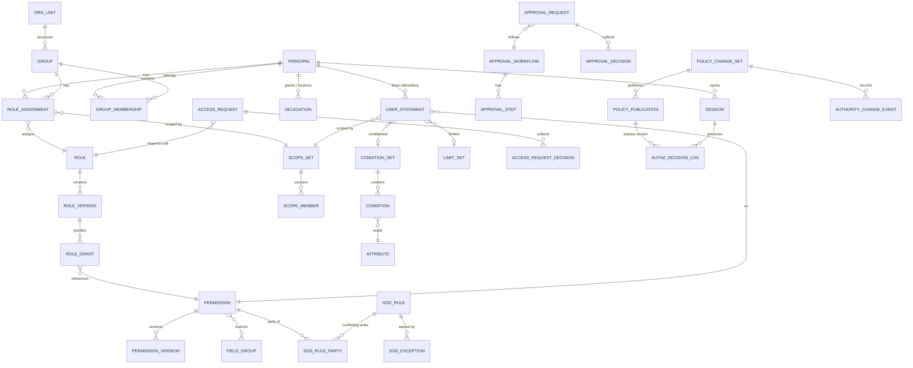

# 4 · نموذج البيانات المفاهيمي (Conceptual ERD)

> §30.4 — «نموذج البيانات والعلاقات ودورة حياة الإصدارات». مفاهيميّ: لا يفرض أسماء جداول نهائية (§19).

## 4.1 المخطط



## 4.2 الكيانات ومسؤولياتها

| الكيان | المسؤولية | مقابله الحالي (إن وُجد) |
|---|---|---|
| `PRINCIPAL` | هوية طالبة: بشريّ / خدمة / جهاز / مجهول / مدير منصّة / جلسة دعم | `users` (بشريّ فقط) — **الأنواع الأربعة الأخرى غير ممثَّلة** |
| `GROUP` / `ORG_UNIT` / `GROUP_MEMBERSHIP` | الهيكل الإداري ومصادر الإسناد | **غير موجود** |
| `ROLE` / `ROLE_VERSION` / `ROLE_GRANT` | حزمة منح ذرية مُنسَّخة | `roles` (بلا إصدارات، بخريطة JSON) |
| `ROLE_ASSIGNMENT` | ربط دور بمستخدم/مجموعة **مع نطاق ومدة وسبب ومصدر اعتماد** | `users.role` + `users.customRoleId` — **مفرد، بلا نطاق ولا مدة** |
| `PERMISSION` / `PERMISSION_VERSION` | الكتالوج الذري (§10.4) | `PERMISSION_MODULES` (25 وحدة، لا 561 صلاحية) |
| `USER_STATEMENT` | سماح/منع مباشر محدود النطاق والمدة | `users.permissionsOverride` (JSON، بلا نطاق/مدة/سبب/منع) |
| `SCOPE_SET` / `SCOPE_MEMBER` | تمثيل الفروع والوحدات والمخازن والعلاقات | `users.branchId` مفرد + `roleBranches` (**خامل**) |
| `CONDITION_SET` / `CONDITION` / `ATTRIBUTE` | شروط typed على سمات موثوقة | **غير موجود** |
| `FIELD_GROUP` / `FIELD_RESTRICTION` | العرض/التعديل/التصدير/الإخفاء | `canSeeCost` (دالّة على اسم الدور) |
| `LIMIT_SET` | المبالغ والنسب والعملات والفترات وسلوك التجاوز | عتبات ثابتة (`getApprovalThreshold`) |
| `SOD_RULE` / `SOD_RULE_PARTY` / `SOD_EXCEPTION` | التوليفات والمعاملات المتعارضة | `SOD_CONFLICTS` (5 أزواج، **غير موصولة**) |
| `APPROVAL_*` | اعتماد المنح والسياسات ومعاملات الأعمال | `vouchers.PENDING_APPROVAL` + `stockAdjustmentRequests` (لكل مجال آليّته) |
| `ACCESS_REQUEST` | طلبات الأدوار والمنح والتوسيع والإلغاء | **غير موجود** |
| `DELEGATION` | تفويض مؤقت محدد النطاق والمدة | **غير موجود** |
| `SESSION` | حالة الجلسة ومستوى الضمان والإبطال | `userSessions` ✅ **موجود وصالح للتطوير** |
| `POLICY_CHANGE_SET` / `POLICY_PUBLICATION` | دورة حياة النشر والتراجع | **غير موجود** |
| `AUTHORITY_CHANGE_EVENT` | من منح/سحب/عدّل سلطة | `auditLogs` (عامّ، غير مفصول) |
| `AUTHZ_DECISION_LOG` | لماذا سُمح أو رُفض | **غير موجود** |

## 4.3 قواعد النموذج (تنفيذ §19.1)

1. **لا SQL داخل أي صفّ سياسة.** الشروط تُخزَّن AST مغلقة ذات `schemaVersion`، والمشغّلات
   والسمات allowlisted، والاستعلام يُبنى بمعاملات آمنة خادمياً (§12.4).
2. **لا JSON حرّ مصدرَ حقيقة** للفروع أو المنح أو الحقول أو الحدود. JSON مسموح **فقط**
   لقطةَ تدقيق أو AST مُتحقَّقاً منه. ⚠️ هذا **يُلغي** النموذج الحالي `permissionsOverride: json`.
3. **لا نطاق تنظيمي دائم داخل تعريف الدور** — النطاق في التعيين (§11.1).
4. **لا حدّ خصم ولا جلسة ولا IP ولا MFA داخل صفّ الدور.**
5. **`approved_by` مفرد لا يكفي** — الموافقات المتعددة تحتاج طلباً وخطوات وقرارات.
6. **`NULL` لا يعني «كل الفروع» ولا «بلا حدّ»** — تُستعمل دلالة صريحة
   (`scope_kind = ALL_BRANCHES` مثلاً)، تنفيذاً لـ§29.10.
7. **الكود الثابت للصلاحية هو الهوية المنطقية** — لا حاجة لفرض UUID على كل جدول (§19.1).
8. **سجلّ تدقيق الأعمال يبقى منفصلاً** عن سجلّ قرارات التفويض (§22.1).
9. **tenantId**: ما دامت سياسات كل منشأة داخل قاعدتها المعزولة فلا يلزم تكراره في كل صفّ؛ فور
   نقلها لمخزن مركزيّ يصبح إلزامياً (§19.1). ⚠️ مرتبط بالفجوة ح-٣.

## 4.4 دورة حياة الإصدارات

```
  PERMISSION            ROLE                    POLICY
  ──────────            ────                    ──────
  draft                 draft                   change_set (draft)
   ↓ publish             ↓ publish               ↓ validate  (schema + مراجع)
  active  ──┐           active(v1) ──┐          ↓ simulate  (فرق أثر + مستخدمون متأثرون)
   ↓ deprecate│          ↓ new version│          ↓ review    (مراجع مستقل ≠ المنشئ)
  deprecated │          active(v2)   │          ↓ publish   (إصدار مُرقَّم)
   ↓ retire  │           ↓ retire     │          ↓ rollback  (إلى إصدار سليم سابق)
  retired  ←─┘          retired    ←─┘
```

**قواعد الإصدار:**

- تغيير **معنى** صلاحية ⇒ كود جديد أو إصدار جديد، لا تغيير صامت تحت الكود نفسه (§10.4).
- إصدار دور جديد **لا يسري تلقائياً** على التعيينات القائمة قبل نشر مُعتمَد + معاينة أثر (§21.5).
- النسخ من قالب **لا ينشئ وراثة حية** (§11.2).
- كل قرار تفويض يحمل `policyVersion` المستعمَل (§22.2) — وهو مفتاح إبطال الكاش (§15.5).

## 4.5 مسار التطوير من النموذج الحالي

| القرار | التوصية |
|---|---|
| `userSessions` | **يُطوَّر** — يُضاف مستوى الضمان و`mfaAt` و`policyEpoch`. لا بديل موازٍ (§19.1). |
| `roles` | **يُطوَّر** — تُضاف `ROLE_VERSION` و`ROLE_GRANT`؛ يبقى `baseRole` عموداً **تاريخياً للقراءة فقط** حتى المرحلة 8 ثم يُزال. |
| `users.permissionsOverride` (JSON) | **يُهاجَر** إلى `USER_STATEMENT` علائقيّ. يبقى العمود للقراءة أثناء Shadow، ويُنهى في المرحلة 8. |
| `users.branchId` مفرد | يبقى مصدر سمة، ويُبنى `SCOPE_SET` فوقه. `roleBranches` القائم (الخامل) أساس صالح. |
| `users.isOwner` | **قرار مالك** (ح-١): استثناء SoD معتمَد ذو مدة وسبب، أو إلغاء لصالح break-glass. |
| `auditLogs` | يبقى **سجلّ أعمال**؛ يُضاف سجلّان مستقلّان: تغيير السلطة، وقرارات التفويض. |
