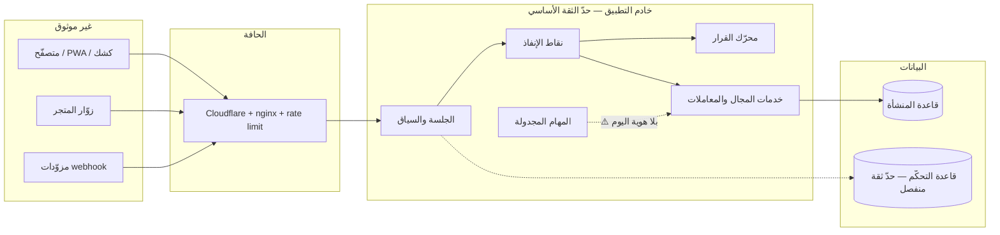

# 7 · نموذج التهديد (Threat Model)

> §30.7 — «حدود الثقة والأصول ومسارات تصعيد الامتياز وIDOR وتجاوز المنشأة أو الفرع وإساءة استخدام الإدارة».
> النطاق: **التفويض وحوكمة الوصول** فقط. لا يغطّي أمن الشبكة/الاستضافة/التشفير (مغطّاة في
> `docs/deployment-vps.md`).

## 7.1 حدود الثقة

| الحدّ | الوصف | الحالة |
|---|---|---|
| TB-1 | العميل ↔ الخادم | ✅ مصادقة + CSRF + بصمة جلسة |
| TB-2 | المنشأة ↔ المنشأة | ✅ عزل قاعدة + مستخدم MySQL مقيَّد (معطَّل في النشر الحاليّ) |
| TB-3 | إدارة المنصّة ↔ المنشأة | ✅ كوكي/JWT منفصلان تماماً |
| TB-4 | المستخدم ↔ المستخدم (داخل المنشأة) | ⚠️ **الحدّ الأضعف** — 130 نقطة بسلطة اسم دور |
| TB-5 | الفرع ↔ الفرع | ⚠️ 292 نقطة بلا بُعد فرع في بوّابتها |
| TB-6 | التكامل/المهمة ↔ التطبيق | ⚠️ المهام المجدولة بلا هوية |
| TB-7 | الإنتاج ↔ الأوفلاين | ✅ `replaySale` بقيود صارمة (نقديّ، 72 ساعة، أسعار ملتقطة) |

## 7.2 الأصول

| الأصل | التصنيف | أثر الاختراق |
|---|---|---|
| النقد والخزينة (سندات/ورديات/تحويلات) | CRITICAL | خسارة مالية مباشرة |
| الرواتب وبيانات الموظفين | CRITICAL | مالي + قانوني + خصوصية |
| كتالوج التكلفة والهوامش | HIGH | تنافسيّ |
| ذمم العملاء وحدود الائتمان | HIGH | مالي |
| مخزون البضاعة (ومنها بضاعة الأمانة — ملك الغير) | HIGH | مالي + التزام تجاه المودِع |
| PII العملاء والموردين | HIGH | خصوصية + سمعة |
| سجلّ التدقيق | HIGH | فقدان قابلية التحقيق |
| النسخ الاحتياطية | CRITICAL | تسريب كامل |
| أسرار التكاملات | CRITICAL | استيلاء على قنوات |
| السلطة نفسها (الأدوار والصلاحيات) | CRITICAL | تصعيد شامل |

## 7.3 مسارات التهديد

### T-1 · تصعيد امتياز عبر منح وحدة صريح

| البند | الوصف |
|---|---|
| **المسار** | إعطاء دور غير مُدرَج في قائمة البوّابة منحاً صريحاً بمستوى `FULL` على وحدة. `moduleAccessAllowed` يُمرّره (`shared/permissions.ts:405`) فتُفتَح **كل** إجراءات الوحدة بما فيها الحسّاس. |
| **الشاهد** | تعليق صريح في `server/trpc.ts:103-104`: «المنح الصريح FULL يفتح كل إجراءات الوحدة (بما فيها ما كان مديرياً كالإلغاءات)». |
| **الأثر** | مثال: منح `treasury=FULL` لدور تشغيليّ يفتح `voucher.approve` (صرف نقديّ) بلا اعتماد ثانٍ. |
| **الحالة** | **سلوك مقصود موثَّق** في النموذج القديم — لكنه ينتهك §8.5 «لا توسع ضمني». |
| **العلاج** | الصلاحيات الذرية: المنح يفتح الفعل المطلوب فقط. الحسّاس يحتاج منحاً صريحاً منفصلاً + SoD. |

### T-2 · تجاوز فصل المهام بعَلَم `isOwner`

| البند | الوصف |
|---|---|
| **المسار** | `server/services/voucher/create.ts:167` — `needsApproval = !actor.isOwner && (...)`. |
| **الأثر** | حامل العَلَم ينشئ سند صرف **ويعتمده ضمناً** بفعل واحد. |
| **الحالة** | مقصود (PR #402) لكنه **تجاوز صامت** — لا مدة، لا سبب إلزاميّ، لا تنبيه، لا مراجعة لاحقة. |
| **العلاج** | ح-١: استثناء SoD معتمَد بضوابط تعويضية (§16.3) أو break-glass (§18.2). **قرار مالك.** |

### T-3 · IDOR عبر مورد بلا بُعد فرع

| البند | الوصف |
|---|---|
| **المسار** | 292 نقطة بلا بُعد فرع؛ منها 57 بنمط `asserted` (يعبُر إن لم يُرسل `branchId`). |
| **الأثر** | قراءة/كتابة عبر الفروع، وتسريب PII وبيانات مالية. |
| **الحالة** | مخفَّف جزئياً بمنطق داخل المعالِجات (`scopedBranchId`) — لكن الاعتماد على المعالِج لا على البوّابة **مخالف لـ§13.1**. |
| **العلاج** | `effectiveScope` داخل الاستعلام + اختبار عضوية عبر فرعين لكل نقطة (§24.3). |

### T-4 · تصعيد عبر إدارة الصلاحيات نفسها

| البند | الوصف |
|---|---|
| **المسار** | 72 نقطة `adminProcedure` تشمل `roleRouter.*` و`userRouter.resetPassword/resetTwoFactor` و`systemRouter.resetSystem`. |
| **الأثر** | أدمن واحد يمنح نفسه أي شيء، يصفّر 2FA لأي حساب، ويمسح النظام — بفعل واحد بلا اعتماد ثانٍ. |
| **العلاج** | §25.22: «لا يستطيع مسؤول الصلاحيات منح نفسه امتيازاً حسّاساً». يلزم: maker-checker على تغيير السلطة + step-up MFA + تدقيق منفصل غير قابل للحذف من مالك السلطة. |

### T-5 · حذف/تعطيل سجلّ التدقيق من مالك السلطة

| البند | الوصف |
|---|---|
| **المسار** | `auditReadProcedure` يقصر القراءة على admin/auditor، لكن لا فصل بين «من يدير الصلاحيات» و«من يملك سجلّها». |
| **العلاج** | §22.4: صلاحية قراءة السجلّ منفصلة، ومدير الصلاحيات لا يعدّل ولا يحذف سجلّ تدقيقه؛ append-only أو tamper-evident. |

### T-6 · تسريب بالجملة عبر التصدير والطباعة والوسائط

| البند | الوصف |
|---|---|
| **المسار** | التصدير يرث صلاحية القراءة؛ `/api/backups/download` (نسخة كاملة)؛ `/api/wa/media/:messageId` (وسائط محادثات)؛ الطباعة الخام مقصورة على «وردية مفتوحة» لا على صلاحية. |
| **الأثر** | نسخة كاملة أو PII بالجملة عبر مسار لا يمرّ بالبوّابة الرئيسية. |
| **العلاج** | §29.12: صلاحيات `export`/`print`/`download`/`send` مستقلّة + سياسة حقول على التصدير + تدقيق إلزاميّ لكل تصدير حسّاس (§22.3). |

### T-7 · مهمة مجدولة بسلطة غير محددة

| البند | الوصف |
|---|---|
| **المسار** | `outboxSweeper` يرسل واتساب فعلياً؛ `reservations/lifecycle` يغيّر حالات؛ `hrDevices/bridge` يكتب حضوراً — بلا Principal. |
| **الأثر** | خطأ منطقيّ أو حقن بيانات يتحوّل إلى أثر خارجيّ بلا فاعل قابل للنسبة أو الإيقاف. |
| **العلاج** | Principal «حساب خدمة» بمالك وغرض ونطاق (§11.8) + kill switch لكلٍّ. Kill Switch موجود لواتساب — يُعمَّم. |

### T-8 · تجاوز الواجهة بطلب API مصطنع

| البند | الوصف |
|---|---|
| **المسار** | إخفاء الأزرار/الشاشات لا يمنع استدعاء نقطة tRPC مباشرة. |
| **الحالة** | ✅ الخادم يحرس في الأغلبية الساحقة — لكن الـ53 نقطة «بلا بوّابة» و30 قراءة بلا استشارة الخريطة تحتاج فحصاً فردياً. |
| **العلاج** | §24.8: اختبار «طلب API مصطنع يتجاوز الواجهة» لكل نقطة حسّاسة. |

### T-9 · Principal مجهول يكتب

| البند | الوصف |
|---|---|
| **المسار** | `storefrontRouter.createOrder`، `countPortalRouter.submit/finish` (**يكتب على المخزون**)، `recruitmentRouter.submit` (PII). |
| **العلاج** | تمثيل أنواع Principal الخمسة صراحةً بحدود ثقة ونطاق (ح-٢) + حدّ معدل + حجم + idempotency. |

### T-10 · قرار قديم بعد تغيير الصلاحية

| البند | الوصف |
|---|---|
| **المسار** | لا `policyEpoch` اليوم؛ الدور يُقرأ طازجاً كل طلب (نقطة قوة) لكن لا آلية إبطال لكاش قرار مستقبليّ. |
| **العلاج** | `authorization epoch` + إبطال موثوق + قياس زمن الانتشار (§15.5) + SLO معلن ومختبَر (§25.18). |

### T-11 · انحراف بين المعاينة والإنفاذ

| البند | الوصف |
|---|---|
| **المسار** | الواجهة تحسب القرار بمنطق موازٍ (`hasModuleAccess` مشتركة لكنها **إعادة حساب** لا استهلاك نتيجة). |
| **الحالة** | سابقة موثَّقة: شكوى المالك «فتحتُ الصلاحية ولم تُطبَّق» (٦/٧). |
| **العلاج** | §21.4 + §25.8: المحاكي والمعاينة يستدعيان محرك القرار نفسه؛ التطابق بوابة قبول. |

### T-12 · إعادة إدخال الأنماط القديمة بعد الانتقال

| البند | الوصف |
|---|---|
| **المسار** | مطوّر يضيف `managerProcedure` أو `ctx.user.role === "admin"` في نقطة جديدة. |
| **العلاج** | §25.26: حارس CI يمنع raw-role gates ونقاط غير مسجّلة. `scripts/authz-inventory.mjs --check` هو الأساس. |

## 7.4 مصفوفة المخاطر

| المسار | الاحتمال | الأثر | الأولوية |
|---|---|---|---|
| T-2 تجاوز SoD بـ`isOwner` | متوسط | CRITICAL | **P0 — قرار مالك** |
| T-4 تصعيد عبر إدارة الصلاحيات | منخفض | CRITICAL | **P0** |
| T-1 تصعيد عبر منح `FULL` | **مرتفع** | HIGH | **P0** |
| T-3 IDOR عبر الفرع | متوسط | HIGH | P1 |
| T-6 تسريب بالتصدير/الوسائط | متوسط | HIGH | P1 |
| T-7 مهمة بلا هوية | منخفض | HIGH | P1 |
| T-5 حذف سجلّ التدقيق | منخفض | HIGH | P1 |
| T-9 Principal مجهول يكتب | متوسط | MEDIUM | P2 |
| T-10 قرار قديم | متوسط | MEDIUM | P2 |
| T-11 انحراف المعاينة | **مرتفع** | MEDIUM | P2 |
| T-8 تجاوز الواجهة | منخفض | MEDIUM | P2 |
| T-12 انحدار بعد الانتقال | **مرتفع** | HIGH | P1 |

## 7.5 افتراضات وحدود

1. الخادم غير مخترَق؛ من يملك تنفيذ كود على الخادم خارج هذا النموذج.
2. قاعدة البيانات لا يُوصَل إليها مباشرة من الإنترنت (مؤكَّد: `127.0.0.1:3307`).
3. النسخ الاحتياطية مشفَّرة gpg ومنقولة بقناة موثوقة.
4. مالك المنظومة موثوق **إدارياً** — لكن SoD لا يُبنى على الثقة بل على البنية (لهذا T-2 و T-4 قائمان).
5. **لم يُغطَّ:** أمن سلسلة التوريد للحزم، وتحليل الأثر الجانبي داخل الخدمات (نقطة تبدو قراءةً
   وتُصدِر واتساب/طباعة). الثاني بند صريح في المرحلة 1.
