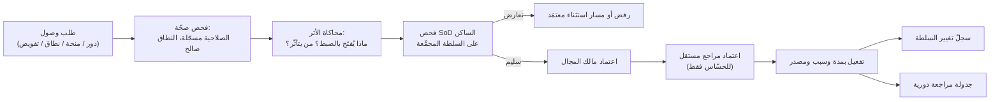

# 9 · تصميم فصل الموافقات (Approval Separation Design)

> §30.9 — «فصل منح الوصول ونشر السياسة ومعاملة الأعمال». تنفيذ §17.

## 9.1 الأنواع الثلاثة — لا تُخلط أبداً

| النوع | يجيز | لا يجيز | من يعتمد |
|---|---|---|---|
| **أ · موافقة منح الوصول** | تعيين دور، منح مباشر، توسيع نطاق، تفويض مؤقت، break-glass | تنفيذ معاملة | مالك المجال + مراجع مستقل |
| **ب · موافقة نشر السياسة** | تعديل دور حسّاس، إضافة/إزالة صلاحية حسّاسة، تغيير قاعدة SoD، تغيير عتبة أو نطاق واسع | منح وصول لشخص | مراجع مستقل مخوَّل ≠ المنشئ |
| **ج · موافقة معاملة أعمال** | إلغاء/عكس، خصم فوق الحد، تعديل ائتمان، اعتماد سند أو تسوية، مشاركة خارجية | **توسيع صلاحية أو نطاق** | معتمِد مخوَّل مسبقاً |

**القاعدة الحاكمة (§14.5، §29.13):** الموافقة **لا تتغلب على غياب الصلاحية**. من لا يملك
`treasury.voucher.approve` لا يصبح معتمِداً لأن أحداً «وافق». الموافقة تُجيز **طلباً محدداً**
لمن يملك الحق أصلاً.

## 9.2 لماذا الفصل ضروريّ هنا تحديداً

النظام اليوم يخلط النوعين (أ) و(ج) ضمناً: منح `treasury=FULL` (منح وصول) يفتح `voucher.approve`
(سلطة اعتماد معاملات) دفعةً واحدة. أي أن **منح وصول يمنح سلطة اعتماد** — وهو بالضبط الخلط الذي
يوجب هذا الفصل.

## 9.3 حالة الموافقات القائمة

النظام يملك **آليات موافقة ناضجة على معاملات الأعمال** (النوع ج) — تُحفَظ وتُوحَّد لا تُستبدل:

| المجال | الآلية | الحالة |
|---|---|---|
| سندات الصرف | `PENDING_APPROVAL` + `approveVoucher` + عتبة | ✅ ناضج |
| بضاعة الأمانة | كل سند صرف لمودِع `PENDING_APPROVAL` **دائماً** + سقف يُعاد فحصه عند الاعتماد تحت القفل | ✅ نموذجيّ |
| تسوية المخزون | `stockAdjustmentRequests` + فحص تفاؤليّ على الرصيد الحيّ | ✅ ناضج |
| الجرد | توقيعان دائماً + منشئ/عادّ ≠ معتمِد | ✅ ناضج |
| العمولات | اعتماد التشغيلة + معتمِد ≠ محتسِب | ✅ |
| ائتمان COD | `managerOverrideByUserId` يجب أن يكون مديراً مُتحقَّقاً | 🟡 raw-role |
| البثّ التسويقي | اعتماد ثانٍ (SOD) + فرض `OPTED_IN` | ✅ |

**الفجوة:** لا يوجد **أي** آلية للنوعين (أ) و(ب). تغيير الأدوار والصلاحيات اليوم فعل
`adminProcedure` أحاديّ فوريّ بلا طلب ولا اعتماد ولا معاينة أثر ولا تراجع.

## 9.4 عقد طلب الموافقة (§17.2)

```
ApprovalRequest {
  id, type: ACCESS_GRANT | POLICY_PUBLISH | BUSINESS_TXN,
  actionCode,                    // كود الصلاحية الذرية
  resource: { type, id },
  resourceStateFingerprint,      // بصمة حالة المورد وقت الطلب (يسدّ د-٤)
  values: { amount?, currency?, percent?, oldValue?, newValue? },
  requestedBy, requestedAt,
  reason,                        // إلزاميّ
  triggeringPolicy: { policyId, ruleId, policyVersion },
  workflow: { steps[], approvers[], quorum },
  expiresAt,
  consumption: { status: UNUSED | CONSUMED | EXPIRED | INVALIDATED, consumedAt, consumedBy },
  idempotencyKey
}
```

**`resourceStateFingerprint` بدل «تغيّر جوهريّ»** (سدّ د-٤): بصمة محسوبة من الحقول التي تُبنى
عليها الموافقة (المبلغ، الحالة، الطرف، الأسطر). أي اختلاف عند التنفيذ ⇒ الموافقة **باطلة**
بلا اجتهاد.

## 9.5 التنفيذ بعد الموافقة (§17.3)

مُلزِم — بالترتيب:

1. **إعادة تقييم التفويض كاملاً** عند التنفيذ (لا يُفترض بقاء الحق).
2. **إعادة فحص النطاق** — الموافقة لا تنفّذ خارج نطاق مقدّم الطلب.
3. **مطابقة بصمة الحالة** — عدم التطابق ⇒ إبطال.
4. **الاستهلاك مرة واحدة** (`single-use`) داخل المعاملة نفسها التي تُحدث الأثر — لا قبلها.
5. **الأقفال والمعاملة الذرّية** تبقى مسؤولية خدمة المجال (`withTx`).
6. **منع اعتماد الذات** — بنيوياً لا بمراجعة.
7. **التصعيد يعيد التوجيه** إلى معتمِد **مخوَّل مسبقاً**، ولا يوسّع سلطة الموافقة تلقائياً.

⚠️ **سابقة موثَّقة في هذا المشروع:** «تحصيل مزدوج عند ارتداد قسط» (#308) و«bounceCheck المزدوج»
(#307) — كلاهما فشل استهلاك/إعادة تشغيل. البند 4 ليس نظرياً هنا.

## 9.6 workflow منح الوصول (النوع أ) — الجديد



**قواعد:** مقدّم الطلب ≠ معتمِده · المستفيد لا يعتمد لنفسه · المنح المؤقت له تاريخ انتهاء
**إلزاميّ** · التفويض لا يتجاوز نطاق المفوِّض ولا يسلسل (عمق 1 في الإصدار الأول، §11.9).

## 9.7 workflow نشر السياسة (النوع ب) — الجديد

`مسودّة → فحص صحّة → محاكاة → فرق قبل/بعد → قائمة المتأثرين → فحص SoD → مراجعة → اعتماد → نشر بإصدار → (تراجع)`

**بوابات إلزامية:**

- **لا نشر بلا معاينة أثر**: عدد المستخدمين المتأثرين + الصلاحيات المضافة والمسحوبة.
- **مراجع مستقل ≠ المنشئ** لأي تغيير حسّاس (§27 الفقرة الأخيرة).
- **step-up MFA** عند النشر.
- **كل نشر إصدارٌ مُرقَّم** قابل للتراجع إلى إصدار سليم سابق (§29.19 — لا رجوع إلى legacy الأوسع).

## 9.8 مصفوفة التوجيه الأولية (تحتاج اعتماد مالك — §31.5)

| الفعل | العتبة | المعتمِد | الخطوات |
|---|---|---|---|
| سند صرف | > العتبة الحالية | مدير/محاسب ≠ المنشئ | 1 |
| سند صرف لمودِع أمانة | **أي مبلغ** | مدير ≠ المنشئ | 1 |
| تسوية مخزون | أي كمية | مدير آخر | 1 |
| جرد | أي جلسة | توقيعان | 2 |
| خصم فوق الحد | حسب المصفوفة | مدير | 1 |
| إلغاء/عكس ماليّ | أي | مدير + MFA | 1 |
| تعيين دور حسّاس | أي | مالك المجال + مراجع مستقل | 2 |
| نشر سياسة حسّاسة | أي | مراجع مستقل + MFA | 1–2 |
| break-glass | أي | إشعار فوريّ + مراجعة بعدية ضمن SLA | 0 قبل / 1 بعد |
| استثناء SoD | أي | مالك المخاطر ≠ المستفيد | 1 |

**العتبات والعملات والمعتمِدون بالاسم قرار مالك** — لا تُثبَّت في الكود (§31، §29.15).
