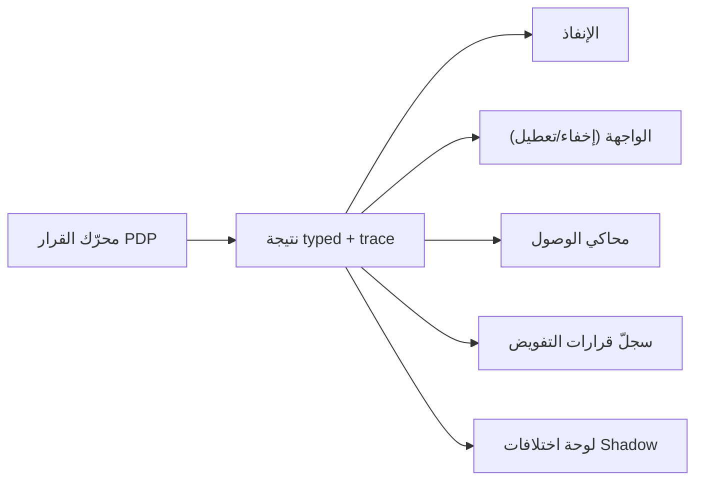

# 11 · تصميم تفسير القرار (Decision Trace Design)

> §30.11 — «كيف يفسر كل سماح ورفض». تنفيذ §8.8، §14.6، §22.2.

## 11.1 مستويات التفسير الثلاثة

| المستوى | الجمهور | المحتوى | من يراه |
|---|---|---|---|
| **T0 — رسالة المستخدم** | المستخدم النهائيّ | سبب عربيّ مفهوم بلا تفاصيل استكشافية | الجميع |
| **T1 — ملخّص القرار** | المدير الإداريّ | المنحة المطابقة، مصدرها، النطاق، الشرط، الالتزامات | من يملك `iam.decision.view` |
| **T2 — التتبّع الكامل** | مسؤول الأمن/التدقيق | كل statement مُقيَّم، سبب استبعاد كلٍّ، القيم، إصدار السياسة | من يملك `audit.decision_trace.view` |

**قاعدة أمنية (§14.6):** T0 لا يكشف وجود مورد لا يملك المستخدم رؤيته، ولا يميّز «غير موجود» عن
«ممنوع» حين يكون التمييز نفسه تسريباً (§24.8).

## 11.2 رسائل T0 — مجموعة مغلقة

| `reasonCode` | الرسالة العربية | ملاحظة |
|---|---|---|
| `NO_GRANT` | «هذا الإجراء غير متاح لحسابك.» | لا يذكر اسم الصلاحية |
| `SCOPE_MISMATCH` | «هذا السجل خارج نطاق عملك.» | |
| `TENANT_BOUNDARY` | «هذا السجل غير متاح.» | لا يلمّح لوجود منشأة أخرى |
| `EXPLICIT_DENY` | «هذا الإجراء ممنوع على حسابك — راجع مديرك.» | |
| `SOD_*` | «لا يمكنك تنفيذ هذه الخطوة لأنك نفّذت خطوة سابقة على السجل نفسه.» | تفسير مفهوم بلا كشف القاعدة |
| `CONDITION_FAILED` | «حالة السجل لا تسمح بهذا الإجراء الآن.» | |
| `LIMIT_EXCEEDED_HARD` | «القيمة تتجاوز الحد المسموح لحسابك.» | لا يذكر الحدّ (يُذكر إن كان معلناً للمستخدم) |
| `MFA_REQUIRED` / `MFA_STALE` | «يلزم تأكيد هويتك لإتمام هذا الإجراء.» | |
| `APPROVAL_REQUIRED` | «يحتاج هذا الإجراء اعتماداً — أُرسل الطلب.» | + رقم الطلب |
| `USER_DISABLED` / `SESSION_INVALID` | «انتهت جلستك — يلزم تسجيل الدخول.» | |
| `POLICY_ERROR` / `ATTRIBUTE_MISSING` | «تعذّر التحقق من الصلاحية — تواصل مع الدعم.» | **+ رمز متابعة** |

⚠️ الرمز الأخير يتّبع النمط القائم في `server/trpc.ts:24-26` (`correlationId` يُلحق بالرسالة
العامة فقط) — نمط ناجح يُعمَّم لا يُعاد اختراعه.

## 11.3 بنية T2

```
DecisionTrace {
  decisionId, traceId, at, policyVersion,
  principal:  { type, id, sessionId, assuranceLevel, mfaAt },
  request:    { action, resourceType, resourceId, channel },
  phases: [
    { phase: "TENANT",     result: "PASS", detail: {...} },
    { phase: "IDENTITY",   result: "PASS", detail: {...} },
    { phase: "REGISTRY",   result: "PASS", detail: { permissionId, version } },
    { phase: "ATTRIBUTES", result: "PASS", loaded: [{ name, value, source, age }] },
    { phase: "HARD_DENY",  result: "PASS", evaluated: [ruleIds] },
    { phase: "SOD",        result: "PASS", evaluated: [ruleIds] },
    { phase: "STATEMENTS", result: "PARTIAL", statements: [
        { id, source: "ROLE_ASSIGNMENT#12", permission, scope, conditions,
          fields, limits, validity, outcome: "MATCH" | "SCOPE_MISS" | "CONDITION_FAIL",
          failedOn: "condition:status" }
      ] },
    { phase: "MERGE",      result: "PERMIT_CANDIDATE", winningStatementId },
    { phase: "FIELDS",     result: "PASS", allowed: [], masked: [] },
    { phase: "LIMITS",     result: "PASS", applied: {...} },
    { phase: "OBLIGATIONS",result: "PENDING", required: ["MFA_STEP_UP"] }
  ],
  outcome, reasonCode
}
```

**قاعدة حاسمة:** التتبّع يسجّل **سبب استبعاد كل statement لم يُطابق**، لا المطابق فقط. بدون ذلك
لا يمكن الإجابة عن «لماذا لم يُسمح لي رغم أن لي الدور؟» — وهي شكوى المالك التاريخية بعينها.

## 11.4 مبدأ المصدر الواحد



- المحاكي **يستدعي المحرك نفسه** لا نسخة منطقية (§21.4).
- الواجهة **تستهلك النتيجة** لا تعيد حسابها (§8.3) — هذا يُنهي فئة الخطأ T-11.
- التطابق بين الثلاثة **بوابة قبول** (§25.8) واختبار مستمرّ (§24.8).

## 11.5 التسجيل (§22.2، §22.3)

| الحدث | يُسجَّل؟ | المستوى | الاحتفاظ المقترح |
|---|---|---|---|
| رفض على فعل حسّاس | **دائماً** | T2 كامل | 24 شهراً |
| رفض عاديّ | نعم — **قابل للتجميع** (عدد + نافذة + فاعل + نوع القرار + traceIds) | T1 | 90 يوماً |
| سماح حسّاس | **دائماً** | T2 كامل | 24 شهراً |
| سماح عاديّ | مقاييس + trace بالعيّنة | مقياس | 30 يوماً |
| break-glass / impersonation | **دائماً** + إشعار فوريّ | T2 كامل | 36 شهراً |
| تصدير/مشاركة بيانات حسّاسة | **دائماً** | T2 كامل | 24 شهراً |
| كل طلب وقرار موافقة | **دائماً** | T2 كامل | 36 شهراً |
| كل تغيير سلطة | **دائماً داخل معاملة التغيير** | سجلّ منفصل | دائم |

**قيد تشغيليّ مُلزِم (سدّ ج-٦):** ميزانية الحجم جزء من §14 Performance Budget، لا قراراً تشغيلياً
لاحقاً. سابقة: سجلّ التدقيق سقط بـ`Out of sort memory` تحت الحجم.

**التجميع مسموح بشرط عدم فقد:** العدد · النافذة الزمنية · الفاعل · نوع القرار · معرّفات التتبع
اللازمة للتحقيق (§22.3).

## 11.6 حماية السجلّ (§22.4)

1. **Append-only** لسجلّ تغيير السلطة وقرارات break-glass؛ tamper-evident (سلسلة hash) للباقي
   حسب مستوى الخطر.
2. **لا payload حسّاس ولا أسرار** داخل التتبّع — قيم الحقول الحسّاسة تُخزَّن كبصمة أو تُحذف.
3. **صلاحية قراءة السجلّ منفصلة** عن صلاحية إدارة الصلاحيات (S-12).
4. **مدير الصلاحيات لا يعدّل ولا يحذف سجلّ تدقيقه** — قيد بنيويّ لا سياسة.
5. **مراقبة فقد الأحداث أو تأخّرها** — عدّاد مكتوب/مفقود + تنبيه.

## 11.7 السجلّات الثلاثة المنفصلة (§22.1)

| السجلّ | يجيب عن | المصدر الحاليّ |
|---|---|---|
| سجلّ الأعمال | ماذا تغيّر في الفاتورة/السند/العميل؟ | ✅ `auditLogs` (37 راوتراً) |
| سجلّ التفويض | لماذا سُمح أو رُفض؟ | ❌ غير موجود (اليوم: تحذير pino عابر عند FORBIDDEN، `trpc.ts:31`) |
| سجلّ تغيير السلطة | من منح/سحب/عدّل دوراً أو سياسة؟ | 🟡 مخلوط داخل `auditLogs` |

الفصل شرط §22.1 — ودمجها يجعل «من غيّر سلطتي؟» سؤالاً يحتاج مسحاً يدوياً.
