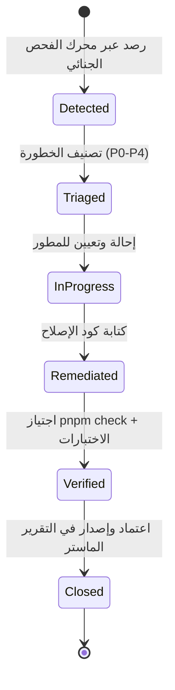

# بروتوكول الاقتراحات والتحسينات والمعالجة الجنائية — ERPM-Remediation & Improvements Protocol v1.0
## نظام إدارة أعمال «الرؤية العربية للتجارة العامة» (v2)

> **المرجع الحاكم:** [`docs/erpm-forensic-protocol.md`](erpm-forensic-protocol.md)  
> **القاعدة المؤسسية الحاكمة:** لا دينار يضيع بصمت، ولا ملاحظة جنائية تُهمل بلا تتبع أو إغلاق قطعي مُثبت.

---

## ١. الفلسفة المؤسسية: من الرصد الجنائي إلى المعالجة الجذرية

الكشف الجنائي الذري لنظام الـ ERP ينتج عنه بطاقات عيوب (`Defect Cards`) وملاحظات تحسينية عبر المستويات التسعة. هذا البروتوكول يحدد **المسار الهندسي والإجرائي الصارم** لتحويل كل ملاحظة إلى تحسين مُثبت ومُعتمد، دون إدخال أي انحدار برمجي (`Zero-Regression`).

### المبادئ الأربعة للمعالجة الجنائية:
1. **علاج السبب الجذري (Root Cause Fix):** معالجة المنبع البرمجي لا الأعراض الخارجية (مثل إضافة قفل تشاؤمي أو حارس نوعي صريح بدلاً من مجرد إخفاء رسالة الخطأ).
2. **التحقق الذري الصارم (Atomic Verification):** لا تُغلق أي بطاقة عيب إلا بعد اجتياز اختبار وحدة مخصص وتأكيد محرك الفحص الجنائي.
3. **عدم الانحدار (Zero-Regression):** كل معالجة يجب أن تُبقي الأنواع خضراء (`pnpm check`) وتجتاز كامل حزمة الحرّاس (`check:guards`).
4. **المسؤولية والتتبع (Traceability):** كل تحسين يرتبط ببطاقة عيب محددة ومعرف نقطة تفتيش فريد (`Checkpoint ID`).

---

## ٢. دورة حياة الملاحظة الجنائية (Defect Lifecycle)



### توصيف الحالات:
- **`Detected` (مرصود):** تم كشف الملاحظة آلياً أو يدوياً وتوليد بطاقة العيب `DEF-XXX`.
- **`Triaged` (مُصنّف):** تحديد مستوى الأولوية الفنية والمالية ونصف قطر الانفجار (`Blast Radius`).
- **`InProgress` (قيد المعالجة):** البدء في كتابة كود المعالجة وعزل التغيير.
- **`Remediated` (مُعالج):** تطبيق التعديل البرمجي وإزالة مسبب الخلل.
- **`Verified` (مُثبت):** اجتياز اختبارات الوحدة وفحص الأنواع وحرّاس الجودة بنسبة 100%.
- **`Closed` (مُغلق):** تسجيل الإغلاق في سجل التدقيق الجنائي وتحديث مؤشر سلامة النظام ($SII$).

---

## ٣. مصفوفة اتفاقية مستوى الخدمة للإصلاح (Remediation SLA Matrix)

| مستوى الخطورة | التوصيف الجنائي | أمثلة عملية | المهلة القصوى للإصلاح (SLA) | متطلبات الاعتماد |
|:---:|:---|:---|:---:|:---|
| **`P0` (حرج ومصيري)** | ثغرة أمنية مفتوحة، فقدان ذرية في مسار مالي، أو تعامل بفاصلة عائمة على الأموال | مسار تعديل بدون مصادقة، كتابة قيود محاسبية دون `withTx` | **٤ ساعات** | موافقة المالك + حارس آلي يمنع تكراره |
| **`P1` (خلل وظيفي عالي)** | قيد غير متوازن، كسر تسلسل ترقيم الفواتير، أو خطر سباق تنافسي غير مقفول | تعديل رصيد نقدي دون قفل تشاؤمي، خطأ حسابي في ضريبة/خصم | **٢٤ ساعة** | اختبار وحدة مخصص + اجتياز التدقيق |
| **`P2` (متوسط / وقائي)** | خطر نقر مزدوج على زر ترحيل، استعلام متكرر N+1 يهدد الأداء | زر نموذج بدون `disabled={isPending}`، حلقة استعلامات في خدمة | **٧ أيام عمل** | مراجعة الكود + تحديث المكون |
| **`P3` (منخفض / كود)** | كتل catch فارغة قد تخفي أخطاء غير خطيرة، أو تكرار استيراد | ابتلاع خطأ إشعار غير حرج في كتلة catch | **١٤ يوم عمل** | توثيق أو تسجيل الخطأ في السجل |
| **`P4` (تحسين موضعي)** | تسميات واجهة، توحيد نصوص، أو تحسين أداء هوامش | تحسين صياغة رسالة توجيهية للمستخدم | **مجدولة حسب الأولويات** | مراجعة جودة المنتج |

---

## ٤. مسارات المعالجة التقنية الأربعة (Technical Remediation Tracks)

### المسار الأول: السلامة المالية والتزامن (Financial Concurrency Track)
- **القاعدة الحاكمة:** لا تعديل لأرصدة الصناديق أو الخزائن أو المخزون دون قفل تنافسي صريح.
- **أنماط القفل المعتمدة:**
  1. القفل التشاؤمي في Drizzle: `.for('update')` داخل استعلام القراءة السابق للتعديل.
  2. القفل التشاؤمي في SQL الخام: `SELECT ... FOR UPDATE`.
  3. القفل الموزع للأرقام التسلسلية: `SELECT GET_LOCK(...)`.
  4. التحقق التفاؤلي عبر إصدار الصف: `WHERE id = ? AND version = ?`.

### المسار الثاني: الأمان وإحكام بوابات tRPC (Security & Contract Hardening)
- **القاعدة الحاكمة:** حظر أي `publicProcedure.mutation` باستثناء بوابات الدخول المعتمدة صراحة.
- **إحكام عقود الإدخال (Input Schemas):**
  - العمليات ذات المدخلات: إلزام مخطط `z.object({...})` مع تعقيم الحقول والحد الأقصى للأطوال.
  - العمليات عديمة المدخلات (`Void Mutations` مثل `logout`): إما تحديد `z.void().optional()` أو توثيقها كإجراء خروج صريح بلا حمولة لمنع حقن الحمولات غير المتوقعة.

### المسار الثالث: الأداء وقابلية التوسع (Performance & Query Batching)
- **القاعدة الحاكمة:** منع استدعاء `await db.select` أو `await tx.select` داخل حلقات تكرارية (`for ... of`).
- **نمط المعالجة المعتمد:**
  ```typescript
  // النمط المحظور (N+1 Query)
  for (const id of ids) {
    const item = await db.select().from(table).where(eq(table.id, id));
  }

  // النمط المعتمد (Batch Query)
  const items = await db.select().from(table).where(inArray(table.id, ids));
  ```

### المسار الرابع: تجربة المستخدم وحظر النقر المزدوج (UX Submit Hardening)
- **القاعدة الحاكمة:** كل زر يُحدث تغييراً في حالة النظام (حفظ، ترحيل، دفع، إرجاع) يجب أن يُعطل أثناء المعالجة:
  ```tsx
  <Button disabled={mutation.isPending} onClick={() => mutation.mutate()}>
    {mutation.isPending ? "جاري الحفظ..." : "حفظ"}
  </Button>
  ```

---

## ٥. مصفوفة التحقق والموافقة على التحسينات (Sign-off Matrix)

قبل اعتماد أي حزمة تحسينات وتقديمها للمراجعة النهائية:
1. `pnpm check`: التأكد من عدم وجود أي خطأ في فحص الأنواع الصارم.
2. `node scripts/check-guards-registered.mjs`: التأكد من بقاء كامل الحرّاس الـ 42 مسجلة ومطابقة في CI.
3. `pnpm audit:erpm`: تشغيل الفحص الجنائي الشامل وتأكيد ارتفاع مؤشر سلامة النظام ($SII$).
4. إصدار تقرير المراجعة التنفيذي في `docs/ERPM-IMPROVEMENTS-REVIEW-YYYY-MM-DD.md`.
