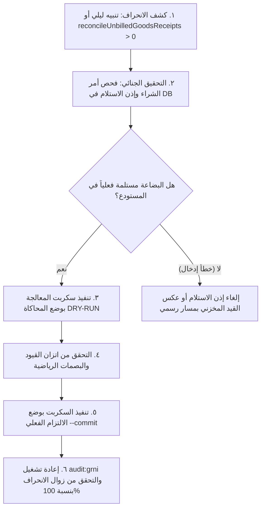

# دليل التحقيق المحاسبي وبروتوكول حوكمة المطابقة الثلاثية ووسيط GRNI
## (Playbook & Lessons Learned: 3-Way Matching & GRNI Integrity)

> **وثيقة تعلّم مؤسسي وحوكمة محاسبية دائمة** — صادرة عن أمانة الجودة والحوكمة في نظام إدارة أعمال الرؤية العربية.
> تُعد هذه الوثيقة مرجعاً ملزماً لأي محاسب، مهندس برمجيات، أو وكيل ذكاء اصطناعي يعمل على دورة المشتريات، المخزون، أو قيود الأستاذ العام (GL).

---

## ١. ملخص الحادثة وجذور المشكلة (Forensic Incident Analysis: PO-94)

### ١.١ السياق التاريخي والانتقال المعماري
في مطلع أيلول ٢٠٢٦ (PR #923 / #925 / #926)، انتقل نظام الرؤية العربية معمارياً من نموذج الشراء القديم (حيث كان استلام البضاعة أو إنشاء الفاتورة يتم بمسارات متفرقة أو بتأثيرات مباشرة على الذمة) إلى **منظومة المطابقة الثلاثية الصارمة (3-Way Matching)** والحوكمة المقيدة:
- أصبحت دورة الشراء تتكون من:
  1. أمر الشراء (`purchaseOrders`): يبدأ كمسودة `DRAFT` بدون أي أثر مخزني أو مالي.
  2. الإرسال للاعتماد: ينتقل إلى `SENT` وينشئ طلب اعتماد مراجعة `APPROVE_REVISION` مع فصل المهام (Maker-Checker).
  3. الاعتماد والاستلام الذري: يقر المعتمد وصول البضاعة كاملاً، فينفذ النظام سلسلة ذرية في معاملة واحدة (`withTx`):
     $$\text{GRN (إذن استلام مخزني)} \longrightarrow \text{حركة مخزون وWAVG} \longrightarrow \text{قيد وسيط GRNI} \longrightarrow \text{فاتورة المورد والمطابقة الثلاثية} \longrightarrow \text{ترحيل الذمة AP}$$

### ١.٢ ما حدث في أمر الشراء PO-94 (إذن استلام GRN 128)
أثناء فترة الانتقال المعماري، صدر أمر الشراء الآجل رقم `PO-94` للمورد **«مطبعة دار المغرب 2027»** (معرف المورد: `11`) بمبلغ إجمالي **1,155,000 دينار عراقي** لقاء توريد ملازم دراسية (120 نسخة عبر 9 بنود).
- تم ترحيل إذن استلام مخزني رقم `GRN 128` بحالة `POSTED` وكتب النظام قيد إثبات البضاعة في المخزون مقابل وسيط الاستلام غير المفوتر:
  - **من حـ/ المخزون (Inventory)**: 1,155,000 د.ع (مدين).
  - **إلى حـ/ بضاعة مستلمة غير مفوترة (GRNI)**: 1,155,000 د.ع (دائن) بقيد `GRNI:RECEIPT:128`.
- **الخلل الحرج**: لم تُستكمل حلقة إنشاء فاتورة المورد ومطابقتها وترحيلها إلى الذمم الدائنة (AP)؛ إما بسبب انقطاع أثناء المعالجة أو استخدام مسار استلام جزئي لم يكن مدمجاً ذرياً مع ترحيل الفاتورة في تلك اللحظة.

### ١.٣ الآثار المحاسبية والتشغيلية المترتبة
1. **تضخم وهمي في المخزون مقابل وسيط معلق**: دخلت الملازم إلى رفوف المكتبة وارتفع رصيد المخزون، وظل حساب وسيط GRNI يحمل رصيداً دائناً بقيمة 1,155,000 د.ع.
2. **غياب الذمة الدائنة للمورد (AP Blindspot)**: لم يُنشأ قيد `GRNI:SUPPLIER_INVOICE`، ولم يُسجل أي التزام على المورد في `suppliers.currentBalance`، فبقي رصيد المورد مسجلاً (0.00 د.ع).
3. **كشف حساب المورد الأعمى**: عند فتح كشف حساب «مطبعة دار المغرب 2027» (`SupplierStatement.tsx`)، لم يظهر أمر الشراء أو الاستلام نهائياً، لأن الكشف كان يعتمد فقط على الفواتير المرحلة والقيود المؤثرة على AP.
4. **خطر تجاري ومحاسبي جسيم**: المحل يدين للمطبعة بأكثر من مليون دينار، لكن دفاتره الرسمية وكشوفاته تظهر أنه لا يدين بشيء، مما يعرض الشركة لمطالبات مفاجئة أو تشويه في القوائم المالية الشهرية.

---

## ٢. القواعد المحاسبية الصارمة (Strict Accounting Invariants)

لتفادي تكرار هذه الفجوة إلى الأبد، أُقرت القواعد الحتمية التالية التي لا يجوز كسرها برمجياً أو إجرائياً:

### القاعدة الأولى: عدم بقاء وسيط GRNI بلا ترحيل فاتورة مورد موازية
> **قاعدة إخلاء وسيط الاستلام (GRNI Clearing Invariant):**
> حساب وسيط البضاعة المستلمة غير المفوترة (GRNI - Goods Receipt Not Invoiced) هو حساب وسيط عابر لطبيعة التوقيت بين الاستلام المادي واستلام فاتورة المورد المالية.
> - **كل إذن استلام أصيل (`goodsReceipts.origin = 'NATIVE'`) بحالة مرحلة (`POSTED`) يجب أن يُقابله في النهاية فاتورة مورد مرحلة (`supplierInvoices.status = 'POSTED'`) وقيد تصفية وسيط (`GRNI:SUPPLIER_INVOICE:<id>`).**
> - المعادلة المحاسبية الحاكمة لاتزان الوسيط:
>   $$\sum \text{GRNI Credits (Receipts)} - \sum \text{GRNI Debits (Invoices)} = \sum \text{Unbilled Native Goods Receipts}$$
> - بقاء أي رصيد في GRNI لا يقابله إذن استلام فعلي قيد المراجعة يُعد انحرافاً مالياً محظوراً.

### القاعدة الثانية: تطابق رصيد المورد في كشف الحساب مع قيود AP في الأستاذ العام
> **قاعدة تطابق ذمة المورد (Supplier AP Balance Invariant):**
> رصيد المورد المخزن في جدول `suppliers.currentBalance` ليس رقماً حراً يُعدل عشوائياً، بل هو انعكاس رياضي حتمي لمجموع قيود الذمم الدائنة في الأستاذ العام:
> $$\text{suppliers.currentBalance} \equiv \sum_{\text{All AP Entries}} (\text{PURCHASE} + \text{OPENING} + \text{PAYMENT\_IN} + \text{RETURN} + \text{GRNI:SUPPLIER\_INVOICE} - \text{PAYMENT\_OUT} - \text{EXCHANGE\_SETTLE} - \text{GRNI:REVERSAL})$$
> - **أي إذن استلام بضاعة غير مفوتر يجب أن يُفصح عنه فوراً في كشف الحساب كبند رقابي منفصل (`unbilledReceipts`) حتى لا يُضلل المحاسب أو المورد بأن الرصيد النهائي صفري.**

### القاعدة الثالثة: الذرية الكاملة في دورة الشراء الحديثة
> **قاعدة الذرية (Atomic 3-Way Matching):**
> لا يجوز فصل الاستلام المخزني عن إنشاء فاتورة المورد في العمليات التشغيلية اليومية.
> - تنفيذ اعتماد الشراء في `decidePurchaseOrderControl` مشروط بـ `confirmedFullReceipt=true`.
> - المعاملة ذرية: فشل ترحيل فاتورة المورد، أو فشل المطابقة، أو فشل قيد الذمة AP $\Longrightarrow$ يتراجع استلام المخزون وحركة WAVG وقيد GRNI فوراً وبشكل كامل (`ROLLBACK`).

### القاعدة الرابعة: مبدأ المالك الحاكم §٥
> **«لا دينار يضيع بصمت أو يُهدر أو يختفي أو ليس له مسار أو تبويب.»**
> بضاعة دخلت المستودع = التزام مالي نشأ للمورد = إفصاح فوري في القوائم والتقارير الرقابية.

---

## ٣. دليل إجراءات التحقيق والمعالجة القياسية (Forensic Investigation & Remediation SOP)

عند ظهور تنبيه رقابي عن وجود إذن استلام عالق أو انحراف في رصيد مورد، يجب اتباع الخطوات التالية حصراً:



### الخطوة الأولى: الكشف والتحري (Detection)
- الفحص عبر أداة التدقيق الميكانيكية:
  ```bash
  pnpm audit:grni
  ```
- أو عبر شاشة تدقيق التوافق المالي `/reconcile` (قسم: «أذونات استلام بضاعة غير مفوترة GRNI»).
- أو عبر تنبيه الفحص الليلي التلقائي (`reconcile-drift`).

### الخطوة الثانية: التحقيق الميداني والمستندي (Investigation)
1. استخراج بيانات إذن الاستلام العالق:
   ```sql
   SELECT gr.id, gr.receiptNumber, gr.purchaseOrderId, gr.supplierId, gr.status, gr.totalAmount
   FROM goodsReceipts gr
   WHERE gr.id = <GRN_ID>;
   ```
2. مطابقة البضاعة مع أمين المستودع: التأكد من وجود وصل استلام ورقي (Delivery Note) ومطابقة الكميات الفعلية الداخلة.
3. فحص القيود المحاسبية للأمر:
   ```sql
   SELECT id, entryType, dedupeKey, amount, notes
   FROM accountingEntries
   WHERE purchaseOrderId = <PO_ID>;
   ```
   التأكد من وجود `GRNI:RECEIPT:<GRN_ID>` وغياب `GRNI:SUPPLIER_INVOICE`.

### الخطوة الثالثة: المعالجة الجراحية الذرية (Surgical Remediation)
يُحظر تماماً التعديل اليدوي المباشر على عمود `currentBalance` في جدول `suppliers` دون قيد محاسبي وسجل تدقيق.
- يجب استخدام سكربت معالجة معياري محكوم (على غرار `scripts/remediate_stranded_grn_po94.mjs`) يقوم بالخطوات التالية داخل معاملة ذرية `conn.beginTransaction()`:
  1. قفل الصفوف ذات العلاقة بـ `FOR UPDATE` (`purchaseOrders`, `goodsReceipts`, `suppliers`).
  2. التحقق من شروط التحصين ضد التكرار (Idempotency Check): التأكد من عدم وجود قيد فاتورة مورد سابق لنفس الاستلام.
  3. إنشاء سجل فاتورة المورد `supplierInvoices` بحالة `MATCHED`.
  4. إنشاء بنود الفاتورة `supplierInvoiceLines` مطابقة لمراجعة أمر الشراء.
  5. إنشاء جولة المطابقة `supplierInvoiceMatchRuns` مع البصمة التشفيرية (`evidenceHash` و`payloadHash`).
  6. إنشاء تخصيصات المطابقة `supplierInvoiceMatchAllocations` التي تربط بنود الفاتورة ببنود إذن الاستلام.
  7. كتابة قيد الأستاذ العام في `accountingEntries`:
     - `entryType = 'ADJUST'`
     - `dedupeKey = 'GRNI:SUPPLIER_INVOICE:<supplierInvoiceId>'`
     - المدين: GRNI بمبلغ الفاتورة (إخلاء الوسيط).
     - الدائن: AP بمبلغ الفاتورة (إثبات الذمة).
  8. تحديث حالة الفاتورة إلى `POSTED` وربط `postingEntryId`.
  9. تحديث رصيد المورد `suppliers.currentBalance` بالزيادة المطابقة لمبلغ الفاتورة.
  10. تسجيل حركة تدقيق رسمية في `auditLogs` توثق معرّف الفاعل والعملية والبيانات القديمة والجديدة.
  11. التحقق الآلي داخل المعاملة قبل الالتزام:
      $$\left| \text{suppliers.currentBalance} - \sum \text{Ledger AP} \right| \le 0.01$$
      فإذا وُجد أي فرق يُلقى استثناء ويتراجع السكربت كلياً.

### الخطوة الرابعة: دورة التشغيل (Dry-Run vs Commit)
- **التشغيل التجريبي أولاً**:
  ```bash
  node scripts/remediate_stranded_grn_po94.mjs
  ```
  يقوم بمحاكاة كامل السلسلة ثم ينفذ `ROLLBACK` ويعرض التقرير.
- **التشغيل الفعلي بعد الاعتماد**:
  ```bash
  node scripts/remediate_stranded_grn_po94.mjs --commit
  ```

---

## ٤. منظومة الحرّاس الآليين والرقابة المستمرة (Automated Governance Architecture)

تحولت هذه التجربة إلى منظومة رقابية رباعية الطبقات تعمل بشكل دائم:

| الطبقة | المكوّن البرمجي | آلية العمل | التوقيت / المشغل |
|---|---|---|---|
| **١. حارس الرقابة الذاتية** | `reconcileUnbilledGoodsReceipts()` | فحص SQL حتمي يبحث عن أي إذن استلام NATIVE POSTED بلا فاتورة مرحلة | يُستدعى برمجياً في كل فحص اتزان |
| **٢. الفحص الليلي المجدول** | `reconcileScheduler.ts` | دورة فحص ليلية تقرأ تقرير الاتزان وتطلق إشعاراً إدارياً فورياً للمالك والمدير | يومياً الساعة 02:10 UTC |
| **٣. الإفصاح المزدوج في الشاشات** | `SupplierStatement.tsx` و `Reconcile.tsx` | إظهار شارة تحذيرية برتقالية في كشف حساب المورد، وعرض قسم مستقل في شاشة المطابقة المالية | لحظي عند تصفح المحاسب للشاشات |
| **٤. أداة التدقيق الميكانيكية** | `scripts/audit-grni-integrity.mjs` (`pnpm audit:grni`) | سكربت قراءة محضة يفحص سلامة وسيط GRNI وتطابق أرصدة الموردين مع الأستاذ العام | عند الطلب، في CI، وقبل أي إقفال شهري |

---

## ٥. إرشادات للمطورين والوكلاء (Engineering Guidelines)

1. **ممنوع إنشاء إذن استلام `goodsReceipts` خارج المعاملة الذرية للاعتماد**:
   - لا تبنِ مساراً مستقلاً ينشئ إذن استلام ويتركه بانتظار شاشة أخرى إلا إذا كان ذلك جزءاً من نظام فواتير قيد الانتظار مصحوباً بمطابقة إجبارية.
2. **عند تعديل راوتر المشتريات أو خدمات الفواتير**:
   - شغّل اختبار الانحدار الحاسم:
     ```bash
     pnpm exec cross-env TZ=UTC vitest run server/services/__tests__/strandedGrnReconciliation.test.ts
     ```
3. **حفظ سلامة عقود الموبايل**:
   - تطبيق أندرويد يعتمد على ٧ محاور محددة في `reports.reconcileSummary`؛ أي محور جديد في واجهة الويب يجب أن يُدمج ذكياً في الإسقاط الموجز للموبايل دون كسر مصفوفة المحاور أو التحقق من الإجمالي.
