# v2 — برنامج «السهل الممتنع» (Lean · Automation-First · Poka-Yoke)

> خطة هندسية · نمط عالميّ · دايكرام لكل عملية
> **الفرع:** `claude/lean-philosophy-system-implementation-32f06d` · **القياسات من الشيفرة، ٢/٩/٢٦.**

---

## 0. نظام السلامة — لماذا لا يستطيع خطأٌ في هذه الخطة أن يؤذيك

**تصحيحان منهجيّان أُقرّ بهما:**
1. اقترحتُ إعادةَ استعمال آلية تسوية المندوب لأنّها **موجودة**، بلا تحقّقٍ من أنّها **صحيحة**. وهي ليست كذلك (§٢).
2. اقترحتُ «الطلب أوّلاً» بوصفه العلاج، **وهو تشخيصٌ خاطئٌ جزئياً**. بنيةُ المالك (شاشةٌ بوضعين، والفاتورة تُوجَّه لجهة التوصيل) **أصحّ** — والعلّة في ثلاثة أشياءَ أُخَر (§١).

> ⛔ **القاعدة الحاكمة: لا يُعاد استعمال آلية قبل إثبات صحّتها — والوجودُ ليس إثباتاً.** كل مكوّنٍ يُعاد استعماله هنا مُعلَّمٌ **✅ مُتحقَّقٌ منه**، أو يُعاد بناؤه.


| # | الضابط | التطبيق |
|---|---|---|
| ١ | **إضافةٌ لا هدم** | لا هجرةَ تحذف · لا `DROP` · الفواتير القائمة **لا تُمَسّ** |
| ٢ | **تشغيلٌ ظلّيّ** | كل حسابٍ جديد (رصيد المندوب · الذمّة · المتبقّي) يُحسَب **بجانب** القديم ويُسجَّل الفرق؛ لا يصير مرجعاً إلّا بعد **٧ أيامٍ متطابقة**. النمطُ مُستعمَلٌ في المستودع أصلاً ✅ |
| ٣ | **مفتاحُ إطفاء** | كل موجةٍ خلف علَمٍ يُطفأ بثانيةٍ ويُعيد السلوك القديم |
| ٤ | **تراجعٌ بنقرة** | قرارُ المالك: كل خطوةٍ ينفّذها النظام تحمل «تراجع» يعكسها ذرّياً بسببٍ موثَّق |
| ٥ | **الثابت يفشل بصوت** | لا اقتطاعٌ صامت · لا تقريبٌ صامت · لا `catch` يبتلع |

---

## 1. البنية المعتمَدة: كاشيرٌ واحد بوضعين

**بنية المالك** — وهي المعتمَدة:

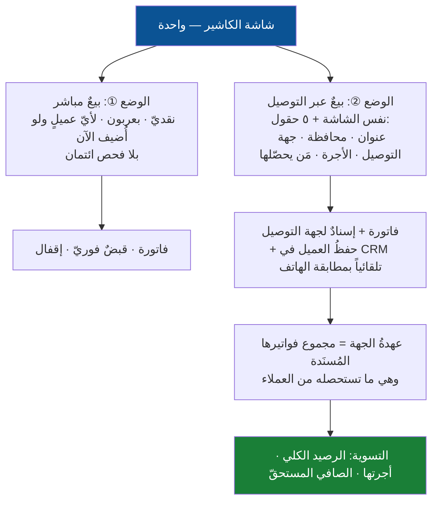

**لماذا هي أصحّ من «الطلب أوّلاً» الذي اقترحتُه:**
1. **مفهومٌ واحد لا اثنان** — شاشةٌ بوضعين أبسط من مستندَين. أقلُّ شيفرةً وأقلُّ تعلُّماً، وهو جوهر الترشيق.
2. **أصدقُ فيزيائياً** — البضاعة في سيارة المندوب **ليست في المخزن**. إخراجُها عند الإسناد أدقّ من «حجزها» وهي خارج المحلّ.
3. **مبنيّةٌ أصلاً** ✅ — الفاتورة والإرسالية والدفتر قائمة؛ العمل **تصحيحٌ لا بناءٌ من الصفر**، وهذا أقلُّ مخاطرةً بكثير.

### التحسينات الستّ التي تحتاجها البنية

| # | التحسين | لماذا هو ضروريّ |
|---|---|---|
| **١** | **الطرف المدين عند الإسناد = جهة التوصيل، لا العميل** | «بيعٌ بلا ائتمان» إن نُفِّذ بتعطيل السقف = **إضعافُ ضابط**. وإن نُفِّذ صحيحاً **سقط الائتمان بنيوياً**: الفاتورة المُسنَدة ذمّتُها **عهدةٌ على الجهة**، والعميل بلا ذمّةٍ إطلاقاً — إلّا إن سلّم المندوب آجلاً بقرارٍ صريح. عندها يُباع لأيّ عميلٍ جديد فوراً **بلا تعطيل حارسٍ واحد** |
| **٢** | **الرفض/الإرجاع = عكسٌ تلقائيّ كامل بنقرةٍ واحدة** | هذا ما يعادل «حذف الفاتورة» عندكم قديماً — لكن بأثرٍ موثَّق. يعيد المخزون · يعكس القيد · يُنزِل عهدة الجهة · يُقفل الفاتورة بسببها. **يلزمه محرّك العكس (ق٧)** لأنّ العكس اليوم **٢٠+ تنفيذاً يدوياً** يفوت الكوبون والإرسالية |
| **٣** | **رصيد الجهة مشتقٌّ لا مخزَّن** | «الفواتير التي عليها» تُحسَب من المستندات، لا عمودٌ يكتبه **١٨+ موضعاً** ويتجاوزه أربعة ويكتب فوقه استيراد (§٢) |
| **٤** | **الأجرة ثلاثةُ أرقامٍ لا رقم** — كما قلتَ | الرصيد الكلي · أجرتها المستحقّة · الصافي. ويلزمه **حسابان لا يُصافَيان** في الدفتر، وإلّا صار «الصافي» رقماً لا يُفكَّك عند الخلاف. **والأجرة تُستحقّ عند التسليم لا عند الإسناد** — وإلّا استحقّت أجرةً على طردٍ رجع |
| **٥** | **حفظ العميل في CRM تلقائياً بمطابقة الهاتف** | حتى لا يتكرّر العميل بثلاث بطاقات. الدالّة موجودةٌ ✅ (`customers.receptionResolveByPhone`) — تُوصَل بالوضع الثاني ويُنشأ العميل **تلقائياً** بلا خطوةٍ منفصلة |
| **٦** | **وضعان لا شاشتان** | الوضع الثاني يضيف خمسة حقولٍ فقط والباقي **مطابق** — وهو تطبيقٌ مباشرٌ لقانون النموذج الواحد (ق٤) |

### أثرُ ذلك على الشكاوى المقيسة

| الشكوى | كيف تُحلّ |
|---|---|
| العميل الجديد بلا ائتمان يُرفض | التحسين ①: **الذمّة على الجهة** ⇒ لا فحصَ ائتمانٍ أصلاً |
| عميلُ الهاتف/واتساب/إنستغرام | اسمٌ وهاتفٌ وعنوانٌ وقناة في نفس الشاشة، والعميل **يُنشأ تلقائياً** (⑤) |
| مشاكل الإسناد | حقلُ جهةٍ في نفس الشاشة — نقرة |
| احتساب المبالغ | **قيمة الفاتورة = ما يستحصله**. رقمٌ واحد |
| التسوية | **ثلاثةُ أرقامٍ مشتقّة** (④) بدل رقمٍ مخزَّنٍ منحرف |
| تحديث الذمم | الذمّة **على الجهة** وتنزل بالتوريد؛ ولا ذمّةَ على العميل إلّا بقرارٍ صريح |
| «ماذا وصل ورجع وأُلغي؟» | لوحةٌ واحدة بخمسة أعمدة ⇓ |
| الرفض ١٣ خطوة | التحسين ②: **نقرةٌ واحدة، والباقي تلقائيّ** |

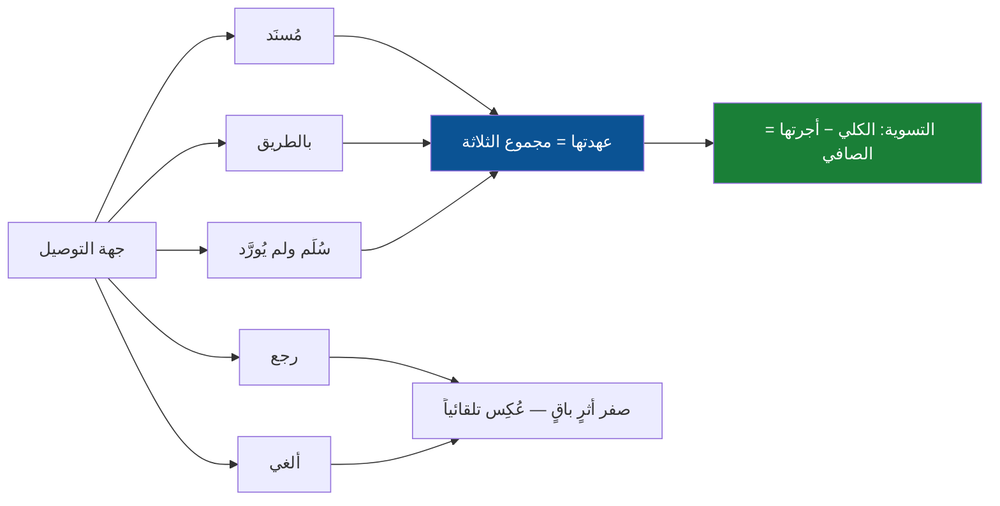
كل عمودٍ قابلٌ للنقر، وكل صفٍّ فيه فعلُه في مكانه.

---

## 2. العلّة الحقيقية الأولى: رصيد الجهة **مخزَّن** فيَنحرف حتماً

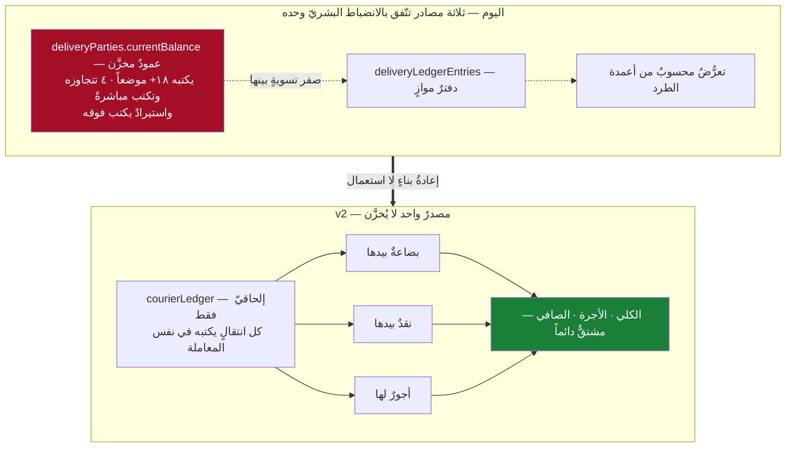

**لماذا هذا صحيحٌ بنيوياً:** لا عمودَ رصيدٍ ⇒ **لا شيءَ ينحرف عنه** · **وثابتُ إغلاق الفاتورة**: مجموع أحداث الدفتر **لكل فاتورةٍ مُسنَدة** = صفر عند إغلاقها ⇒ الخطأ يُحاصَر في فاتورةٍ باسمها لا يصير لغزاً في رقمٍ إجماليّ · **ولا مسارَ يحرّك فاتورةً بلا تحريك المال** (الكتابتان في معاملةٍ واحدة أو لا تقعان).

| البند | يزيد بـ | ينقص بـ |
|---|---|---|
| **بضاعةٌ بيدها** | إسناد فاتورة | تسليم · إرجاع · إلغاء |
| **نقدٌ بيدها** | تحصيل | توريد · شطبٌ معتمَد |
| **أجورٌ لها** | **تسليمٌ ناجح** (لا الإسناد) | دفعُ أجرة · مقاصّةٌ من التوريد |

> الأعمدة الأربعة في `shared/partyExposure.ts` **مفهومٌ صحيحٌ ✅**، لكن **مصدرها يصير الدفتر المشتقّ**.

### إيقاعا التسوية — كلاهما مطلوبٌ بقرارك

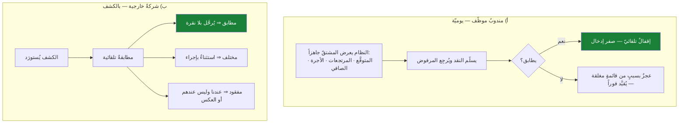

---

## 3. العلّة الحقيقية الثانية: النظام لا يعمل تلقائياً

### ق-أ: الأتمتة أوّلاً — القانون الحاكم
> **كل خطوةٍ يملك النظام دليلها ويستطيع تنفيذها بأمان: يُنفّذها ويُسجّلها ويُبلِغ بعدها — ولا يعرضها كزرّ.**
> **الخطوة اليدوية = قرارٌ بشريٌّ حقيقيّ فقط.**

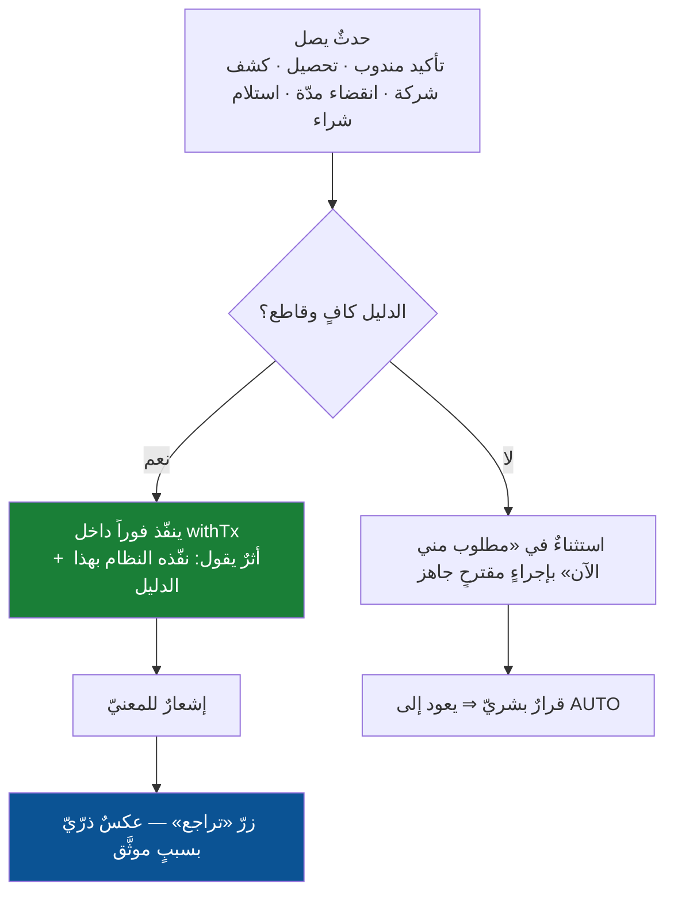

| # | ما يصير تلقائياً | يقتل |
|---|---|---|
| ١ | **الحالة تتقدّم بالدليل** لا بالنقرة | «لا أعرف أين أذهب» |
| ٢ | **الإغلاق التلقائيّ للمرفوض**: مخزونٌ يعود · قيدٌ يُعكَس · عهدةٌ تنزل · فاتورةٌ تُقفَل | ١٣ خطوة عكس |
| ٣ | **التسوية المستمرّة**: مقارنةٌ دورية، واستثناءٌ **عند الفرق فقط** | شاشاتُ مطابقةٍ يفتحها أحدٌ متى تذكّر |
| ٤ | **الإسناد التلقائيّ** بالمنطقة — والمستخدم **يعدّل لا يبتدئ** | مشاكل الإسناد |
| ٥ | **كلّ رقمٍ مشتقّ**: العهدة · المتبقّي · الأجور · الذمّة | «المتبقّي» من عمودٍ لا يكتبه أحد |
| ٦ | **المهمّة تُولَد وتُسنَد وتُرسَل** | تسعةُ طوابيرَ لا يراها أحد |
| ٧ | **التنفيذ تحت السقف** | «اعتماداتٌ كثيرة ومتوسّعة» |
| ٨ | **الكشف الاستباقيّ** (WAVG منحرف · ذمّةٌ لا تطابق · طردٌ متقادم) بإجراءٍ مقترح | اكتشافُ الخلل بعد شهور |

**الإنفاذ:** `shared/automationRegistry.ts` — كل انتقالٍ يُصرّح `AUTO` (بدليلٍ مُسمّى) أو `MANUAL` (**بمبرّرٍ مكتوبٍ للحكم البشريّ**). و`check:automation-registry` يرفض انتقالاً بلا تصريح، **و`MANUAL` بلا مبرّر**.
**والمقياس:** **نسبة الخطوات اليدوية** لكل عملية — تُقاس وتُجمَّد وتُخفَّض.

---

## 4. أرقام النظام والعلل

| المؤشّر | القياس |
|---|---|
| المخطّط | **٣١٢ جدولاً** — **٣٠ منها جداولُ «طلب اعتماد» فقط** |
| صفحات · مسارات · وحدات | ٢٧٦ · ١٩٠ (**٦٢ إعادةَ توجيهٍ محضة**) · ٢٨ |
| اعتمادات | **~٥٠** — **٦ في الصندوق**، **وصفرٌ من عشرة اعتماداتٍ للمشتريات** |
| `branchId` في العقود | **٢٣٨** — ٦٩ يعرفها الخادم، **٧ يقارن ثمّ يرمي** |
| **تنفيذاتُ العكس اليدوية** | **٢٠+** · صفر تجريدٍ مشترك |
| صفحات > ١٢٠٠ سطر | **١١** · أسوأ دالّة **١٩٧٩ سطراً** بـ٥٥ `useState` |

| العلّة | دليلٌ مقيس | الأساس |
|---|---|---|
| **D-أ الرصيد المخزَّن** | ١٨+ كاتباً · ٤ متجاوزين · استيرادٌ يكتب فوقه · **صفر تسوية** | الدفتر المشتقّ (§٢) |
| **D-ب لا أتمتة** | صفر انتقالٍ يُنفَّذ بالدليل | الأتمتة أوّلاً (§٣) |
| **D-ج الائتمان في غير محلّه** | الذمّةُ على العميل عند الإسناد ⇒ **العميل الجديد يُرفض** | التحسين ① |
| **D1 لحام المعاني** | `receipts` **٨ مستنداتٍ + حالتان بلا قيدٍ على حاصل ضربهما** · `accountingEntries` ٣٣ نوعاً + ٨ مفاتيح · `workOrders` ٤٧ عموداً و٣ حالات · `expenses` ٥ معانٍ · `users` ٦ مصادر سلطة · `branchStock` مملوكٌ وأمانةٌ **بلا عمود ملكية** · `inventoryMovements` **٣ ترميزاتٍ لإشارةٍ واحدة** | أ١ الصفّ الواحد |
| **D2 القاعدة المكرّرة** | رصيدُ الفاتورة **≥٢٠ ملفاً وقد انحرف** · `GREATEST` في ١٠ و`reconcileService` **أسقطها** · SOD **٧ مرّات بـ٥ تعريفات** | أ٢ مسندات مشتركة |
| **D3 تناثر الحوكمة** | ٣٠ جدولاً · ~٥٠ اعتماداً · **٩ طوابير مخفيّة** في المشتريات | أ٣ سجلّ القرارات |
| **D4 الشاشة العملاقة** | **١٩٧٩ سطراً في دالّة** · **٢١٠١ في مكوّن** · **٩ سلطاتٍ في شاشة** | أ٤ سقف الشاشة |
| **D5 انحراف الإنشاء/التعديل** | `AssetNew/Edit` **٦ اختلافات — التعديل يمسح العهدة صامتاً** · `UserNew/Edit` ٤.٢× · **خدمتا تحديث منتجٍ تختلفان في ٦ من ٧ حرّاس** | أ٥ نموذجٌ واحد |
| **D6 تعدّد المفردات** | **٧ قواميس «قناة»** إحداها نسخةٌ حرفية · ١٠ لطرق الدفع | أ٦ قاموسٌ ورسائل |
| **D7 السؤال عمّا يُعرَف** | ٦٩ حقلاً · نموذجُ السند يبدأ بـ`useState<number>(1)` | أ٧ الاستنتاج |
| **D8 العكس غير الذرّي** | `sale/cancel` **نسخةٌ يدوية وقد اختلفتا** · **الكوبون لا يُحرَّر أبداً** · حارس الإرسالية **تعليقٌ يصف سلوكاً غير موجود** ويرمي **بعد** كل الكتابات · **٤ عمليات مالٍ بلا سبب** | أ٨ محرّك العكس |
| **D9 لا لقطةَ ولا استعادة** | `auditLogs` يُقتطع عند **٨ ك.ب** و**لا يرمي أبداً** و**خارج المعاملة** · `priceChangeLog` يكتبه **أندرويد وحده** · الاستعادة **حقلٌ واحد** | أ٩ اللقطة |
| **D10 صلاحياتٌ بلا مصفوفة** | **«بيعٌ بلا إلغاء» مستحيلٌ بنصّ الشيفرة** · **بوليانان يقودان ٥٩ إخفاءً** والمحاسب **يرى الكلفة في شاشةٍ ولا يراها في أخرى** · عزلُ «ما أنشأتُه» **يفوت عروض الأسعار وحركات المخزون رغم ادّعاء التعليق** | أ١٠ المصفوفة |
| **D11 لا أحد يعرف أين يذهب** | **صفر حقلٍ يقول «الخطوة التالية ومَن يملكها»** · الزرّ المعطَّل بأربعة شروطٍ **لا يقول أيَّها فشل** | أ١١ الخطوة التالية |

---

## 5. المِحَكّ + ميزانية الاعتماد

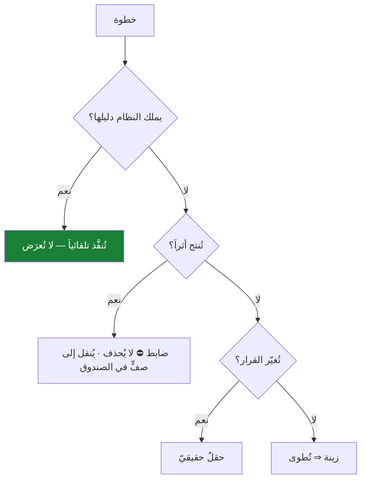

> **الثابت:** عدد الآثار المالية والرقابية **لا ينقص ولا واحداً**. ما ينقص: النقرات · الشاشات · الأسئلة · الانتظار.

**⚖️ ميزانية الاعتماد:** الاعتماد لثلاثةٍ فقط — خروجُ مالٍ فوق سقف المالك · مسُّ فترةٍ مُقفَلة · تجاوزُ حدٍّ رقابيّ. **والمقياس:** اعتمادٌ لم يُرفَض ولا مرّةً في ٩٠ يوماً ليس ضابطاً بل احتكاك.

**⚠️ قرارٌ باقٍ:** الشراء يتطلّب **٣ إلى ٥ مستخدمين متمايزين**. الخيارات: إبقاؤه · **سقفٌ ماليّ** يُفرَض فوقه · استثناءُ المالك الموثَّق.

---

## 6. القوانين

### ق١ الاستنتاج قبل السؤال
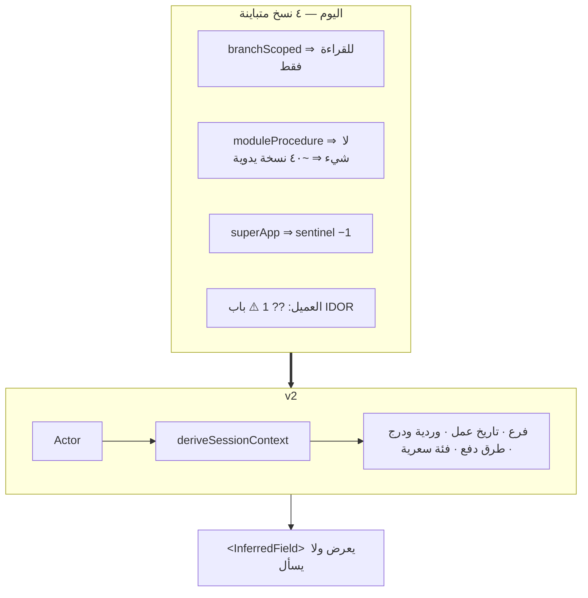

### ق٢ الفعل في مكانه
الصندوق يُبنى **من السجلّ** ⇒ ٦ ⇒ ~٥٠. **وأوّلُ ما يُوصَل: طوابير المشتريات التسعة.** ⚠️ **والصفّ يعرض ما يُقرَّر عليه** — اليوم المعتمِد يرى «عدد الأسطر» بلا أصنافٍ ولا أسعار، وفي المشتريات **معرّفاً قاعدياً**.

### ق٣ السطح الواحد + شريط الأفعال
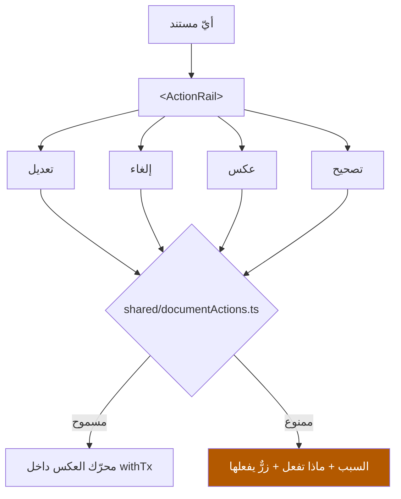
**خمسة أفعالٍ ⇒ أربعة.** **ونهاياتٌ مسدودة تُغلَق:** فاتورةٌ مسّها مندوب · فاتورةٌ عليها مرتجعٌ سابق · GRN مرتبطٌ بفاتورة `MATCHED` **لا يُعكس ولا يُرتجع** · مرتجعُ شراءٍ `LEGACY` **غير قابلٍ للعكس أبداً** · **أمرُ شراءٍ بضريبة لا يُستلَم والبضاعة على الرصيف** · مرتجعُ إرساليةٍ عربونُه أكبر من كل درج.

### ق٤ نموذجٌ واحد لثلاثة أوضاع
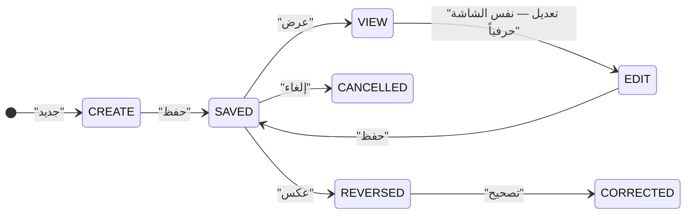
**`<SaveBar>`:** `حفظ` (Ctrl+S، **يبقى**) · `حفظ وجديد` · `حفظ وإغلاق`. **والمرتجع نفس المحرّر بوضع `RETURN`.** **والوضعان في الكاشير تطبيقٌ مباشرٌ لهذا القانون.** `check:form-parity` يفشل عند اختلافٍ غير مُصرَّح.

### ق٥ لوحة المفاتيح بلا تنازلٍ عن اللمس
`autoFocus` (٣٤/٢٧٦) · `Ctrl+S` (١٢/٢٤) · لوحةُ أوامرٍ **بالأفعال** · الرقاقةُ **على هدف اللمس**. **وباركود المشتريات يُوصَل** — الشاشة تعد بقارئٍ والشيفرة **تُعطّله صراحةً**.

### ق٦ مفرداتٌ ورسائلُ خطأٍ تقول ماذا تفعل
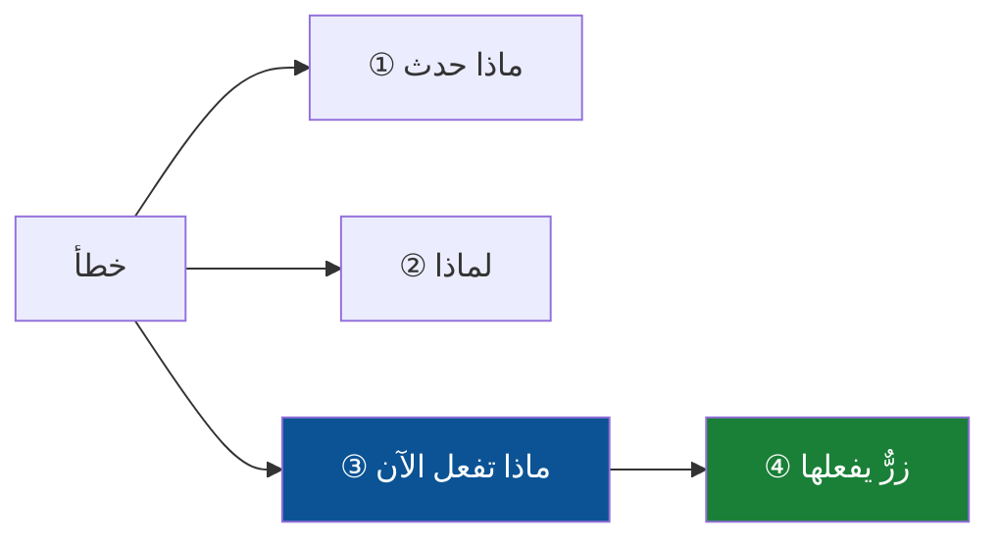

| ❌ اليوم | ✅ v2 |
|---|---|
| «GRNI يدعم الضريبة الصفرية فقط» — والبضاعة على الرصيف | «الأمر عليه ضريبة ٥٪. **اضغط «إزالة الضريبة وإعادة الاعتماد»**» |
| «لا يمكن عكس كمية خُصصت لفاتورة مورد» | «مرتبطةٌ بفاتورة X. **افتح الفاتورة وأعد المطابقة** ثمّ أعد العكس.» |
| «يلزم تصحيحٌ صريحٌ للبيانات» | **شاشة**: «اضغط «إصلاح وحدات المتغيّر»» |
| زرٌّ معطَّل بأربعة شروطٍ صامتة | كل شرطٍ بحالته: ✅ ❌ ✅ ❌ |

`appError({ what, why, doThis, action? })` + `check:error-messages`. والقاموس `shared/terms.ts`: `{ compact بلا تشكيل · prose · tooltip }`.

### ق٧ محرّك العكس الواحد — **وهو ما يجعل «الرفض» نقرةً**
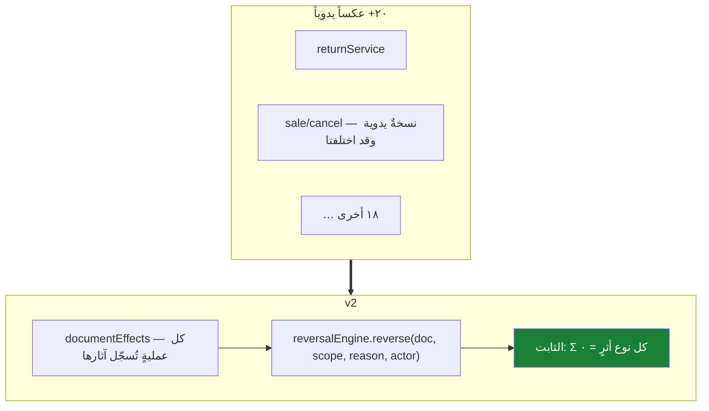
**أنواع الأثر:** مخزون · قيد · رصيد عميل · **عهدة جهة التوصيل** · مدفوع · عمولة · عربون · **كوبون** · هدية · قسط · بطاقة · أمانة · تقريب · أوفلاين.

### ق٨ اللقطة والاستعادة
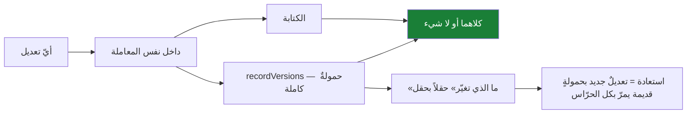
**لا لقطة ⇒ لا تعديل.** والاقتطاع **يفشل بدل أن يبتلع**. البيانات المرجعية تُستعاد؛ والمستندات المالية **تُعكَس**.

### ق٩ مصفوفة الصلاحيات
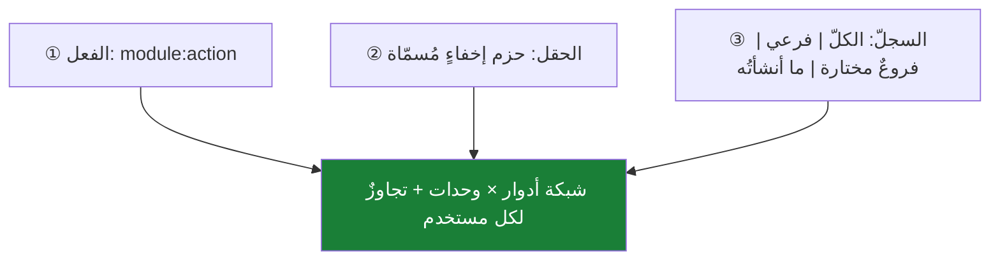
`shared/capabilities.ts` **مبنيٌّ ومُختبَرٌ وموقوف ✅** ⇒ **وصلٌ لا تصميم**. البوّابات الـ٩٣ **تُشتَقّ** بالخريطة القائمة ⇒ **صفر انحدار**؛ والنطاق السجلّيّ يُفعَّل **مخنقاً مخنقاً** بتكافؤ رؤية.

### ق١٠ مصدر ردّ المال يُختار من قائمة
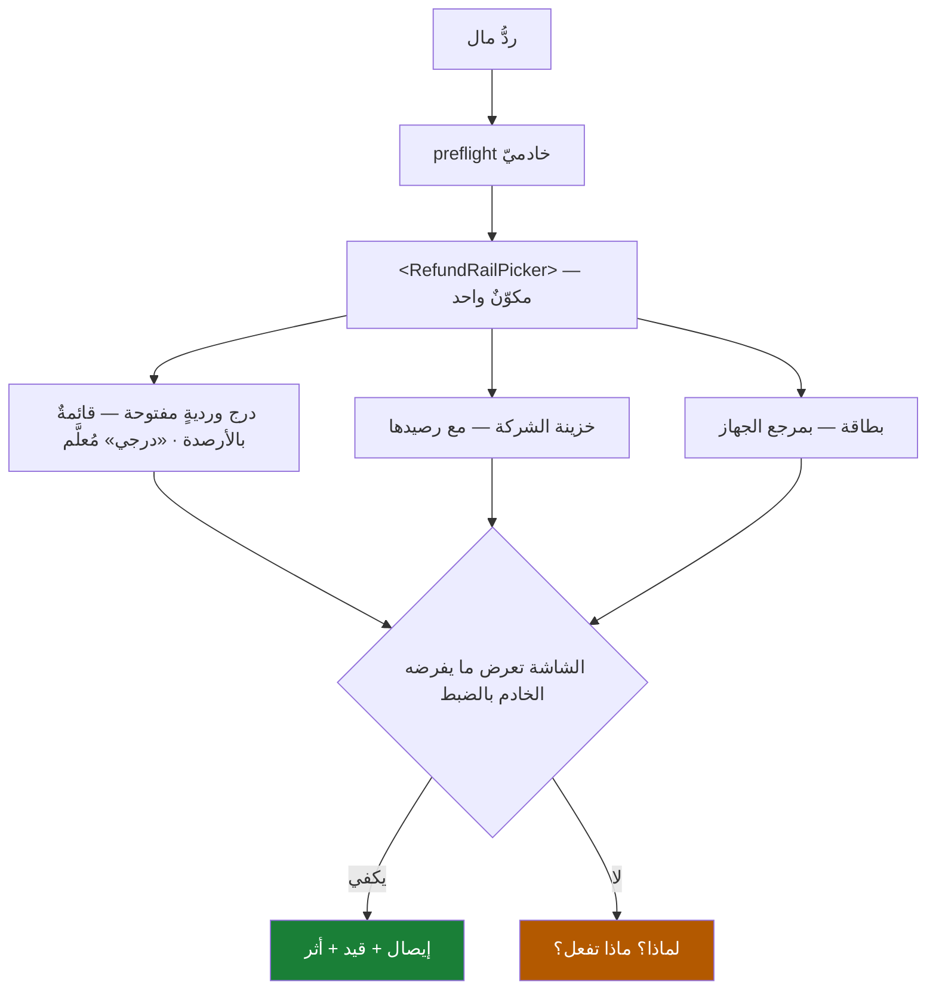
اليوم **ثمانية مواضع بثمانية سلوكيات**، أسوأها **رقمُ ورديةٍ يُكتَب يدوياً بلا قائمة**؛ ومرتجعُ الإرسالية **نهايةٌ مسدودة** لغياب مفتاحٍ واحدٍ في سياسة استثناءات الخزينة. القالب المرجعيّ ✅ موجودٌ ويُعمَّم.

### ق١١ الخطوة التالية ومالكها
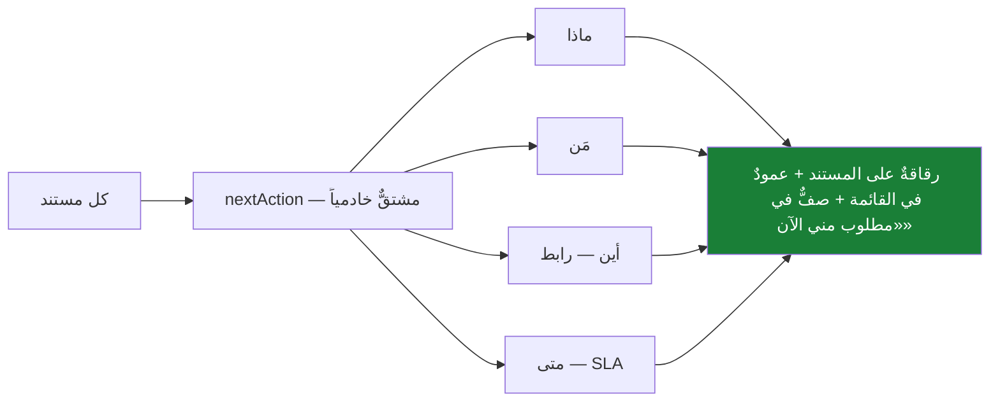
`check:next-action` يرفض حالةً جديدة بلا خطوةٍ معرَّفة ⇒ **لا حالةَ صمّاء**.

---

## 7. مقاييس النجاح

```
مسافة العملية = الشاشات + النقرات + الحقول اليدوية
نسبة الأتمتة   = الخطوات التلقائية ÷ إجمالي الخطوات
```

| العملية | اليوم | الهدف |
|---|---|---|
| **بيعٌ لعميلٍ جديد عبر واتساب مع توصيل** | **مستحيلٌ عملياً** (فحص ائتمان) | **شاشةٌ واحدة · وضعٌ ثانٍ · ٥ حقولٍ إضافية** |
| **رفضُ الزبون** | ١٣ خطوة عكس | **نقرةُ سببٍ — والباقي تلقائيّ** |
| **تسوية مندوبٍ يوميّة** | إدخالٌ ومطابقةٌ بشرية | **محسوبٌ سلفاً — تأكيدٌ واحد** |
| **تسوية شركةٍ بالكشف** | لا استيرادَ ولا مطابقة | **المطابق يُرحَّل بلا نقرة** |
| «ماذا وصل ورجع وأُلغي؟» | ٣ شاشات | **لوحةٌ بخمسة أعمدة** |
| اعتماد أيّ شيء | ٣-٤ شاشات · **٩ طوابير مخفيّة** | **٠ شاشة** |
| ردّ مالٍ نقديّ | ٨ سلوكيات · أحدها رقمٌ يُكتَب يدوياً | **مكوّنٌ واحد بثلاثة روافد** |
| سند قبض | ١ + ٧ حقول | ١ + **٢** |
| مرتجع بيع | ١١ خطوة · شاشةٌ مغايرة · لا مدخلَ من الفاتورة | **من الفاتورة · نفس المحرّر · ٣ خطوات** |
| شراء كامل | ٤ شاشات + ٦ حوكمة + **٣-٥ مستخدمين** | **١ سطح + أفعالٌ في مكانها** |
| استعادة تعديل منتج | **مستحيل** | **نقرتان** |

---

## 8. الموجات

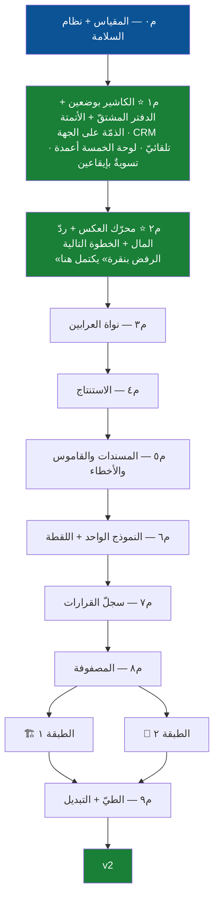

| الموجة | البند | معيار الخروج |
|---|---|---|
| **م٠** | `check-friction` · **مقياس نسبة الأتمتة** · بنية التشغيل الظلّيّ · مفاتيح الإطفاء | خطّ الأساس مجمَّد |
| **م١ ⭐** | الوضع الثاني في الكاشير (٥ حقول) · **الذمّة على الجهة** · CRM تلقائيّ بمطابقة الهاتف · **`courierLedger` مشتقٌّ بلا عمود رصيد** · الأجرة تُستحقّ عند التسليم · لوحة الخمسة أعمدة · تسويةٌ بإيقاعين · **٨ أتمتات** | بيعٌ لعميلٍ جديد عبر واتساب مع توصيل يتمّ في شاشةٍ واحدة · **صفر فحصِ ائتمانٍ وصفر تعطيلِ حارس** · **Σ أحداث كل فاتورةٍ = ٠ عند إغلاقها** · **الرصيد الظلّيّ يطابق ٧ أيام** |
| **م٢ ⭐** | `documentEffects` + `reversalEngine` · `<RefundRailPicker>` في الثمانية + المفتاح الناقص · `nextAction` معمَّم | **الرفض نقرةٌ واحدة** · اختبار `Σ = 0` أخضر · **صفر ردٍّ يُكتَب رقمُه يدوياً** · صفر نهايةٍ مسدودة |
| **م٣** | `services/advances/` نقلاً ميكانيكياً ⇒ هجرة ⇒ قلب ٦ مستوردين | **صفر تعديلٍ في أيّ اختبار** أوّلاً · اختبار عزل |
| **م٤** | `sessionContext` + `<InferredField>` | ٣ شاشاتٍ مرجعية · `check:authz` أخضر |
| **م٥** | `predicates/*` + `terms.ts` + `errors.ts` | ٥ مسنداتٍ و٥ قواميس · ٢٠ رسالةً أُعيدت كتابتها |
| **م٦** | `<RecordForm>` + `<SaveBar>` + `recordVersions` | **استعادةُ منتجٍ تعمل** |
| **م٧** | `decisionRegistry` + `controlRequests` + `<DecisionRow>` | ~٥٠ نوعاً مُسجَّلاً |
| **م٨** | وصلُ `capabilities` + حزم الإخفاء + النطاق السجلّيّ + الشبكة | **صفر انحدار** + تكافؤ رؤية |
| **م٩** | الطبقتان ثمّ الطيّ والتبديل | §١٠ |

**قواعد التوازي:** كاتبٌ واحدٌ لكل ملف · `session:new` + `coord:claim` · **لا شريحة تلمس ملفاً ساخناً** · حجزٌ ذرّيّ لكل رقم هجرة · كل هجرةٍ تمسّ `CHECK`/`enum` تُسجَّل في `ci-apply-extra-migrations.mjs`.

---

## 9. خطة الوحدات

**الطبقة ١:** الكاشير والتوصيل (م١-م٢) · **المحاسبة** (٣ دفاتر متوازية · قائمةُ الدخل **مرّتين في ملفٍّ واحد** · ١١٨١٦ سطراً) · **المشتريات** · **الخزينة** (`receipts` ٨ أدوارٍ · ٤ أنظمة فروق) · **الكاشير الموحَّد** (٣ محرّكات بيع · ٨٥٦٧ سطراً · الدمج مكتوبٌ «مؤجَّلاً») · **أوامر الشغل** (٤٧ عموداً · ٣ حالات · **١٠٤٦ سطراً غير قابلةٍ للوصول ويُختبَر عليها**).

**المشتريات — ثمانية إصلاحاتٍ بترتيب الألم:** ① **مطابقةٌ بسماحٍ صفريّ + تقريبٌ ثمّ ضرب ⇒ فرق ٣ فلوس ⇒ HOLD ⇒ توقُّف الذمّة والدفع والمرتجع وإقفال الشهر** ② «المتبقّي» من عمودٍ لا يكتبه المسار المحكوم ③ **WAVG باتجاهٍ واحد ⇒ تلوّثٌ دائمٌ صامت** ④ مفتاحُ الضريبة يُنتج أمراً لا يُستلَم ⑤ **الكمية `parseInt` تبتلع ١٫٥ ⇒ ١ · وسعرُ البذرة يتجاهل المعامل ⇒ أمرٌ أقلّ ١٢×** ⑥ ٣ روابطَ تُسقط معاملاتها ⑦ **ضوابطُ بلا مستدعٍ ومفتاحٌ لا يقرؤه شيء** ⑧ لا مسارَ لاستلامٍ زائد.

**الطبقة ٢:** المرتجعات · المصروفات · الجرد · المنتجات · الاستوديو · المخزون · الأقساط · الإقفال · الأصول · CRM · القنوات · HR · البطاقات · العمولات · المهام · المستخدمون · الموردون · الأمانة · الصيرفة. **⭐ والهدايا القالبُ المرجعيّ.**

> **سطحٌ ثالث:** `android-native` فيه **٣٠ وحدة ميزة**. كل تغييرِ عقدٍ يُمرَّر عليه **في نفس الشريحة**.

---

## 10. التبديل والتحقّق

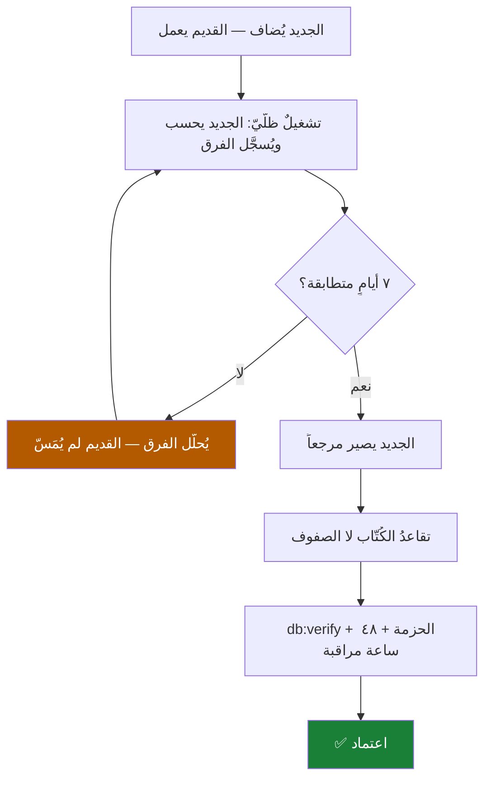

| الطبقة | المعيار |
|---|---|
| الأنواع · الحرّاس (٢٩ + **١٤ جديدة**) | صفر · لا خطّ أساسٍ يرتفع |
| الاختبارات (٥٦٧ ملفاً) | أخضر · **ولا اختبار ماليّ حُذف بلا بديلٍ مسمّى** |
| **دفتر الجهة** | **Σ أحداث كل فاتورةٍ مُسنَدة = ٠ عند إغلاقها** · الرصيد الظلّيّ يطابق ٧ أيام |
| **الائتمان** | **صفر فحصِ ائتمانٍ على العميل عند الإسناد** — والذمّةُ على الجهة، بلا تعطيل أيّ حارس |
| **الأتمتة** | كل انتقالٍ مُصرَّحٌ `AUTO`/`MANUAL` بمبرّر · **ولكل خطوةٍ تلقائية تراجعٌ يعمل** |
| **العكس** | **Σ كل نوع أثرٍ = ٠** بسيناريو عشوائيّ ٢٠٠ خطوة |
| **ردّ المال · اللقطة · الصلاحيات** | صفر نهايةٍ مسدودة · لا تعديلَ بلا لقطة · **صفر انحدارٍ في الرؤية** |
| الهجرة · الإنتاج | `migration-dry-run` على مخطّطٍ إنتاجيّ · `db:verify` · ٤٨ ساعة مراقبة |

---

## 11. المخاطر

| # | الخطر | العلاج |
|---|---|---|
| ١ | **أتمتةٌ تُنفّذ خطأً على نطاقٍ واسع** | تشغيلٌ ظلّيّ · **تراجعٌ بنقرة** · سقفٌ يوميّ للتنفيذات التلقائية في أوّل أسبوع · مفتاحُ إطفاء |
| ٢ | **الذمّة على الجهة تُخفي عميلاً لا يدفع** | التسليم الآجل **قرارٌ صريح** ينقل الذمّة للعميل ويُفحَص ائتمانه عندها · وتقريرُ «سُلِّم ولم يُحصَّل» عمودٌ مستقلّ في اللوحة |
| ٣ | **الدفتر المشتقّ يبطئ القراءة** | لقطاتٌ محسوبة **مشتقّةٌ لا مصدرية**، تُبنى من الدفتر وتُتحقَّق دورياً |
| ٤ | **رفضٌ بعد إقفال الشهر** | العكس **في تاريخه** لا في تاريخ الفاتورة · وحارسُ الفترة المُقفَلة يعمل ✅ |
| ٥ | **حذف الاستقبال يكسر أوامر الشغل** | م٣ **قبل أيّ حذف** · بوّابتها `grep`=٠ + اختبار عزل |
| ٦ | **محرّك العكس يفوت أثراً** | `check:reversal-registry` يرفض كتابةً ماليّةً بلا تسجيل أثر |
| ٧ | **وصل الصلاحيات يوسّع وصولاً بصمت** | الافتراض **هو الوضع الحاليّ حرفياً** · `authz-guard-diff` · تكافؤ رؤية |
| ٨ | **توحيد الدفاتر يُفسد تقريراً تاريخياً** | يبدأ بالقراءة · تكافؤٌ رقميّ على كامل التاريخ |
| ٩ | **اختباراتٌ تقرأ الواجهة كنصٍّ خام** ⇒ تُحذف فيضيع ثابتٌ ماليّ. **وأحدها يفرض غياب زرّ المرتجع من الفاتورة** | إعادةُ التوجيه **في نفس الالتزام** · دالّةُ قراءةٍ ترمي خطأً مُسمّى · **ممنوع حذفها** |
| ١٠ | **الدمج يُنتج شاشةً أكبر** · **لوحة المفاتيح تُفسد اللمس** · **أندرويد يتخلّف** | `check:page-size` في نفس الشريحة · الرقاقة على هدف اللمس · أندرويد في نفس الشريحة |
| ١١ | **حارسٌ يُنذر كذباً ⇒ يُتجاوَز** | `--selftest` · `stripComments` · محلّل TS |

---

## 12. الخطوة التالية

**م٠ — يومٌ واحد بلا هجرةٍ ولا تغيير سلوك:** المقياس + **نظام السلامة قبل أيّ تغيير**.
**ثمّ م١** — الكاشير بوضعين والدفتر المشتقّ والأتمتة، و**م٢** التي تُكمل «الرفض بنقرة».

**⚠️ قرارٌ باقٍ:** فصل المهام في المشتريات (٣-٥ مستخدمين متمايزين لكل أمر شراء).

