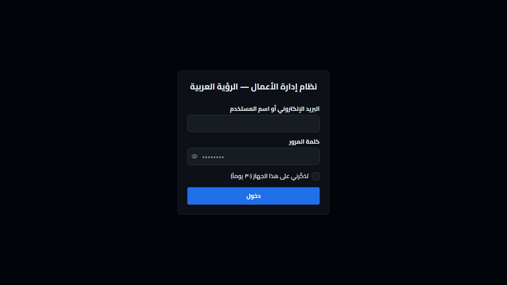
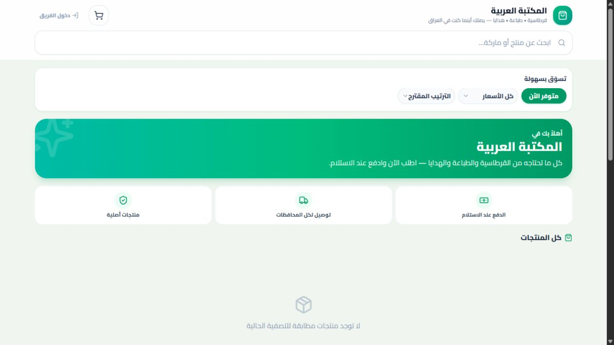
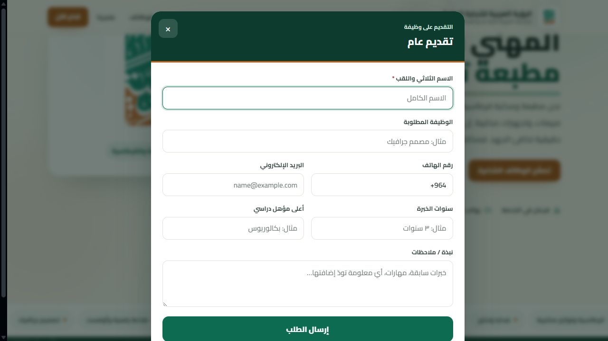

# تدقيق ذري للنظام — الأمن، الوظائف، التشغيل، الإنتاجية والتصميم

**التاريخ:** 12 آب/أغسطس 2026
**النطاق:** تطبيق الويب والخادم، مسارات tRPC، قاعدة البيانات، إعدادات الإنتاج، الاختبارات، وأربع رحلات عامة مرئية.
**المنهج:** مراجعة ثابتة للكود والإعدادات، فحص اعتماديات الإنتاج، فحص مصفوفة التفويض، فحص TypeScript، اختبارات الوحدة، وتشغيل محلي محدود مع لقطات شاشة. لم يُجرَ اختبار اختراق تخريبي أو استخدام بيانات إنتاج.

## نتيجة التنفيذ بعد التدقيق

نُفّذت حزم الإصلاح ذات الأولوية P0/P1/P2 في نفس دورة التدقيق، ثم أُعيدت مراجعتها عدائياً. لم تعد النتائج SEC-01 إلى SEC-05 مفتوحة:

- فُرض نطاق الفرع على الموظفين، الترقيات، التوظيف وأجهزة الحضور، وأُغلقت سباقات TOCTOU داخل المعاملات.
- صار إنهاء الخدمة مساراً ذرياً واحداً يعطّل الحساب والجلسات ويرفع روابط الأجهزة، مع حارس يمنع تعطيل المالك/مدير أعلى امتيازاً.
- صارت الاستعادة دفقاً خاماً مصادقاً قبل القراءة، بتذكرة قصيرة أحادية الاستخدام وحد حجم وملف مؤقت آمن؛ والاستعادة/التصفير عبر الويب معطّلان نهائياً في الإنتاج.
- توحّدت حدود المعدّل أمام عمال PM2 في Nginx بلا خدمة مدفوعة، وأُغلقت aliases وحساسية حالة المسارات وXFF المحلي بسر hop.
- فُصل مستخدم MySQL الخاص بالويب عن root، وأضيف `pnpm db:ensure-app-user` لترقية القواعد القديمة بأقل امتياز.
- أضيف تعافي كلمة المرور برمز مجزأ قصير العمر، وCLI طوارئ لآخر مدير، وإبطال ذري للجلسات و2FA عند الطلب الصريح.
- أضيف CV آمن PDF/DOCX، سجل أسعار داخل المنتج، مفضلة/حديثة حسب الدور، وحالات خطأ/فراغ ووصولية محسّنة.

تظهر الأقسام أدناه الحالة التي كُشفت قبل الإصلاح وتحافظ على دليل القرار. الحالة النهائية والتحقق مذكوران في خاتمة الوثيقة.

## الخلاصة التنفيذية قبل الإصلاح

النظام كبير وناضج وظيفياً، وفيه طبقات جيدة فعلاً: فصل شركات، صلاحيات وحدات، تدقيق مالي، حماية Cookie وJWT، سياسة CSP، تحقق ثنائي، إبطال جلسات، فحص OSV في CI، واختبارات كثيرة. لم أعثر على سرّ مضمّن في Git أو ثغرة معروفة عالية الخطورة في اعتماديات الإنتاج، ولم أثبت اختراقاً بين شركتين.

لكن توجد **ثلاث فجوات عالية الأثر** لا تظهر في فحص الحزم:

1. صلاحيات الموارد البشرية لا تطبّق نطاق الفرع بصورة منهجية؛ مدير فرع يملك `hr: FULL` قد يصل إلى موظفين وإجراءات HR في فروع أخرى داخل الشركة.
2. مسار استعادة النسخة الاحتياطية يتيح تحليل جسم JSON ضخم قبل المصادقة، بينما إعداد Nginx يمنع عملياً الملفات التي صُمّم المسار لاستقبالها.
3. مسار «إكمال إنهاء الخدمة» لا يستخدم خدمة الإنهاء المركزية، لذلك قد يترك حساب الموظف وجلساته وربط جهاز الحضور فعّالة.

**التقييم العام قبل الإصلاح:** لم توجد ملاحظة حرجة مؤكدة، لكن لم يكن موصى باعتبار النظام جاهزاً لإنتاج متعدد الفروع قبل معالجة البنود SEC-01 إلى SEC-03 واختبارها. أُغلقت هذه البنود لاحقاً كما هو موثق في «نتيجة التنفيذ بعد التدقيق» أعلاه.

## مقياس الشدة

- **حرج:** اختراق شامل أو فقد مالي/بيانات واسع وسهل الاستغلال.
- **عالٍ:** وصول أو تعديل غير مصرح به، أو مسار تعطيل قوي، مع أثر تجاري واضح.
- **متوسط:** ضعف دفاعي أو تشغيلي مهم يحتاج شروطاً إضافية للاستغلال.
- **منخفض:** تقوية مطلوبة أو مخاطرة تشغيلية محدودة.

## النتائج الأمنية

### SEC-01 — عالٍ — صلاحيات HR لا تفرض نطاق الفرع

**الدليل**

- `server/trpc.ts:159-168`: حارس `requireModule` يتحقق من صلاحية الوحدة فقط ولا يفرض فرع المستخدم.
- `server/services/companyBranchScope.ts:21-30`: السياسة المركزية تحصر العرض الشامل بالمالك/المدير العام، وتطلب فرعاً لبقية الأدوار.
- `shared/permissions.ts:106-120`: الدور الافتراضي `manager` يملك `hr: FULL`.
- `server/routers/employeeRouter.ts:23-24,65-138,220-280`: عرض/إنشاء/تعديل/تغيير حالة/حذف الموظفين يعتمد `hrRead/hrWrite` ويقبل معرفات فرع أو موظف من الطلب دون اشتقاق نطاق الممثل.
- `server/routers/promotionRouter.ts:12-13,41-155` و`server/services/promotionService.ts:93-205`: الترقيات والإنهاءات تعمل بمعرف الموظف/السجل دون تحقق فرعي.
- `server/routers/recruitmentRouter.ts:14-15,140-200` و`server/services/recruitmentService.ts:181-231`: إدارة الشواغر تقبل `branchId` وتعدّل السجل بالمعرف دون نطاق فرعي.
- تقرير التفويض الحالي يحصي 132 نقطة `NO_BRANCH_SCOPE` ضمن خط الأساس؛ ولا توجد اختبارات عابرة للفروع لمسارات HR تقابل اختبارات الوحدات الأخرى.

**الأثر:** مدير فرع قد يقرأ بيانات شخصية ورواتب فروع أخرى أو ينشئ/يعدّل/ينهي/يرقّي موظفيها وينشر أو يحذف شواغرها. الأثر داخل الشركة الواحدة، ولم يثبت عبور شركة إلى أخرى.

**الإصلاح المقترح:** اشتقاق النطاق من هوية المستخدم في كل استعلام/تغيير باستخدام `companyBranchScope` و`resolveTargetBranch`، وعدم الثقة بـ`branchId` القادم من العميل، وإرجاع `NOT_FOUND` للمعرفات خارج النطاق. أضف اختبارات مصفوفة: مدير الفرع الحالي، فرع آخر، مدير عام، مالك، ومعرّف غير موجود.

### SEC-02 — عالٍ — تحليل رفع استعادة ضخم قبل المصادقة وتعارض مع Nginx

**الدليل**

- `server/index.ts:232-240`: محللات الجسم تُركّب قبل tRPC والمصادقة.
- `server/middleware/bodyParsers.ts:22-56`: يسمح `system.restoreUpload` بجسم يصل 300MB اعتماداً على اسم المسار قبل التحقق من جلسة المدير.
- `server/routers/systemRouter.ts:119-135`: المصادقة وكلمة المرور التأكيدية تحدثان بعد اكتمال تحليل الجسم.
- `deploy/nginx-erp.conf:20-25`: `client_max_body_size 25m` لكل الطلبات، ولذلك لن تمر نسخة استعادة أكبر من 25MB إلى المسار المصمم لـ300MB.
- `deploy/nginx-erp.conf:49-59`: مهلة الوكيل 60 ثانية فقط.

**الأثر:** إذا انكشف منفذ Node مباشرة، يستطيع غير المصادق استهلاك ذاكرة/CPU برفع أجسام كبيرة. وعبر Nginx، تفشل الاستعادة الواقعية بملفات أكبر من 25MB، ما يجعل خطة التعافي غير موثوقة.

**الإصلاح المقترح:** مسار رفع مستقل streaming/multipart، التحقق من الجلسة قبل قراءة المحتوى، حد بايت صارم، تخزين مؤقت إلى القرص، hash، حد تزامن ومعدل خاص، ثم مواءمة حجم ومهلة Nginx. الأقل تكلفة والأكثر أماناً: جعل الاستعادة عملية CLI محلية على الخادم مع سجل تدقيق، وإبقاء الواجهة لبدء/متابعة العملية فقط.

### SEC-03 — عالٍ — مسار إنهاء خدمة يترك باب الوصول مفتوحاً

**الدليل**

- `server/services/employeeService.ts:292-351`: الخدمة المركزية `setEmploymentStatus` تعطل حساب المستخدم، تغيّر `sessionsValidFrom` لإبطال الجلسات، وتحرر روابط جهاز الحضور عند الإنهاء.
- `server/services/promotionService.ts:337-400`: `completeTermination` يحدّث الموظف مباشرة إلى `terminated` وينشئ سند التسوية، لكنه لا يستدعي تلك الخدمة ولا يعطل المستخدم ولا يبطل الجلسات ولا يحرر ربط الجهاز.

**الأثر:** موظف منتهي الخدمة عبر مسار الترقيات/الإنهاءات قد يبقى قادراً على دخول النظام، وقد يستمر ربطه بجهاز الحضور.

**الإصلاح المقترح:** توحيد كل حالات الإنهاء في خدمة نطاق واحدة تعمل داخل معاملة واحدة: تغيير الحالة، تعطيل الحساب، إبطال الجلسات، تحرير الجهاز، إنشاء تسوية معلقة، ثم كتابة سجل تدقيق. أضف اختباراً يثبت أن كل مسارات الإنهاء تنتج الآثار نفسها.

### SEC-04 — متوسط — محددات المعدل ومحاولات الدخول محلية لكل عامل

**الدليل**

- `ecosystem.config.cjs:70-77`: الإنتاج يعمل افتراضياً بعاملين cluster.
- `server/index.ts:173-391`: محددات Express لا تضبط مخزناً مشتركاً، و`express-rate-limit` يستخدم `MemoryStore` افتراضياً.
- `server/routers/authRouter.ts:61-77`: عداد محاولات IP عبارة عن `Map` داخل العملية.

**الأثر:** الحد الفعلي يتضاعف عبر العمال ويُصفّر مع إعادة التشغيل. قفل الحساب في قاعدة البيانات وطبقة Nginx/Cloudflare يقللان المخاطرة، لكن الاتساق غير مضمون.

**الإصلاح المقترح:** مخزن Redis مشترك إن كان موجوداً أصلاً، أو جدول/عداد DB بسيط لمحاولات المصادقة، أو جعل Nginx/Cloudflare الطبقة المرجعية الوحيدة للمعدل مع مفاتيح صحيحة. لا أنصح بشراء خدمة جديدة لهذا وحده.

### SEC-05 — متوسط — ربط الإنتاج يفشل إلى الوضع المفتوح

**الدليل**

- `.env.production.example:6`: المثال يضبط `HOST=127.0.0.1`.
- `server/index.ts:508-533`: عند غياب `HOST` يستخدم الخادم كل الواجهات ويكتفي بتحذير في الإنتاج.

**الأثر:** خطأ إعداد واحد قد يكشف Node مباشرة ويتجاوز حدود Nginx، رؤوس الأمان، وحدود الرفع والمعدل.

**الإصلاح المقترح:** إيقاف بدء الإنتاج إن كان `HOST` غائباً أو غير loopback، إلا مع متغير صريح مثل `ALLOW_PUBLIC_BIND=1`. ثبّت أيضاً جدار الحماية/نشر الحاوية على loopback.

### SEC-06 — متوسط — خط أساس التفويض يمنع التراجع ولا يعالج الدين الحالي

`pnpm check:authz` و`check:authz:diff` نجحا، لكن النجاح يعني عدم إضافة مخالفة جديدة فقط. الفحص أحصى 838 نقطة سلطة، و175 استثناءً مُطبّعاً في خط الأساس، منها 132 `NO_BRANCH_SCOPE` و32 `UNAUTHENTICATED`. ليست كلها ثغرات، لكن SEC-01 يثبت أن الخط الأساس يستطيع إخفاء فجوة حقيقية.

**الإصلاح المقترح:** تحويل الخط الأساس إلى قائمة استثناءات مسماة: مالك، سبب، تاريخ انتهاء، واختبار سلوكي. خفّض العدد تدريجياً في كل إصدار بدلاً من مشروع إعادة كتابة مكلف.

### SEC-07 — منخفض — قبول CSRF عند غياب كل رؤوس المصدر

`server/middleware/csrf.ts:38-56` يسمح بالطلب عندما تغيب `Origin` و`Referer` و`Sec-Fetch-Site`، اعتماداً على `SameSite=Strict`. هذا مقبول غالباً للمتصفحات الحديثة لكنه دفاع غير مكتمل للـWebViews/العملاء القديمة.

**الإصلاح المقترح:** CSRF token للطلبات المتصفحية المتغيرة للحالة، واستثناء عميل الهاتف عبر ترويسة/رمز صريح لا عبر غياب الرؤوس.

### SEC-08 — منخفض — أمر seed التطويري يستطيع استهداف قاعدة إنتاج بالخطأ

- `package.json:37-38`: `seed` يفرض `NODE_ENV=development`، بينما `seed:prod` هو المسار الآمن.
- `server/seed.ts:18-31,59-70`: وضع التطوير يملك بيانات اعتماد افتراضية؛ فحص الإنتاج يعتمد البيئة التي يغيّرها الأمر نفسه.

**الإصلاح المقترح:** رفض seed التطويري عندما يبدو اسم المضيف/قاعدة البيانات إنتاجياً، وطلب `CONFIRM_DESTRUCTIVE_SEED=<اسم القاعدة>`، وحذف كلمة المرور الافتراضية أو توليدها عشوائياً وعرضها مرة واحدة.

## ما هو جيد أمنياً

- رفض سر JWT القصير أو المفقود عند البدء (`server/index.ts:75-82`).
- Cookies بـHttpOnly/SameSite/Secure، CSP وHelmet، CORS allowlist، تحقق ثنائي، وإبطال جلسات.
- توقيع HMAC للـwebhooks وحدود معدل متعددة.
- MySQL مربوط على `127.0.0.1` في Docker.
- فحص OSV دوري ومثبت checksum في CI، وlockfile مجمد.
- وجود معاملات وidempotency وفصل مهام في مسارات مالية حساسة.

## الفجوات الوظيفية والإنتاجية

### F-01 — منصة موحدة لإنهاء الخدمة

الحالة الحالية موزعة بين مسارين، وأحدهما ناقص. ينبغي أن تكون هناك قائمة إقفال واحدة: الحساب والجلسات، جهاز الحضور، العهد والأصول، السلف، الوردية المفتوحة، التسليمات، العمولات، الموافقات المعلقة، والتسوية النهائية. هذا يحل SEC-03 ويقلل العمل اليدوي والأخطاء.

### F-02 — استعادة كلمة المرور والتعافي الإداري

شاشة الدخول لا توفر «نسيت كلمة المرور»، والمسار الموجود لإعادة الضبط إداري (`server/routers/userRouter.ts:206-231`). أضف رمزاً أحادي الاستخدام قصير العمر، rate limit، إبطال جلسات بعد التغيير، ومسار CLI موثق لاستعادة آخر مدير. يمكن تنفيذ البريد لاحقاً؛ الإصدار الأول يستطيع استخدام رمزاً يولده المدير أو CLI بلا اشتراك خارجي.

### F-03 — رفع السيرة الذاتية ومستودع مستندات الموظف

المخطط يحتوي `cvFileKey` (`drizzle/schema.ts:4821`) والخدمة تقبله، لكن نموذج التقديم العام لا يرسله (`server/routers/recruitmentRouter.ts:38-53` و`client/src/pages/JobApply.tsx:515-533`). أضف PDF/DOCX بحد حجم، فحص نوع/محتوى، روابط موقعة وسياسة احتفاظ وموافقة خصوصية.

### F-04 — سجل تغير سعر الوحدة داخل شاشة المنتج

واجهة API موجودة وموسومة للاستخدام المستقبلي (`server/routers/priceWavesRouter.ts:92-103`) ولا يظهر مستهلك لها في الواجهة. عرض من/متى/السعر السابق/الجديد/السبب يقلل النزاعات ويُسرّع التحقيق.

### F-05 — مسودة مرتجع المشتريات

الزر موجود لكن يعلن أن الحفظ غير مفعل (`client/src/pages/PurchaseReturnNew.tsx:295-297`). إما تنفيذ مسودة لا تحرك المخزون والذمم، أو إخفاء الزر كي لا يوهم المستخدم بوظيفة غير موجودة.

### F-06 — مساحة عمل مخصصة للدور

القائمة الجانبية كبيرة ومسطحة (`client/src/components/AppLayout.tsx:65-105,166-237`) رغم وجود بحث `Ctrl+K`. أضف «المفضلة»، «الأخيرة»، وقائمة أعمال اليوم/الموافقات حسب الدور. هذا أعلى عائداً من إعادة تصميم القائمة كلها.

## التحسينات التشغيلية

1. **اختبار استعادة ربع سنوي معزول:** لا يكفي نجاح النسخ؛ قِس زمن الاستعادة وتحقق من سلامة البيانات. أصلح تعارض 25MB/300MB أولاً.
2. **مؤشرات قليلة عالية القيمة:** p95 زمن API، 5xx/429/503، تأخر event loop، ضغط pool قاعدة البيانات، عمر آخر نسخة ناجحة، ونتيجة آخر restore drill. Sentry و`/healthz` موجودان؛ ابدأ من السجلات الحالية قبل شراء منصة.
3. **ميزانية اتصالات قاعدة البيانات:** تعليق `ecosystem.config.cjs:70-75` يعترف بأن عدد العمال × الشركات × `DB_POOL_LIMIT` قد يتجاوز MySQL. أضف فحص سعة عند البدء، حد pool إجمالي، وإخلاء pools الخاملة.
4. **Hash كلمات المرور خارج event loop:** `server/auth/password.ts:13-50` يستخدم `scryptSync`. انقله إلى النسخة غير المتزامنة أو worker pool لمنع توقف الخادم وقت ذروة الدخول.
5. **Runbook إنتاج:** بدء/إيقاف، ترقية، rollback، استعادة، تدوير JWT/مفاتيح barcode، فقدان المدير، امتلاء القرص، وانقطاع DB. هذا استثمار وثيقة واختبار لا منتج مدفوع.

## التدقيق التصميمي المرئي

### الخطوة 1 — تسجيل الدخول — الحالة: جيدة مع فجوة تعافٍ

الهرمية واضحة، الحقول معنونة، إظهار كلمة المرور وتذكر الدخول ظاهران، والرسائل تستخدم `role=alert` (`client/src/pages/Login.tsx:139-198`). الناقص الأهم رابط استعادة آمن ومسار تعافٍ للمدير. الواجهة داكنة جداً لكن متماسكة؛ ينبغي قياس contrast للحالات الثانوية آلياً في CI.

### الخطوة 2 — واجهة المتجر — الحالة: جيدة بصرياً، حالة الفراغ ضعيفة

البحث والتصنيفات والثقة البصرية واضحة وRTL جيد. عند عدم وجود نتائج، تظهر رسالة «لا توجد منتجات مطابقة للتصفية الحالية» مع فلتر «متوفر الآن» من دون زر «مسح الفلاتر» أو اقتراح بديل. ميّز بين «المتجر فارغ» و«الفلتر أعاد صفراً»، واعرض زر مسح الفلاتر وعدد النتائج.

### الخطوة 3 — صفحة الوظائف — الحالة: قوية بصرياً، تكرار وصولي

الهوية والرسالة وزر التقديم ومسار الخطوات ممتازة. قائمة التخصصات تُكرر أربع مرات للحركة (`client/src/pages/JobApply.tsx:654-658`) ولا يُخفى وصولياً إلا جزء منها (`:724-728`)، ما قد يجعل قارئ الشاشة يكرر العناصر. استخدم قائمة دلالية واحدة، واجعل كل النسخ البصرية المتحركة `aria-hidden=true`.

### الخطوة 4 — نموذج التقديم — الحالة: مقروء، لكنه ناقص وظيفياً ووصولياً

العناوين والحقول ونص الخصوصية واضحة، وEscape مدعوم. لا يوجد رفع CV رغم وجوده في المخطط. التنفيذ المخصص للحوار (`client/src/pages/JobApply.tsx:492-513`) لا يثبت focus trap أو إعادة التركيز إلى زر الفتح؛ استخدم مكوّن Dialog مجرباً أو أضف الحبس والاسترجاع واختبار لوحة مفاتيح.

## خارطة التنفيذ الاقتصادية الأصلية

### P0 — قبل الإنتاج متعدد الفروع (1–2 أسبوع)

1. إغلاق نطاق فرع HR واختبارات المصفوفة.
2. توحيد إنهاء الخدمة وإبطال الحساب/الجلسات/الأجهزة.
3. منع public bind الافتراضي.
4. جعل الاستعادة CLI/streaming ومواءمة Nginx، ثم اختبار استعادة حقيقي.

كلها تغييرات كود وإعداد واختبار، ولا تحتاج خدمة مدفوعة جديدة.

### P1 — الإصدار التالي (2–4 أسابيع)

1. عدادات مصادقة ومعدل مشتركة.
2. استعادة كلمة المرور والتعافي الإداري.
3. CV آمن وحوار وصولي صحيح.
4. تحويل استثناءات authz الأعلى خطراً إلى اختبارات سلوكية.
5. مؤشرات التشغيل الستة وrunbook.

### P2 — تحسين الإنتاجية التدريجي

المفضلة/الأخيرة/صندوق عمل الدور، تاريخ سعر الوحدة، مسودة مرتجع المشتريات، وتحسين حالات الفراغ. نفّذها وفق بيانات الاستخدام لا كإعادة تصميم شاملة.

## التحقق المنفذ

- `pnpm check`: ناجح بعد الدمج النهائي.
- `pnpm test:unit -- --reporter=dot`: **273/273** اختباراً ناجحاً عبر 36 ملفاً.
- اختبارات DB المركزة للعزل/الإنهاء/التعافي/CV ودورة تجمعات الشركات: ناجحة، وتشمل التزامن وrollback وقطع العميل.
- `pnpm check:authz` و`pnpm check:authz:diff`: ناجحان؛ **840** نقطة، بلا مخالفة سلطة مستجدة، وانخفضت الاستثناءات الموروثة من 175 إلى 168.
- `pnpm check:migrations`: ناجح حتى migration 0173.
- `pnpm check:nginx-abuse`: ناجح.
- `pnpm build`: ناجح؛ شمل Vite/PWA وحزمة خادم Node وبوابات artifact/deployment لجسر الحضور.
- restore drill معزول فعلياً: نجح على حاويتين MySQL مؤقتتين بذاكرة `tmpfs`. أُنشئت نسخة database-neutral، واستعيدت في هدف مختلف، ثم نجحت الهجرات و`db:verify`. اختفى جدول سمّ أُضيف بعد النسخة، وبقي مدير الاختبار وفرعان، ما يثبت الاستبدال لا الدمج. حُذفت الحاويتان والملفات بعد الإثبات.
- `git diff --check`: ناجح.
- `pnpm audit --prod --audit-level high`: لا ثغرات اعتماديات معروفة وفق قاعدة الفحص الحالية.
- تشغيل محلي وفحص مرئي لأربع رحلات عامة؛ أُغلق خادم التدقيق بعدها.

لم يُعتمد `pnpm test` الشامل كرقم نهائي: التشغيل الأول اصطدم بـworktree أخرى على القاعدة المشتركة، ثم أُعيد على قاعدة معزولة مستنسخة المخطط وظل يتقدم بين الملفات لكنه تجاوز سقف الأداة البالغ 20 دقيقة. أُوقفت عمليات هذه الجلسة فقط ولم تُمس العملية الأخرى أو قاعدة الإنتاج. عُوّض ذلك بتشغيل الاختبارات المركزة كلٌ على قاعدة مستقلة، إضافة إلى حزمة الوحدة الكاملة وبوابات الأنواع/التفويض/الهجرات/Nginx والبناء الإنتاجي.

## حدود التدقيق

- لم تُستخدم بيانات اعتماد داخلية، لذلك لم أفحص بصرياً لوحة التحكم وPOS والشاشات الخاصة بالأدوار.
- لم يُنفذ اختبار اختراق شبكي أو fuzzing أو DAST على بيئة إنتاج.
- لم يُختبر الهاتف Android أو الطابعات/الماسحات/أجهزة الحضور فعلياً.
- المتجر المحلي بلا منتجات، لذلك لم تُختبر رحلة سلة/دفع مكتملة.
- نتائج فحص الحزم لحظة زمنية وليست ضماناً مستمراً.
